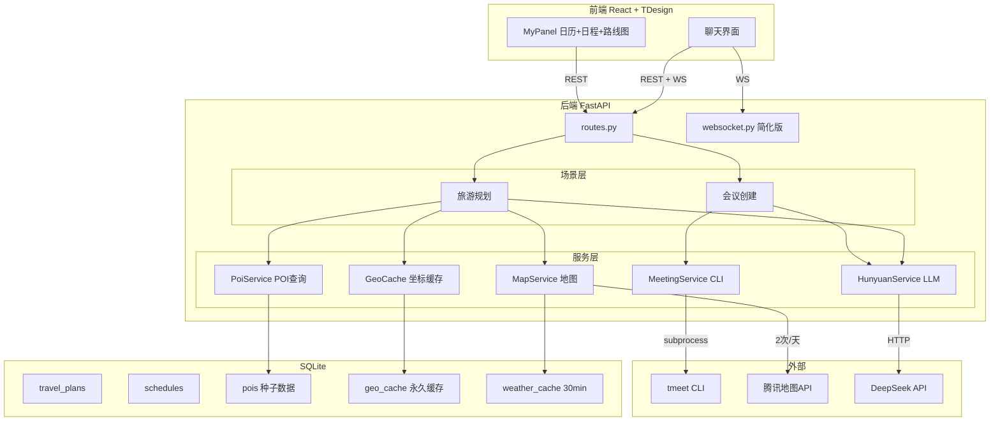

## 产品概述

对现有旅游规划Agent项目进行三大改造：代码清理、腾讯会议CLI集成、旅游地图API额度优化。

## 核心功能

### 1. 代码清理

- 删除所有"元宝主动服务Demo"遗留代码（agent/、tools/、proactive/、debug/等），精简为旅游+会议两个场景
- 清理后端：删除agent/目录(5文件)、tools/目录(8文件)、websocket.py旧版、websocket_hub.py、baike_service.py、3个Demo专用repository
- 清理前端：删除proactive/(3文件)、scenario/、debug/、TravelPlanForm.tsx、PlaceSelector.tsx、ScheduleTable.tsx
- 精简配置：移除腾讯会议AK/SK配置、Demo数据库表、Demo类型定义和状态管理
- 保留：旅游规划全流程、通用日程管理、城市搜索、地图服务、聊天界面

### 2. 腾讯会议自动创建

- 用户在聊天中提到开会意图时，LLM自动提取会议主题、时间、参与人
- 弹出确认建议，用户点击采纳后，后端通过subprocess调用`tmeet meeting create`命令创建会议
- 返回会议号和入会链接，展示在聊天消息中
- 前置条件：用户需一次性运行`tmeet auth login`完成OAuth2授权

### 3. 旅游API额度优化（四层架构）

- **POI数据库层**：预置5个热门城市(北京/杭州/西安/成都/上海)的景点/餐厅/酒店数据(含门票/费用/地址)，直接数据库查询，0次API
- **坐标缓存层**：所有geocode结果永久缓存到SQLite，首次调用后不再重复
- **批量距离矩阵**：一次API获取N×N距离矩阵，本地TSP最近邻排序优化路线
- **waypoints路线**：单次Direction API(含途经点)规划完整路线，替代逐段调用
- 目标：从每次规划~14次API降至缓存命中时2次(1次Matrix+1次Direction)
- 每次返回api_calls计数，便于监控额度消耗

## Tech Stack

- 后端：Python 3.11+ / FastAPI / SQLite(aiosqlite) — 现有，不引入新依赖
- 前端：React 18 + TDesign — 现有，仅适配接口变化
- 腾讯地图：Web Service API(现有key)
- LLM：DeepSeek(现有)
- 腾讯会议：tencentmeeting-cli(npm安装，OAuth2授权，subprocess调用)

## Implementation Approach

### 核心策略

三步并行推进：先清理Demo代码瘦身，再集成会议CLI，最后优化旅游API。

### 关键技术决策

1. **tmeet CLI而非REST API**：CLI用OAuth2设备码授权(浏览器扫码一次)，替代旧的AK/SK HMAC-SHA256签名(需5个密钥)。CLI凭证AES-256加密存储，Python通过`subprocess.run()`调用，JSON输出直接解析
2. **SQLite代替Redis**：项目已用aiosqlite，不引入新依赖。`geo_cache`表+`pois`表，索引优化查询
3. **Direction waypoints**：腾讯地图`/ws/direction/v1/driving/`支持`waypoints`参数(最多16个途经点，`;`分隔)，一天N个地点只需1次API
4. **Distance Matrix批量**：`/ws/distance/v1/`支持`from`和`to`传多坐标(`;`分隔)，一次返回N×N矩阵
5. **POI自动扩充**：种子库未命中时调1次Place Search，结果写入pois表，以后永久不再搜索
6. **天气adcode缓存**：`get_weather()`不再重复geocode获取adcode，首次获取后缓存到geo_cache表

### 改造前后对比

| 操作 | 改造前 | 改造后(缓存命中) |
| --- | --- | --- |
| 地点查找 | Place Search ×6-8 | POI数据库查询 ×0 |
| 坐标获取 | Geocode ×6-8(每次重调) | Geocode ×0 |
| 路线规划 | direction_driving ×5-7(逐段) | direction ×1(waypoints) |
| 距离计算 | 无 | distance_matrix ×1(批量) |
| 天气查询 | geocode+逆geocode+weather ×3 | weather ×1(adcode缓存) |
| **总计/天** | **~14次** | **~2次** |


## Implementation Notes

- **subprocess安全**：`tmeet`命令参数通过列表传递(不拼接shell字符串)，设置timeout=15秒，捕获stderr
- **CLI前置检查**：启动时检查`tmeet`是否已安装(`which tmeet`)，未安装时会议端点返回友好提示
- **OAuth2状态检查**：创建会议前先调`tmeet auth status`检查授权状态，未授权时返回授权引导
- **缓存命中日志**：`[Cache] hit: 灵隐寺` / `[Cache] miss → geocode: 灵隐寺`，便于调试
- **API调用计数**：`plan_daily_route`返回`api_calls`字段，记录本次消耗的地图API次数
- **向后兼容**：`plan_travel_route`(城市间路线)也改造为waypoints模式，不影响RouteMap.tsx组件
- **POI种子数据**：Python字典内嵌，启动时写入SQLite，约100条记录，文件<50KB
- **天气缓存TTL**：30分钟短期缓存，避免同一城市重复查询

## Architecture Design



## Directory Structure

```
backend/
├── services/
│   ├── meeting_service.py         # [REWRITE] tmeet CLI替代AK/SK签名
│   ├── poi_data.py                # [NEW] POI种子数据：5城市×15-20个POI
│   ├── poi_service.py             # [NEW] POI查询：match_poi() + 自动扩充
│   ├── geo_cache.py               # [NEW] 坐标缓存：get_coords() + get_adcode()
│   ├── map_service.py             # [MODIFY] 新增direction_with_waypoints() + batch_distance_matrix()，get_weather()用缓存
│   ├── hunyuan_service.py         # [MODIFY] 移除text_to_image(无用)
│   ├── city_service.py            # 不变
│   └── travel_parser.py           # 不变
├── database/
│   ├── init_db.py                 # [MODIFY] 移除6张Demo表，新增pois/geo_cache/weather_cache
│   ├── connection.py             # 不变
│   └── repositories/
│       ├── plan_repo.py           # 不变
│       └── schedule_repo.py       # 不变
├── api/
│   ├── routes.py                  # [MODIFY] 移除Demo端点，重写plan_daily_route，新增meeting/create
│   └── websocket.py               # [REWRITE] 简化为纯chat relay
├── models/
│   └── schemas.py                 # [MODIFY] 移除Demo模型，新增MeetingRequest
├── prompts/
│   └── templates.py               # [MODIFY] 仅保留TRAVEL+MEETING场景
├── scenarios/
│   └── scenario_type.py           # [MODIFY] 精简为travel+meeting
├── main.py                        # [MODIFY] 移除旧meeting_service/websocket_hub导入
├── config.py                      # [MODIFY] 移除腾讯会议AK/SK配置
└── requirements.txt               # 不变

frontend/
├── src/
│   ├── App.tsx                    # [MODIFY] 移除DebugBar
│   ├── components/
│   │   ├── chat/
│   │   │   ├── MessageBubble.tsx  # [MODIFY] 新增meeting建议卡片渲染
│   │   │   └── ...                # 其他不变
│   │   ├── travel/
│   │   │   └── DailyRouteMap.tsx  # [MODIFY] 适配新数据结构(含ticket/stay_time)
│   │   └── ...                    # 其他不变
│   ├── store/
│   │   └── AppContext.tsx         # [MODIFY] 移除suggestions/tasks/context/scenario状态
│   ├── hooks/
│   │   └── useWebSocket.ts        # [MODIFY] 移除suggestion/task/context dispatch
│   ├── services/
│   │   └── api.ts                 # [MODIFY] 移除fetchScenarios/sendFeedback，新增createMeeting
│   └── types/
│       └── index.ts               # [MODIFY] 移除Demo类型，新增MeetingResult

删除的文件：
backend/agent/ (5 files)
backend/tools/ (8 files)
backend/services/websocket_hub.py
backend/services/baike_service.py
backend/database/repositories/message_repo.py
backend/database/repositories/suggestion_repo.py
backend/database/repositories/user_repo.py
frontend/src/components/proactive/ (3 files)
frontend/src/components/debug/DebugBar.tsx
frontend/src/components/scenario/ (空目录)
frontend/src/components/travel/TravelPlanForm.tsx
frontend/src/components/travel/PlaceSelector.tsx
frontend/src/components/profile/ScheduleTable.tsx
```

## Agent Extensions

### SubAgent

- **code-explorer**
- Purpose: 在实现前验证所有文件间的import依赖关系，确保删除Demo文件后不会产生断裂引用
- Expected outcome: 确认删除agent/、tools/、proactive/等目录后，残留的import语句全部被清理，项目可正常启动