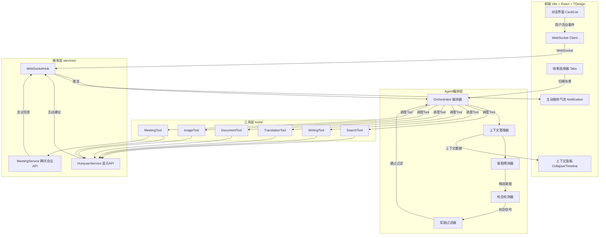

## 产品概述

**元宝主动服务Demo** —— 面向元宝C端用户的主动式AI服务创新方案。通过"感知-预判-服务"三层管线架构，让AI从被动响应升级为主动协作者，在搜索问答、写作、翻译、文档总结、生图、腾讯会议六大日常场景中，无需用户触发即可实时识别机会点并主动提供服务。

## 核心功能

### 1. 主动服务气泡系统（非侵入式主动服务载体）

- 以TDesign Notification悬浮气泡展示AI主动服务建议，不打断用户当前操作
- 支持采纳/忽略两种交互，气泡带有来源场景标签和置信度指示器
- 内置滑入/退出动画，多条建议自动堆叠排列

### 2. 六大主动服务场景

- **搜索问答 - 深度追问预判**：AI回答后主动分析追问方向，气泡展示2-3个预判问题
- **写作 - 素材先行**：检测写作行为时主动收集素材；停顿超阈值时主动提供续写建议
- **翻译 - 无感翻译**：检测到外文输入时主动翻译，输入框旁Popup显示翻译预览
- **文档总结 - 上传即总结**：文档上传完成瞬间主动启动总结，结果卡片滑入
- **生图 - 场景感知生图**：用户描述场景时主动生成配图，识别情绪/风格关键词匹配
- **腾讯会议 - 自动创建会议**：对话检测到开会意图时，自动提取时间/主题/参与人并调用腾讯会议API创建会议

### 3. 上下文感知面板

- 实时展示AI对用户当前上下文的理解（活动类型、关注点、情绪倾向）
- 以TDesign Collapse + Timeline展示AI"思考过程"时间线
- **任务追踪**（借鉴tudou的TaskListTool）：实时展示Agent当前正在执行的Task（检测中→分析中→生成建议中→推送中）

### 4. 误报过滤机制

- 规则引擎第一层快速过滤 + LLM二次判断的奖励模型简化版
- 降低误报率，避免过度打扰用户

### 5. 定时主动服务（借鉴tudou的ScheduleCronTool）

- 基于用户行为画像，在"恰当的时间"主动触发服务
- 例：检测到用户每天22:00写作，21:55主动准备写作素材
- SQLite记录用户行为模式，分析高频活动时段

### 6. 用户偏好学习（借鉴tudou的Context+Memory系统）

- 记录用户对主动服务的反馈（采纳/忽略），构建偏好画像
- 基于历史反馈动态调整主动服务的触发阈值和内容偏好
- 上下文面板展示"AI学到的用户偏好"

### 7. Token消耗追踪（借鉴tudou的cost-tracker）

- 实时展示每次主动服务消耗的Token数和估算成本
- 演示时展示系统的"经济效率"

## Tech Stack Selection

- **前端**：Vite 5 + React 18 + TypeScript 5
- **UI组件库**：TDesign React（`npm i tdesign-react`，唯一UI框架，不混用任何其他UI/动画库）
- **图标**：tdesign-icons-react（TDesign官方图标库）
- **状态管理**：React Context + useReducer
- **后端**：Python 3.11+ + FastAPI + WebSockets
- **数据库**：SQLite（Python内置sqlite3，零部署，持久化用户画像/上下文/服务记录）
- **LLM调用**：腾讯混元大模型API（ChatCompletions / ChatTranslations / FilesUploads+CreateThread+RunThread / TextToImageLite）
- **外部API**：腾讯会议API（POST https://api.meeting.qq.com/v1/meetings，AK/SK鉴权，用户有企业账号）

## Implementation Approach

### 架构参考：claude-code-tudou 工具驱动型 Agent

参考 https://github.com/AICoderTudou/claude-code-tudou 的核心设计：

- **tools/ 目录**：每个Agent能力是独立Tool，有统一基类和接口，可动态注册和调用
- **services/ 目录**：所有外部API调用集中管理（混元API服务、腾讯会议API服务）
- **agent/ 目录**：Agent编排层，负责上下文管理、意图预测、机会检测、奖励过滤、工具调度
- **.env 配置驱动**：所有密钥通过环境变量管理

### 核心架构：感知-预判-服务三层管线

```
用户活动 → [感知层]上下文采集 → [预判层]意图预测+机会检测 → [过滤层]奖励模型过滤 → [服务层]工具调度+服务生成 → WebSocket推送 → TDesign Notification展示
```

### 后端分层设计（参考tudou）

1. **agent/ 编排层**：

- `Orchestrator`：Agent编排器，接收WebSocket事件，决策调用哪个Tool，管理Task生命周期（借鉴tudou Task系统）
- `ContextManager`：维护用户活动状态、历史交互、偏好画像，SQLite持久化+内存缓存
- `IntentPredictor`：调用混元ChatCompletions分析上下文，生成候选意图
- `OpportunityDetector`：规则引擎+LLM判断是否存在主动服务机会
- `RewardFilter`：两层过滤降低误报率
- `BehaviorScheduler`：定时主动服务（借鉴tudou ScheduleCronTool），基于用户行为画像定时触发
- `CostTracker`：Token消耗追踪（借鉴tudou cost-tracker），记录每次LLM调用成本

2. **tools/ 工具层**（每个场景一个Tool，继承BaseTool，参考tudou Tool.ts设计）：

- `BaseTool`（参考tudou `buildTool()` 工厂模式 + fail-closed默认值）：
- `name: str` / `trigger_rules: list` / `max_result_size: int`
- `is_destructive(context) -> bool`（是否不可逆操作，如创建会议）
- `should_suppress(context) -> bool`（是否应该抑制，参考tudou "When NOT to Use"）
- `async def validate_input(context) -> ValidationResult`
- `async def execute(context, on_progress) -> Suggestion`
- `get_activity_description(context) -> str`（如"正在分析追问方向..."，参考tudou getActivityDescription）
- 每个Tool的prompt包含"When to Use"+"When NOT to Use"双向用例（参考tudou设计）
- 提示词使用**禁令式设计**（参考tudou的 NEVER/DO NOT 模式）：
    - "NEVER 在用户正在打字时弹出气泡"
    - "NEVER 对同一条消息重复推送相同建议"
    - "DO NOT 在3秒内连续弹出超过2个气泡"
    - "MUST NOT 在用户明确忽略后5分钟内再次推送同类建议"
- `SearchTool`：追问预判，调用混元ChatCompletions
- `WritingTool`：素材先行+续写建议，调用混元ChatCompletions
- `TranslationTool`：无感翻译，调用混元ChatTranslations
- `DocumentTool`：上传即总结，调用混元FilesUploads→CreateThread→RunThread
- `ImageTool`：场景感知生图，调用混元ChatCompletions+TextToImageLite
- `MeetingTool`：自动创建会议（is_destructive=True），调用混元ChatCompletions提取信息+腾讯会议API创建

3. **services/ 服务层**：

- `HunyuanService`：混元API统一调用封装（对话、翻译、文件对话、生图）
- `MeetingService`：腾讯会议API服务（AK/SK鉴权、创建会议）
- `WebSocketHub`：WebSocket连接管理，主动推送

### 前端TDesign组件映射

| 功能模块 | TDesign组件 | 内置动画 |
| --- | --- | --- |
| 主动服务气泡 | Notification | 滑入/退出 |
| 消息流 | Card + List | - |
| 场景切换 | Tabs | 切换过渡 |
| 上下文面板 | Collapse + Timeline | 展开/收起 |
| 场景详情 | Dialog | 弹入/弹出 |
| 服务详情面板 | Drawer | 侧滑 |
| 翻译预览 | Popup | 弹出过渡 |
| 加载/思考中 | Loading + Skeleton | 旋转/闪烁 |
| 输入栏 | Input + Upload + Button | - |
| 状态指示器 | Tag + Badge | - |


### 关键技术决策

- **单一UI系统**：完全使用TDesign React，不引入Tailwind/Framer Motion/Zustand
- **WebSocket实时推送**：主动服务的核心，后端Tool执行完成后通过WebSocketHub推送结果
- **工具驱动架构**：参考tudou，每个场景是独立Tool，Agent编排器动态选择调用，易于扩展新场景
- **规则+LLM双层过滤**：先用规则引擎快速过滤明显无需求场景，再由LLM精判，降低误报率
- **场景脚本驱动Demo**：每个场景预置模拟用户行为脚本，按时间线触发事件，可重复演示
- **腾讯会议真实接入**：用户有企业账号，AK/SK鉴权真实调用API创建会议

### 性能考量

- LLM调用延迟控制：意图预测使用轻量prompt，max_tokens=200，控制在2-3秒内返回
- TDesign组件内置CSS transition动画，浏览器GPU加速，无需额外动画库
- WebSocket心跳保活 + 断线重连
- TDesign ES模块tree-shaking自动按需加载

## Implementation Notes

- **TDesign安装**：`npm i tdesign-react`，CSS引入 `import 'tdesign-react/es/style/index.css'`
- **SQLite数据库**：`pip install aiosqlite`，Python异步SQLite，启动时自动建表，6张核心表：users/sessions/messages/contexts/suggestions/user_prefs
- **深色玻璃拟态主题**：覆盖TDesign CSS变量（`--td-bg-color-page: #0A0E27`等），玻璃效果用`backdrop-filter: blur(20px)`+rgba半透明背景
- **腾讯会议API鉴权**：AK/SK签名鉴权，Python实现HMAC-SHA256签名，请求头携带`X-TC-Key`和`X-TC-Signature`
- **混元API调用**：使用OpenAI兼容接口格式，通过`httpx`异步调用，支持流式返回
- **任务追踪**（借鉴tudou Task系统）：每次主动服务创建Task，状态流转：pending→detecting→analyzing→generating→pushed→accepted/ignored，实时推送至前端Timeline
- **定时主动服务**（借鉴tudou ScheduleCronTool）：BehaviorScheduler分析用户高频时段，定时触发Tool
- **Token追踪**（借鉴tudou cost-tracker）：记录每次LLM调用的token消耗，前端展示累计成本
- **偏好学习**：用户采纳/忽略反馈写入SQLite user_prefs表，RewardFilter读取偏好调整触发阈值
- **错误降级**：LLM调用失败时降级为规则建议，腾讯会议API失败时展示错误提示气泡
- **.env配置**：`HUNYUAN_API_KEY`、`HUNYUAN_BASE_URL`、`TENCENT_MEETING_APP_ID`、`TENCENT_MEETING_SDK_ID`、`TENCENT_MEETING_SECRET_ID`、`TENCENT_MEETING_SECRET_KEY`
- **提示词设计**（参考tudou的禁令式设计模式）：每个Tool的prompt同时包含"When to Use"（正向用例）和"When NOT to Use"（反向用例），使用NEVER/DO NOT/MUST NOT枚举禁止行为边界，而非正向描述需求
- **BaseTool安全默认值**（参考tudou buildTool fail-closed策略）：`is_destructive`默认True、`should_suppress`默认False、`max_result_size`默认2000字符
- **Compact上下文压缩**（参考tudou compact prompt）：当对话历史超过阈值时，LLM生成结构化摘要（9段式：Primary Request→Key Concepts→Files→Errors→Problem Solving→User Messages→Pending Tasks→Current Work→Next Step），使用<analysis>草稿区+<summary>输出区模式
- **定时任务负载分散**（参考tudou ScheduleCronTool）：定时主动服务避开整点/半点，使用如21:57而非22:00，分散API负载

## Architecture Design



## Directory Structure

```
yuanbao-proactive/
├── frontend/                              # 前端项目
│   ├── src/
│   │   ├── App.tsx                        # [NEW] 根组件，三栏布局编排
│   │   ├── main.tsx                       # [NEW] 应用入口，TDesign样式引入
│   │   ├── index.css                      # [NEW] 全局样式，TDesign深色主题CSS变量覆盖 + 玻璃拟态自定义类
│   │   ├── components/
│   │   │   ├── chat/
│   │   │   │   ├── ChatInterface.tsx      # [NEW] 对话主容器，管理消息流和WebSocket
│   │   │   │   ├── MessageList.tsx        # [NEW] 消息列表，TDesign List，流式渲染
│   │   │   │   ├── MessageBubble.tsx      # [NEW] 消息气泡，区分用户/AI样式
│   │   │   │   └── InputBar.tsx           # [NEW] 输入栏，TDesign Input+Upload+Button
│   │   │   ├── proactive/
│   │   │   │   ├── ProactiveBubble.tsx    # [NEW] 主动服务气泡，TDesign Notification封装
│   │   │   │   ├── SuggestionCard.tsx     # [NEW] 建议卡片，TDesign Card展示服务内容
│   │   │   │   └── ContextPanel.tsx       # [NEW] 上下文面板，TDesign Collapse+Timeline
│   │   │   ├── scenario/
│   │   │   │   └── ScenarioSelector.tsx   # [NEW] 场景切换器，TDesign Tabs，6大场景
│   │   │   └── common/
│   │   │       ├── Header.tsx             # [NEW] 顶部导航栏
│   │   │       └── StatusIndicator.tsx    # [NEW] 状态指示器，TDesign Tag+Badge
│   │   ├── services/                      # 前端服务层
│   │   │   ├── websocket.ts               # [NEW] WebSocket连接管理，心跳+断线重连
│   │   │   └── api.ts                     # [NEW] REST API调用封装
│   │   ├── hooks/                         # React Hooks
│   │   │   ├── useWebSocket.ts            # [NEW] WebSocket连接Hook
│   │   │   └── useProactive.ts            # [NEW] 主动服务状态Hook
│   │   ├── store/                         # 状态管理
│   │   │   └── AppContext.tsx             # [NEW] React Context + useReducer
│   │   └── types/
│   │       └── index.ts                   # [NEW] 全局TypeScript类型定义
│   ├── index.html                         # [NEW]
│   ├── package.json                       # [NEW] tdesign-react + tdesign-icons-react
│   ├── tsconfig.json                      # [NEW]
│   ├── tsconfig.app.json                  # [NEW] verbatimModuleSyntax: false
│   └── vite.config.ts                     # [NEW] allowedHosts: true
├── backend/                               # 后端项目
│   ├── main.py                            # [NEW] FastAPI入口，CORS，路由注册
│   ├── config.py                          # [NEW] 配置管理，读取.env环境变量
│   ├── .env.example                       # [NEW] 环境变量模板（混元+腾讯会议密钥）
│   ├── api/
│   │   ├── routes.py                      # [NEW] REST路由，场景列表、历史记录
│   │   └── websocket.py                   # [NEW] WebSocket端点，实时双向通信
│   ├── agent/                             # Agent编排层（参考tudou entrypoints+核心逻辑）
│   │   ├── orchestrator.py                # [NEW] 编排器，接收事件→决策→调度Tool→推送结果
│   │   ├── context_manager.py             # [NEW] 上下文管理器，维护用户状态/历史/偏好
│   │   ├── intent_predictor.py            # [NEW] 意图预测器，调用混元分析上下文
│   │   ├── opportunity_detector.py        # [NEW] 机会检测器，规则引擎+LLM判断
│   │   └── reward_filter.py               # [NEW] 奖励过滤器，两层过滤降低误报率
│   ├── tools/                             # 工具层（参考tudou tools/）
│   │   ├── base_tool.py                   # [NEW] 工具基类，统一接口 execute(context)->Suggestion
│   │   ├── search_tool.py                 # [NEW] 搜索追问预判，调用混元ChatCompletions
│   │   ├── writing_tool.py                # [NEW] 写作素材先行+续写，调用混元ChatCompletions
│   │   ├── translation_tool.py            # [NEW] 无感翻译，调用混元ChatTranslations
│   │   ├── document_tool.py               # [NEW] 文档总结，调用混元FilesUploads→CreateThread→RunThread
│   │   ├── image_tool.py                  # [NEW] 场景感知生图，调用混元ChatCompletions+TextToImageLite
│   │   └── meeting_tool.py                # [NEW] 腾讯会议创建，调用混元提取信息+腾讯会议API
│   ├── services/                          # 服务层（参考tudou services/）
│   │   ├── hunyuan_service.py             # [NEW] 混元API统一封装（对话/翻译/文件对话/生图）
│   │   ├── meeting_service.py             # [NEW] 腾讯会议API服务（AK/SK鉴权+创建会议）
│   │   └── websocket_hub.py               # [NEW] WebSocket连接管理+主动推送
│   ├── database/                           # 数据持久化层（SQLite）
│   │   ├── connection.py                 # [NEW] SQLite连接管理，aiosqlite异步
│   │   ├── init_db.py                    # [NEW] 建表脚本，启动时自动初始化
│   │   ├── repositories/
│   │   │   ├── user_repo.py              # [NEW] 用户CRUD（模拟元宝C端用户）
│   │   │   ├── context_repo.py           # [NEW] 上下文快照存储/查询
│   │   │   ├── message_repo.py           # [NEW] 对话历史CRUD
│   │   │   └── suggestion_repo.py       # [NEW] 主动服务记录+用户反馈（采纳/忽略）
│   ├── models/
│   │   └── schemas.py                     # [NEW] Pydantic数据模型，WS消息/请求/响应
│   ├── prompts/
│   │   └── templates.py                   # [NEW] LLM提示词模板
│   └── requirements.txt                   # [NEW] fastapi+uvicorn+httpx+pydantic+aiosqlite
└── README.md                              # [NEW] 项目说明文档
```

## Design Style

采用深色玻璃拟态（Glassmorphism）风格，灵感来源于元宝APP的科技感视觉语言。通过覆盖TDesign CSS变量实现统一深色主题，玻璃效果使用backdrop-filter+rgba半透明背景+发光阴影。主动服务气泡以发光浮动卡片形式从侧边滑入，场景切换流畅自然，上下文面板以实时数据流形式展示AI"思考过程"。

## Page Planning

### 页面1：主演示页

- 三栏布局：左侧场景导航(200px) + 中央对话区(flex-1) + 右侧上下文面板(320px)
- 顶部导航栏：Logo"元宝主动服务Demo" + TDesign Tag连接状态指示器
- 场景选择器：TDesign Tabs，6个场景tab（搜索/写作/翻译/文档/生图/会议）
- 对话主体区：TDesign Card+List构建消息流，支持流式渲染
- 主动服务气泡层：TDesign Notification，content放建议卡片，footer放采纳/忽略，duration=0常驻
- 上下文感知面板：TDesign Collapse+Timeline，实时展示AI感知状态
- 底部输入栏：TDesign Input+Upload+Button组合

### 页面2：场景详情浮层

- TDesign Dialog全屏模态，展示场景流程图和设计理念

### 页面3：主动服务详情面板

- TDesign Drawer侧边抽屉，展示用户画像、历史服务记录、AI思考时间线

## Coding Conventions

### 1. 工具类与可扩展性原则

- **底层工具类保持代码简洁、功能单一**：每个 `BaseTool` 子类只负责一个具体场景，单文件不超过 200 行
- **新场景扩展使用枚举 + switch case 结构**：通过 `ScenarioType` 枚举 + `Orchestrator` 内部的 switch-case 分发，新场景只需三步：

    1. 在 `ScenarioType` 枚举中添加值
    2. 继承 `BaseTool` 实现新 Tool 类
    3. 在 `Orchestrator.dispatch()` 的 switch-case 中注册映射关系

```python
# scenarios/scenario_type.py
class ScenarioType(str, Enum):
    SEARCH = "search"
    WRITING = "writing"
    TRANSLATION = "translation"
    DOCUMENT = "document"
    IMAGE = "image"
    MEETING = "meeting"

# agent/orchestrator.py
def dispatch(self, context):
    tool_map = {
        ScenarioType.SEARCH: self.search_tool,
        ScenarioType.WRITING: self.writing_tool,
        ScenarioType.TRANSLATION: self.translation_tool,
        ScenarioType.DOCUMENT: self.document_tool,
        ScenarioType.IMAGE: self.image_tool,
        ScenarioType.MEETING: self.meeting_tool,
    }
    tool = tool_map.get(context.scenario)
    if tool is None:
        return self._default_handler(context)
    return tool.execute(context)
```

### 2. 提示词集中管理

- 所有LLM提示词集中在 `prompts/templates.py` 维护，便于调优
- 每个Tool的提示词包含 `system_prompt`、`when_to_use`、`when_not_to_use` 三个字段

### 3. 错误处理约定

- 后端：**禁止** try-catch 吞错，使用 `console.error` 风格统一在 `app/api/error_handler.py` 中处理
- 前端：使用 TDesign `Message` 组件统一展示错误

## Agent Extensions

### Skill

- **多模态内容生成**
- Purpose: 为Demo界面生成演示用图片素材（生图场景示例输出、写作场景素材配图、文档总结场景图）
- Expected outcome: 生成5-8张与各场景匹配的高质量演示图片，用于主动服务气泡建议卡片展示

> 注：本项目不生成比赛路演PPT，仅产出运行版Demo + 截图即可。所有说明文档以 `README.md` 形式承载。