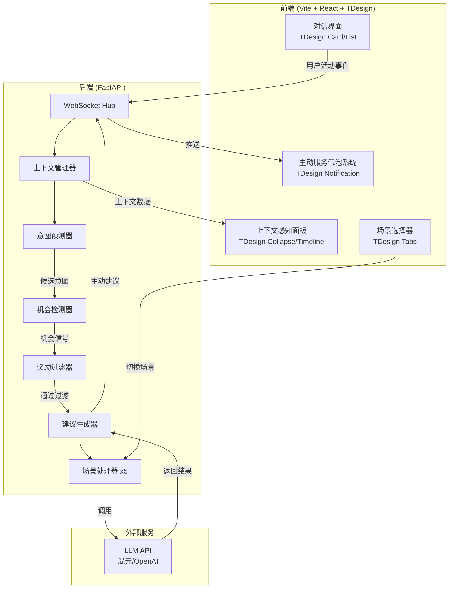

## 产品概述

**元宝主动服务Demo** —— 面向元宝C端用户的主动式AI服务创新方案。通过"感知-预判-服务"三层架构，让AI从被动响应升级为主动协作者，在搜索问答、写作、翻译、文档总结、生图五大日常场景中，无需用户触发即可实时识别机会点并主动提供服务。

## 核心功能

### 1. 主动服务气泡系统（非侵入式主动服务载体）

- 以悬浮气泡形式展示AI主动服务建议，不打断用户当前操作
- 支持展开/收起/忽略/采纳四种交互
- 气泡带有来源场景标签和置信度指示器

### 2. 五大主动服务场景

- **搜索问答 - 深度追问预判**：AI回答后主动分析追问方向，以主动服务气泡展示2-3个预判问题
- **写作 - 素材先行**：检测写作行为时主动收集素材；停顿超阈值时主动提供续写建议；检测专业术语时主动推送解释卡片
- **翻译 - 无感翻译**：检测到外文输入时主动准备翻译，输入框旁显示翻译预览气泡
- **文档总结 - 上传即总结**：文档上传完成瞬间主动启动总结，结果以卡片滑入，同时生成关键探索问题
- **生图 - 场景感知生图**：用户描述场景时主动生成配图建议，识别情绪/风格关键词主动匹配

### 3. 上下文感知面板

- 实时展示AI对用户当前上下文的理解（活动类型、关注点、情绪倾向）
- 展示用户偏好学习结果，增强透明度和信任感

### 4. 误报过滤机制

- 基于规则的第一层快速过滤 + LLM二次判断的奖励模型简化版
- 降低误报率，避免过度打扰用户

## 视觉效果

整体采用深色玻璃拟态风格，主动服务气泡以柔和发光的半透明卡片形式从侧边滑入，带有微动画呼吸效果。场景切换流畅自然，上下文面板以实时更新的数据流形式展示AI的"思考过程"，营造科技感与温度感并存的体验。

## 技术栈

- **前端**：Vite 5 + React 18 + TypeScript 5
- **UI组件库**：TDesign React（唯一UI框架，所有组件和动画均使用TDesign，不引入任何额外UI/动画库）
- **状态管理**：React Context + useReducer（无需额外状态管理库）
- **图标**：tdesign-icons-react（TDesign官方图标库）
- **后端**：Python 3.11+ + FastAPI + WebSockets
- **LLM调用**：OpenAI兼容API（支持混元/OpenAI），用于意图预测和服务生成

## 技术选型理由

- **Vite 5**：启动快、HMR即时，遵循环境构建规范，适合快速搭建Demo
- **TDesign React**：腾讯官方设计系统，与元宝同源；组件齐全，一套框架覆盖全部UI+动画需求：
- 主动服务气泡 → TDesign Notification（内置滑入/退出动画、自定义content、多条堆叠、footer操作区）
- 消息流 → TDesign Card + List
- 场景切换 → TDesign Tabs（内置切换过渡动画）
- 上下文感知面板 → TDesign Collapse（展开/收起动画）+ Timeline
- 场景详情弹窗 → TDesign Dialog（内置弹入/弹出动画）
- 主动服务详情面板 → TDesign Drawer（内置侧滑动画）
- 输入栏 → TDesign Input + Upload + Button
- 状态指示器 → TDesign Tag + Badge + Loading
- 加载/思考中 → TDesign Loading + Skeleton（骨架屏闪烁动画）
- 翻译预览气泡 → TDesign Popup（弹出层，支持hover/click触发，内置过渡动画）
- **FastAPI**：异步高性能，与LLM生态无缝对接，自动生成API文档便于调试
- **WebSocket**：实现主动服务的实时推送，是"主动服务"体验的技术基础

## 实现方案

### 核心架构：感知-预判-服务三层管线

```
用户活动 → [感知层]上下文采集 → [预判层]意图预测+机会检测 → [过滤层]奖励模型过滤 → [服务层]建议生成 → WebSocket推送 → 主动服务气泡展示
```

### 后端核心组件设计

1. **ContextManager**：维护用户当前活动状态、历史交互、偏好画像
2. **IntentPredictor**：调用LLM分析当前上下文，生成候选意图列表
3. **OpportunityDetector**：基于规则引擎+LLM判断是否存在主动服务机会
4. **RewardFilter**：简化版奖励模型，两层过滤降低误报率
5. **SuggestionGenerator**：生成具体的主动服务建议内容
6. **ScenarioHandler**（5个场景各一个）：封装场景特定的感知和预判逻辑

### 前端核心设计

1. **ChatInterface**：模拟元宝对话界面，基于TDesign Card + List构建消息流
2. **ProactiveBubble**：主动服务气泡，直接使用TDesign Notification（内置滑入/退出动画，content放SuggestionCard，footer放采纳/忽略按钮，duration:0常驻不消失）
3. **ContextPanel**：基于TDesign Collapse（展开/收起动画）+ Timeline展示AI实时上下文理解
4. **ScenarioSelector**：基于TDesign Tabs（内置切换过渡动画）实现5大场景切换

### TDesign 深色玻璃拟态主题方案

- 通过TDesign CSS变量覆盖实现深色主题，不引入额外CSS框架
- 关键变量覆盖：`--td-bg-color-page`、`--td-bg-color-container`、`--td-text-color-primary`等
- 玻璃拟态效果：通过自定义CSS（backdrop-filter、rgba背景、发光阴影）对TDesign Card/Dialog组件做样式增强
- 所有自定义样式以CSS Modules或inline style方式编写，不依赖Tailwind

### 关键技术决策

- **单一UI系统**：完全使用TDesign React，不引入Tailwind，避免两套样式系统冲突
- **WebSocket vs HTTP轮询**：选择WebSocket，主动服务需要实时推送，轮询延迟过大且浪费资源
- **规则+LLM双层过滤**：纯LLM误报率高（参考ProActive Agent研究结论），先用规则快速过滤明显无需求场景，再由LLM精判
- **模拟场景 vs 真实集成**：Demo阶段采用模拟用户行为的场景脚本驱动，降低复杂度同时完整展示主动服务体验

### 性能考量

- LLM调用延迟控制：意图预测使用轻量prompt，控制在2-3秒内返回
- 前端动画性能：TDesign组件内置CSS transition动画，浏览器GPU加速，无需额外动画库
- WebSocket连接管理：心跳保活 + 断线重连
- TDesign按需引入：ES模块tree-shaking自动按需加载，减小打包体积

## 架构图



## 目录结构

```
yuanbao-proactive/
├── frontend/                              # 前端项目
│   ├── src/
│   │   ├── App.tsx                        # [NEW] 根组件，布局编排
│   │   ├── main.tsx                       # [NEW] 应用入口，TDesign样式引入
│   │   ├── index.css                      # [NEW] 全局样式，TDesign深色主题CSS变量覆盖 + 玻璃拟态自定义类
│   │   ├── components/
│   │   │   ├── chat/
│   │   │   │   ├── ChatInterface.tsx      # [NEW] 对话界面主容器，管理消息流和WebSocket连接
│   │   │   │   ├── MessageList.tsx        # [NEW] 消息列表，基于TDesign List，支持流式渲染
│   │   │   │   ├── MessageBubble.tsx      # [NEW] 单条消息气泡，区分用户/AI消息样式
│   │   │   │   └── InputBar.tsx           # [NEW] 输入栏，基于TDesign Input+Upload+Button
│   │   │   ├── proactive/
│   │   │   │   ├── ProactiveBubble.tsx      # [NEW] 主动服务气泡，直接使用TDesign Notification(content+SuggestionCard, footer=采纳/忽略, duration=0)
│   │   │   │   ├── ProactivePanel.tsx     # [NEW] 主动建议面板，管理多个气泡排列和优先级
│   │   │   │   └── SuggestionCard.tsx     # [NEW] 建议卡片，基于TDesign Card展示具体服务内容
│   │   │   ├── scenario/
│   │   │   │   ├── ScenarioSelector.tsx   # [NEW] 场景切换器，基于TDesign Tabs实现5大场景tab
│   │   │   │   └── ScenarioStage.tsx      # [NEW] 场景舞台，根据选中场景渲染对应演示内容
│   │   │   └── common/
│   │   │       ├── Header.tsx             # [NEW] 顶部导航栏，Logo+连接状态指示器
│   │   │       └── ContextIndicator.tsx   # [NEW] 上下文指示器，TDesign Tag+Badge显示AI感知状态
│   │   ├── lib/
│   │   │   ├── api.ts                     # [NEW] API客户端，封装HTTP和WebSocket调用
│   │   │   ├── types.ts                   # [NEW] 全局TypeScript类型定义
│   │   │   ├── scenarios.ts              # [NEW] 场景配置数据，5大场景元信息和脚本
│   │   │   └── store.ts                   # [NEW] React Context + useReducer状态管理
│   │   └── theme/
│   │       └── dark-glass.css            # [NEW] TDesign深色玻璃拟态主题覆盖，CSS变量+玻璃效果类
│   ├── index.html                         # [NEW] HTML入口
│   ├── package.json                       # [NEW] 依赖配置
│   ├── tsconfig.json                      # [NEW] TypeScript配置
│   ├── tsconfig.app.json                  # [NEW] TypeScript App配置
│   └── vite.config.ts                     # [NEW] Vite配置，TDesign按需引入
├── backend/                               # 后端项目
│   ├── main.py                            # [NEW] FastAPI应用入口，CORS配置，路由注册
│   ├── config.py                          # [NEW] 配置管理，LLM API Key、模型选择等
│   ├── api/
│   │   ├── routes.py                      # [NEW] REST API路由，场景列表、历史记录等
│   │   └── websocket.py                   # [NEW] WebSocket端点，实时双向通信核心
│   ├── core/
│   │   ├── context_manager.py             # [NEW] 上下文管理器，维护用户活动状态、历史、偏好画像
│   │   ├── intent_predictor.py           # [NEW] 意图预测器，调用LLM分析上下文生成候选意图
│   │   ├── opportunity_detector.py        # [NEW] 机会检测器，规则引擎+LLM判断主动服务机会
│   │   ├── reward_filter.py              # [NEW] 奖励过滤器，两层过滤降低误报率
│   │   └── suggestion_generator.py       # [NEW] 建议生成器，调用LLM生成具体服务建议内容
│   ├── models/
│   │   └── schemas.py                    # [NEW] Pydantic数据模型，请求/响应/WebSocket消息定义
│   ├── prompts/
│   │   └── templates.py                  # [NEW] LLM提示词模板，意图预测、机会判断、建议生成
│   ├── scenarios/
│   │   ├── base_scenario.py              # [NEW] 场景基类，定义统一接口
│   │   ├── search_scenario.py            # [NEW] 搜索问答场景-追问预判逻辑
│   │   ├── writing_scenario.py           # [NEW] 写作场景-素材先行逻辑
│   │   ├── translation_scenario.py       # [NEW] 翻译场景-无感翻译逻辑
│   │   ├── document_scenario.py         # [NEW] 文档总结场景-上传即总结逻辑
│   │   └── image_scenario.py            # [NEW] 生图场景-场景感知生图逻辑
│   └── requirements.txt                 # [NEW] Python依赖
└── README.md                            # [NEW] 项目说明文档
```

## 实现要点

- **单一UI系统**：完全使用TDesign React，通过CSS变量覆盖实现深色玻璃拟态主题，不引入Tailwind，所有布局用TDesign Layout/Space + 原生Flexbox
- **TDesign深色主题**：覆盖`--td-bg-color-page: #0A0E27`、`--td-bg-color-container: rgba(17,22,50,0.8)`等变量，玻璃效果用`backdrop-filter: blur(20px)`+半透明背景
- **WebSocket消息协议**：定义统一消息格式 `{type, scenario, payload, timestamp}`，type区分用户活动事件和主动服务推送
- **场景脚本驱动**：每个场景预置模拟用户行为脚本，按时间线触发事件，让Demo可重复演示
- **LLM调用优化**：意图预测prompt精简化，限制max_tokens=200；建议生成支持流式返回
- **主动服务气泡**：直接使用TDesign Notification，内置滑入/退出动画，通过CSS变量覆盖实现深色玻璃拟态外观
- **翻译预览气泡**：使用TDesign Popup弹出层，hover/click触发，内置过渡动画
- **加载/思考中状态**：使用TDesign Loading旋转动画 + Skeleton骨架屏闪烁动画
- **TDesign按需引入**：配置`babel-plugin-import`实现组件按需加载，减小打包体积
- **错误处理**：LLM调用失败时降级为规则建议，WebSocket断线时展示重连提示

## 设计风格

采用**深色玻璃拟态（Glassmorphism）**风格，灵感来源于元宝APP的科技感视觉语言。通过覆盖TDesign CSS变量实现统一深色主题，玻璃效果使用backdrop-filter+rgba半透明背景+发光阴影。主动服务气泡以发光浮动卡片形式从侧边滑入，带有呼吸式微光动画。

## 页面规划

### 页面1：主演示页

- **顶部导航栏**：左侧Logo"元宝主动服务Demo"+ 右侧连接状态指示器（TDesign Tag圆点）
- **场景选择器区**：基于TDesign Tabs，5个场景tab横向排列（搜索/写作/翻译/文档/生图），选中态带发光边框
- **对话主体区**：中央对话界面，基于TDesign Card+List构建消息流，支持流式渲染
- **主动服务气泡层**：基于TDesign Notification，内置滑入动画，content放建议卡片，footer放采纳/忽略按钮，duration=0常驻
- **上下文感知面板**：右侧固定面板，基于TDesign Collapse+Timeline，实时展示AI感知状态
- **底部输入栏**：TDesign Input+Upload+Button组合

### 页面2：场景详情浮层

- 基于TDesign Dialog全屏模态，展示场景流程图和设计理念，支持切换到实时演示

### 页面3：主动服务详情面板

- 基于TDesign Drawer侧边抽屉，展示完整用户画像、历史主动服务记录、AI思考时间线

## 布局设计

三栏布局：左侧场景导航(200px) + 中央对话区(flex-1) + 右侧上下文面板(320px)，使用原生Flexbox

## Agent Extensions

### Skill

- **多模态内容生成**
- Purpose: 为Demo界面生成演示用的图片素材（如生图场景的示例输出、写作场景的素材配图、文档总结的场景图）
- Expected outcome: 生成5-8张与各场景匹配的高质量演示图片，用于主动服务气泡中的建议卡片展示

- **pptx**
- Purpose: 在开发完成后，生成比赛路演用的PPT演示文稿，包含方案概述、技术架构、场景演示截图、创新亮点
- Expected outcome: 产出一份15-20页的专业比赛演示PPT