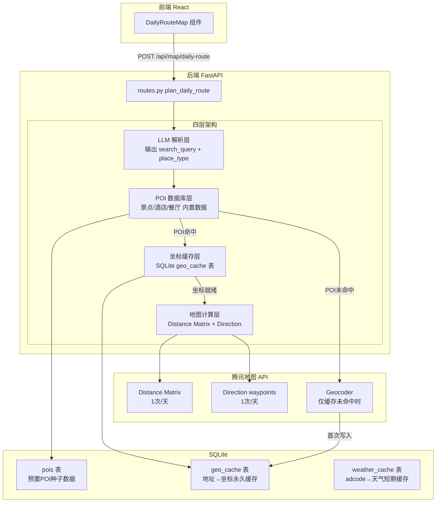

## 用户需求

将旅游Agent的腾讯地图API调用从当前每次规划约12-14次降至理想2次，核心改造为四层架构：

### 当前问题

- `plan_daily_route`：对每个日程地点调用 `place_search()`（4-6次/天）+ geocode兜底 + 每段路线 `direction_driving()`（3-5次/天）+ `get_weather()` 内部调用3次API
- `plan_travel_route`：geocode每个城市+途经点 + direction每段 + get_weather 3次
- `get_weather()` 即使 `_CITY_COORDS` 已有坐标仍调 geocode API
- 无任何缓存，切换日期查看全部重调

### 目标架构（四层）

1. **LLM层**：解析用户需求，输出 `search_query` + `place_type`（不生成虚构地名）
2. **POI数据库层**：景点/酒店/餐厅/门票数据内置，直接查询，不调地图搜索
3. **坐标缓存层**：地址→坐标永久缓存到SQLite，首次geocode后永不重复
4. **腾讯地图计算层**：仅负责 Distance Matrix（1次）+ Direction waypoints（1次）

### 目标API调用量

- 缓存命中时：0次Place Search + 0次Geocoder + 1次Distance Matrix + 1次Direction = **2次**
- 缓存未命中（新POI）：+1次Place Search + 1次Geocoder = **4次**（仅首次）

### 十条原则落地

- 景点/酒店/餐厅预置数据库，不调Place Search
- 坐标永久缓存到SQLite，不重复Geocode
- 路线用Direction waypoints一次解决（非逐段调用）
- 距离矩阵批量计算替代逐对Direction
- 预算来自数据库（门票/酒店/餐饮），地图只估算交通费

## 技术栈

- **后端**：Python 3.11+ / FastAPI / SQLite（aiosqlite，现有）- 不引入Redis，用SQLite代替
- **前端**：React 18 + TDesign（现有，仅适配接口变化）
- **腾讯地图**：Web Service API（现有key `REMOVED_TENCENT_MAP_KEY`）
- **LLM**：DeepSeek（现有）

## 实现方案

### 核心策略：POI数据库 + 坐标缓存 + 批量路线

当前每次规划调用约12-14次地图API。改造后分三步：

1. **POI种子数据**：内置北京/杭州/西安/成都/上海等热门城市的景点/餐厅/酒店数据（含地址、门票、费用），直接数据库查询，0次API
2. **坐标缓存**：所有 geocode 结果存入 SQLite `geo_cache` 表，首次调用后永久缓存，后续0次
3. **路线合并**：腾讯 Direction API 支持 `waypoints` 参数，一天N个地点只需1次API调用（非N-1次）；距离矩阵API支持批量from/to，一次返回全部点对距离

### 改造前后对比

| 操作 | 改造前 | 改造后 |
| --- | --- | --- |
| 地点查找 | Place Search ×6-8 | POI数据库查询 ×0 |
| 坐标获取 | Geocode ×6-8（每次重新调） | Geocode ×0（缓存命中）/ ×1-2（首次） |
| 路线规划 | direction_driving ×5-7（逐段） | direction_driving ×1（waypoints） |
| 距离计算 | 无 | distance_matrix ×1（批量） |
| 天气查询 | geocode + 逆geocode + weather ×3 | weather ×1（adcode缓存） |
| **总计/天** | **~14次** | **~2次**（缓存命中）/ **~4次**（首次） |


### 关键技术决策

1. **SQLite代替Redis**：项目已用aiosqlite，不引入新依赖。`geo_cache` 表 + `pois` 表，索引优化查询
2. **Direction waypoints**：腾讯地图 `/ws/direction/v1/driving/` 支持 `waypoints` 参数（最多16个途经点），用 `;` 分隔多个 `lat,lng`。一天路线一次性请求
3. **Distance Matrix批量**：腾讯地图 `/ws/distance/v1/` 支持 `from` 和 `to` 传多个坐标（`;` 分隔），一次返回 N×N 距离矩阵。用于TSP最近邻排序优化路线顺序
4. **POI种子数据**：Python字典内嵌热门城市POI，启动时写入SQLite，覆盖北京/杭州/西安/成都/上海5个城市，每个城市约15-20个POI（景点+餐厅+酒店+交通枢纽）

## 实现细节

### POI种子数据结构

```python
# backend/services/poi_data.py
POI_SEED = {
  "杭州": [
    {"name": "灵隐寺", "address": "杭州市西湖区灵隐路法云弄1号", "category": "scenic",
     "ticket": 75, "stay_time": 120, "cost_estimate": 75, "place_type": "scenic"},
    {"name": "楼外楼", "address": "杭州市西湖区孤山路30号", "category": "restaurant",
     "ticket": 0, "stay_time": 90, "cost_estimate": 200, "place_type": "restaurant"},
    ...
  ]
}
```

### 坐标缓存查询

```python
async def get_coords(address: str) -> dict:
    # 1. 查SQLite geo_cache表
    cached = await db.execute("SELECT lat, lng FROM geo_cache WHERE address = ?", (address,))
    if cached: return {"lat": cached[0], "lng": cached[1]}
    # 2. 缓存未命中 → 调一次geocode API
    coords = await map_service.geocode(address)
    # 3. 写入缓存
    await db.execute("INSERT OR REPLACE INTO geo_cache (address, lat, lng) VALUES (?, ?, ?)", ...)
    return coords
```

### Direction waypoints 路线

```python
async def direction_with_waypoints(points: list[dict]) -> dict:
    # points = [{lat, lng, name}, ...]
    from_str = f"{points[0]['lat']},{points[0]['lng']}"
    to_str = f"{points[-1]['lat']},{points[-1]['lng']}"
    waypoints = ";".join(f"{p['lat']},{p['lng']}" for p in points[1:-1])
    resp = await client.get(f"{base}/ws/direction/v1/driving/", params={
        "from": from_str, "to": to_str, "waypoints": waypoints, "key": key
    })
    # 一次API返回完整路线
```

### 性能分析

- **POI查询**：SQLite索引查询 <1ms，0次API调用
- **坐标缓存**：SQLite查询 <1ms，命中时0次API
- **路线规划**：1次Direction API（含waypoints），替代原来的5-7次逐段调用
- **距离矩阵**：1次API返回N×N矩阵，本地TSP排序 <1ms
- **天气缓存**：adcode存入geo_cache，避免重复geocode+逆geocode

### 日志策略

- 在 `plan_daily_route` 入口和出口记录API调用次数（`[MapAPI] called N times`）
- 缓存命中时记录 `[Cache] hit: 灵隐寺`
- 缓存未命中时记录 `[Cache] miss → geocode: 灵隐寺`

## 架构设计



## 目录结构

```
backend/
├── services/
│   ├── poi_data.py            # [NEW] POI种子数据：5城市×15-20个POI（景点/餐厅/酒店/交通）
│   ├── poi_service.py         # [NEW] POI查询服务：按城市+类别查SQLite，回退到place_search+缓存
│   ├── geo_cache.py           # [NEW] 坐标缓存服务：get_coords(address) → 查缓存/调geocode/写缓存
│   ├── map_service.py         # [MODIFY] 新增 direction_with_waypoints()、batch_distance_matrix()；get_weather()用缓存adcode
│   └── ...                    # 其他服务不变
├── database/
│   ├── init_db.py             # [MODIFY] 新增 pois 表、geo_cache 表、weather_cache 表建表语句
│   └── connection.py         # 不变
├── api/
│   └── routes.py              # [MODIFY] 重写 plan_daily_route：POI查询→坐标缓存→距离矩阵→TSP排序→Direction一次
├── prompts/
│   └── templates.py           # [MODIFY] TRAVEL prompt：search_query改为与POI库匹配的查询词
└── ...                        # 其他文件不变

frontend/
├── src/
│   └── services/
│       └── api.ts             # [MODIFY] planDailyRoute 返回类型适配：locations 增加 ticket/stay_time 字段
│   └── components/
│       └── travel/
│           └── DailyRouteMap.tsx  # [MODIFY] 适配新的 locations 数据结构（含POI详情）
```

### 文件改动详情

#### `backend/services/poi_data.py` [NEW]

- 内嵌5个热门城市（北京/杭州/西安/成都/上海）的POI种子数据
- 每个城市15-20个POI：景点5-8个、餐厅5-6个、酒店3-4个、交通枢纽2-3个
- 每个POI包含：name, address, category, ticket, stay_time, cost_estimate, place_type
- 提供函数 `seed_pois()` 将种子数据写入SQLite

#### `backend/services/poi_service.py` [NEW]

- `query_pois(city, keyword, category)` → 查SQLite pois表
- `match_poi(city, search_query)` → 模糊匹配POI名称，返回最佳匹配+备选2-3个
- `get_poi_coords(poi)` → 查geo_cache，未命中调geocode并缓存
- 缓存未命中时调 `map_service.place_search()` 搜索一次，取结果写入pois表（自动扩充POI库）

#### `backend/services/geo_cache.py` [NEW]

- `get_coords(address: str)` → 查SQLite geo_cache表，命中返回，未命中调geocode API
- `cache_coords(address, lat, lng)` → 写入缓存
- `get_adcode(city: str)` → 查缓存，未命中调geocode获取adcode并缓存
- 内存级LRU缓存（dict）+ SQLite持久化双保险

#### `backend/services/map_service.py` [MODIFY]

- 新增 `direction_with_waypoints(points: list[dict])` → 调用 `/ws/direction/v1/driving/` 带 `waypoints` 参数，一次API返回完整路线
- 新增 `batch_distance_matrix(points: list[dict])` → 调用 `/ws/distance/v1/` 批量from/to，返回N×N矩阵
- 修改 `get_weather()` → 先查geo_cache获取adcode（不重复geocode），天气结果短期缓存（30分钟）
- 删除 `plan_travel_route()` 中的逐段direction调用，改为waypoints模式

#### `backend/api/routes.py` [MODIFY]

- 重写 `plan_daily_route()`：

1. 对每个日程地点调 `poi_service.match_poi(city, search_query)` → POI数据库查询
2. 对每个POI调 `geo_cache.get_coords(address)` → 获取坐标（缓存命中0次API）
3. 调 `map_service.batch_distance_matrix(points)` → 1次API获取N×N距离矩阵
4. 本地TSP最近邻算法优化路线顺序
5. 调 `map_service.direction_with_waypoints(points)` → 1次API获取完整路线polyline
6. 费用 = POI门票/餐饮/酒店 + 路线交通费估算

- 返回数据增加 `api_calls` 字段，记录本次调用了几次地图API

#### `backend/database/init_db.py` [MODIFY]

- 新增3张表：
- `pois` (id, city, name, address, category, ticket, stay_time, cost_estimate, place_type, lat, lng, created_at)
- `geo_cache` (address PRIMARY KEY, lat, lng, adcode, created_at)
- `weather_cache` (city PRIMARY KEY, weather_json, updated_at)
- 启动时调用 `poi_service.seed_pois()` 写入种子数据

#### `backend/prompts/templates.py` [MODIFY]

- TRAVEL prompt 中 `search_query` 字段说明改为："写与POI库匹配的地点名称，如'灵隐寺'、'楼外楼'、'杭州东站'"
- 新增 `place_type` 枚举说明与POI category对应关系

#### `frontend/src/services/api.ts` [MODIFY]

- `DailyRouteLocation` 类型增加 `ticket`、`stay_time`、`cost_estimate` 字段
- `DailyRouteData` 增加 `api_calls` 字段

#### `frontend/src/components/travel/DailyRouteMap.tsx` [MODIFY]

- 路线地点列表显示门票价格
- 适配新的数据结构

## Agent Extensions

### SubAgent

- **code-explorer**
- Purpose: 在实现前验证 SQLite 表结构和 map_service 现有方法的精确签名，确保新增方法不破坏现有调用方
- Expected outcome: 确认所有调用 `map_service.geocode()`、`map_service.direction_driving()`、`map_service.place_search()` 的代码位置，确保改造不影响 `plan_route` 端点和 `RouteMap.tsx` 组件