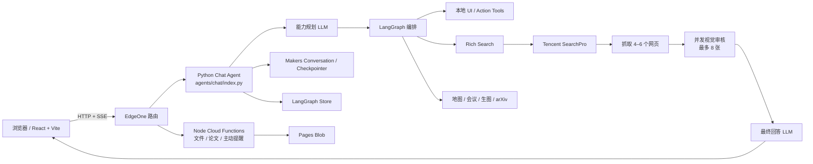
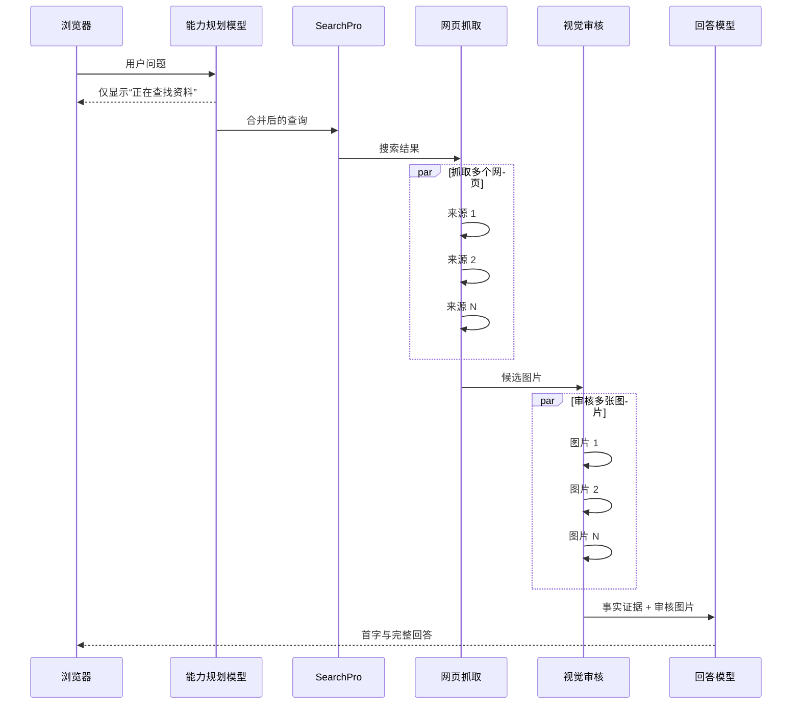
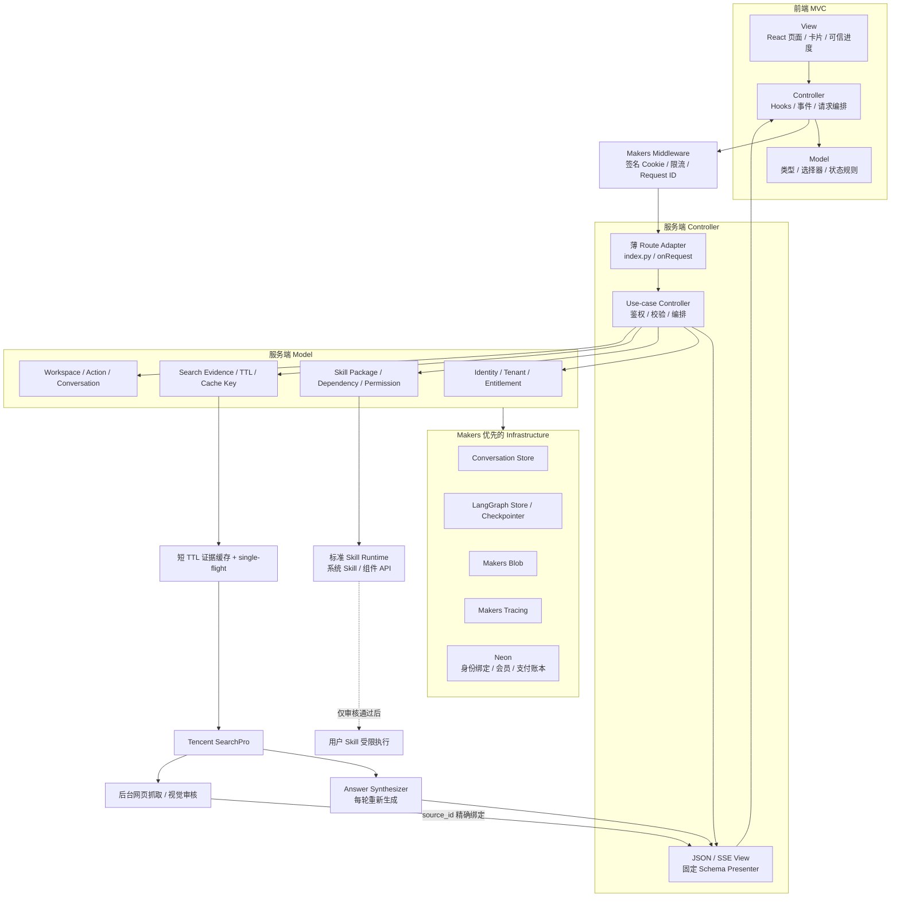
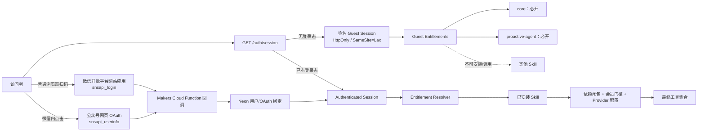
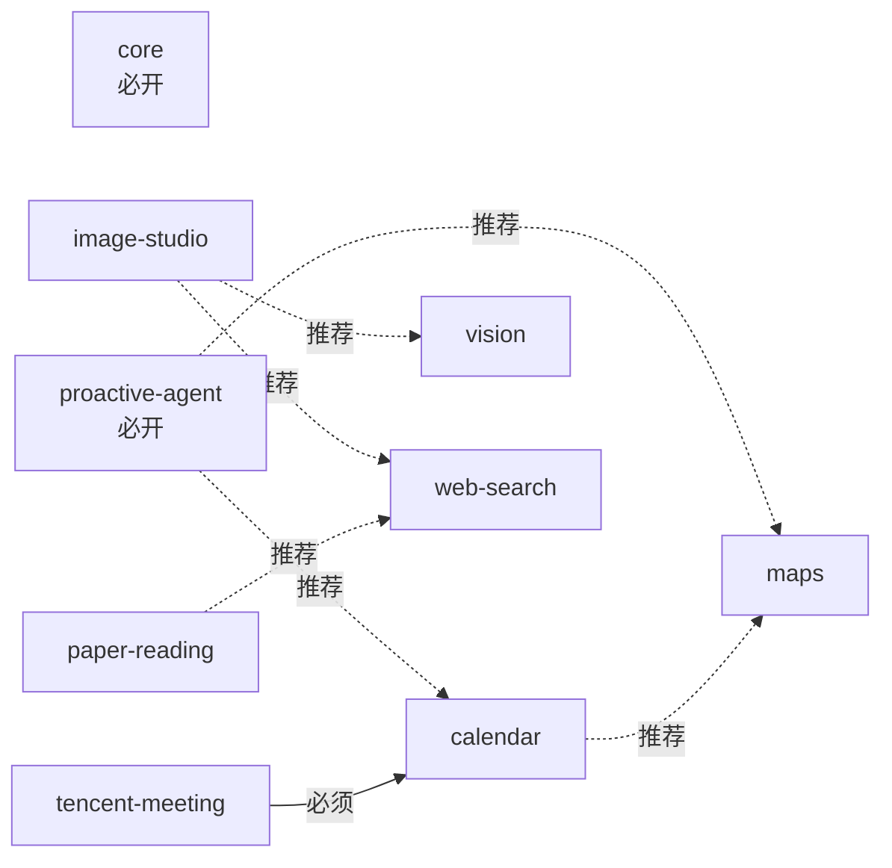
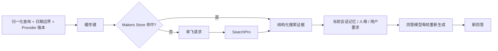
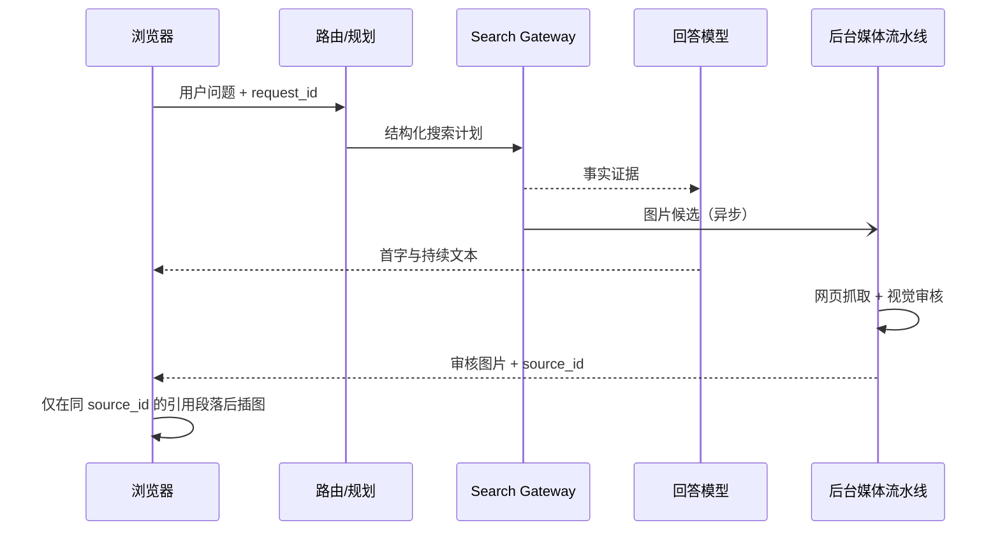

# FLORIS 架构审查与演进计划

> 基线：`main` 提交 `712fe07a1b41dc1ce2ba316838bba0e2d111d32a`
> 工作分支：`dev`
> 审查日期：2026-07-31
> 范围：线上体验、前后端与 Agent 全仓代码、搜索关键路径、部署配置和测试体系

## 1. 结论摘要

FLORIS 已经不是一个简单聊天页，而是一个以 LangGraph 为中枢、同时连接搜索、地图、日历、会议、论文、文档、图片和主动提醒的个人 Agent。当前架构的优点是能力覆盖完整、工具副作用边界明确、SSE 与断线恢复较扎实、单元测试数量充足。

当前最影响体验的问题不是“没有并行”，而是**并行任务仍然位于回答首字之前的关键路径**：

1. 每轮先调用一次能力规划模型。
2. 搜索轮等待 SearchPro。
3. 默认继续抓取 4–6 个结果网页。
4. 并发视觉审核最多 8 张候选图。
5. 上述媒体阶段全部完成后，最终回答模型才开始输出。

所以，即使第 3、4 步内部已经并行，用户仍要等待整段流水线。

本分支已完成第一阶段低风险改造：**搜索事实证据仍在关键路径，网页图片抓取与视觉审核改为渐进交付；只有图片生成需要审核后的参考图时才阻塞等待。**

在后续讨论中，产品目标已从单人演示扩展为可匿名使用、微信优先登录、多租户隔离、可安装 Skill 平台和未来会员体系。以下原则成为后续改造的硬约束：

1. **Makers 原生能力优先。** Conversation Store、LangGraph Checkpointer / Store、Blob、Cloud Functions、Agent Runtime、Tracing 和部署能力能复用就不自建。
2. **模型只负责生成，不负责安全边界。** 身份、租户、Skill 权限、依赖、会员权益、媒体插入与副作用确认都由确定性服务端规则执行。
3. **缓存证据，不缓存答案。** 缓存只能缩短搜索、规范化和业务决策准备时间；最终回答每轮都结合当前上下文重新生成。
4. **展示可验证进度，不展示原始思维链。** 用户看到阶段、工具、来源数量、耗时和降级状态，而不是模型内部隐式推理。
5. **`main` 始终保持发布基线。** 全部架构与实现工作只进入 `dev`，通过 Preview 和回归测试后再单独决定是否合并。
6. **采用适配 Serverless/React 的分层 MVC。** Model 不依赖 HTTP/React，Controller 只做鉴权、校验和用例编排，View 只负责 JSON/SSE Presenter 或 React 呈现；EdgeOne `index.py/onRequest` 保持为薄路由适配器。

截至本次 `dev` 实施，纯多用户身份、标准 Skill 包、全页 Skill 广场、组件 API、上传待审核、证据缓存/single-flight 和可信结构化进度均已进入代码；支付仍只保留接口，用户 Skill 审核执行与后台管理按约定未开放。

## 2. 线上体验记录

本次通过生产站点 `https://floris.jlutx.com/chatBot` 各执行一次真实请求。它们是单样本观察，不替代正式压测。

| 场景 | 请求 | 观察到完成 | 现象 |
| --- | --- | ---: | --- |
| 普通问答 | `1+1等于几？只回答结果。` | 约 11.3 秒 | 说明模型规划与回答本身已有较高固定成本 |
| 富搜索 | `最近 24 小时 AI 领域有哪些重要进展？请给出 3 条并注明来源。` | 约 29.5 秒 | 约 14.7 秒时仍只有“正在查找资料…”，尚无首字 |

搜索相对普通问答额外增加约 18.2 秒。结果可读、引用可点击并带图片，但本轮展示的来源全部落在同一个腾讯搜索聚合域名，来源独立性和第一方来源优先级仍需加强。

建议今后用服务端事件统一记录：

- `request_received`
- `plan_completed`
- `search_provider_completed`
- `answer_first_token`
- `answer_completed`
- `media_completed`
- `request_settled`

核心指标应是 `TTFT`、回答完成时间、搜索 Provider 时间、媒体阶段时间、成功率和取消率的 p50/p95，而不是只看整轮总时长。

## 3. 修改前架构（`main` 基线）



当前搜索关键路径：



## 4. 主要不足

### 4.1 P0：搜索媒体阻塞首字

- `agents/chat/index.py` 原先固定传入 `progressive_media=False`。
- 原 `agents/_shared/rich_search.py` 的 SearchPro、网页抓取、视觉审核按阶段串行；当前实现已迁至 application/domain/infrastructure 边界。
- 网页抓取和视觉审核各自内部并行，但整个媒体阶段仍在最终回答之前。
- 默认 `image_limit=8`，普通新闻问答也会付出完整视觉链路成本。

### 4.2 P0：`main` 基线的身份与数据隔离仅适合受控的个人部署

- Python `require_user()` 固定返回 `local-user / owner`。
- Node `currentUser()` 同样固定返回 `local-user / owner`。
- 如果站点没有平台层访问控制，所有访问者会共享会话归属、工作区和 Owner 能力。

若产品明确只供站长个人使用，应在 EdgeOne 前增加访问门禁并写入部署文档；若准备开放多用户，必须在新增功能前接入可信身份、租户前缀和服务端授权检查。

### 4.3 P1：编排层过度集中

- `agents/chat/index.py` 约 2500 行，承担请求解析、规划、状态加载、工具配置、SSE、持久化和后处理。
- `agents/chat/_ui_tools.py` 同时承载多个业务域适配器。
- 前端 `MessageBubble.tsx` 和全局样式也偏大。

这使性能策略、领域逻辑和协议逻辑耦合，修改一个搜索行为需要理解整条对话链路。

### 4.4 P1：网络层缺少复用和真正的取消

- 搜索与网页抓取使用 `urllib` + `asyncio.to_thread`。
- 没有共享异步连接池。
- `asyncio.wait_for` 超时后不能真正停止底层阻塞线程。
- 单页最多读取 5 MB，慢源可能继续占用线程和连接。

### 4.5 P1：搜索质量与缓存策略不足

- 相同或近似问题跨轮次会再次访问 Provider。
- 当前线上样本的来源域名集中，缺少第一方来源优先和域名多样性约束。
- `result_limit` 主要在 Provider 返回后本地截断，不能保证减少上游工作量。

缓存不应简单恢复成长期答案缓存，而应使用短 TTL 的“检索证据缓存”，并把时效边界、用户要求和 Provider 版本纳入 key。

### 4.6 P2：缺少性能回归门禁

当前测试对功能正确性覆盖很好，但还缺少：

- 搜索 TTFT / p95 预算；
- Provider 慢、媒体超时、取消等故障注入；
- 浏览器级关键流程测试；
- 前端 bundle 体积门禁。

当前主应用构建产物约 1.25 MB（gzip 约 369 KB），PDF worker 约 1.30 MB，仍有进一步按路由和能力懒加载的空间。

## 5. 目标架构



### 5.0 MVC 在本项目中的边界

这里采用的不是传统服务端模板 MVC，而是与 EdgeOne Agent Runtime、Cloud Functions 和 React 相匹配的分层 MVC：

| 层 | Python Agent | Cloud Functions | React |
| --- | --- | --- | --- |
| Model | `agents/_domain/` 与 `_application/` 中无 HTTP 依赖的用例 | `auth/`、权益、身份 Repository、领域规则 | `frontend/src/features/*/model/`、类型、选择器 |
| Controller | `agents/_controllers/`；Route 入口只委托 | `onRequest` 只做协议适配并调用身份/存储用例 | `use*Controller.ts` Hooks 负责请求、状态和用户动作 |
| View | `agents/_presenters/` 的 JSON/SSE Presenter；`_views/` 仅保留兼容出口 | 固定 JSON Response Presenter | `features/*/view/` 与共享组件只渲染 Controller 状态 |

依赖方向必须保持 `Route → Controller → Model/Repository → View Presenter`。Model 不读取 `ctx.request`、不构造 React 元素；View 不直接访问 Provider、数据库或 `authorizedFetch`。大文件按功能逐步迁移，避免一次性重写 2500 行 Chat Agent 造成行为回归。

### 5.1 Makers 能力映射与不造轮子边界

| 需求 | 首选能力 | 决策 |
| --- | --- | --- |
| 对话消息、会话索引 | Makers Conversation Store | 直接复用 `userId` 索引；服务端补充 `tenant_id/owner_user_id` 校验 |
| LangGraph checkpoint、用户偏好、工作区 | Makers Checkpointer / LangGraph Store | 直接复用；所有 namespace 由可信身份派生 |
| Skill 包、用户上传、图片与文档 | Makers Blob | 直接复用；安装元数据强一致读，公开资源按需使用最终一致 |
| Agent 编排与长任务 | Makers Agent Runtime | 直接复用，不另建常驻 Agent 服务 |
| OAuth 回调、权益 API、Webhook | Makers Cloud Functions | 直接复用，密钥只在服务端环境变量 |
| 日志、链路阶段、模型与工具追踪 | Makers Tracing | 直接复用，并补充产品级 TTFT 指标 |
| 小型边缘配置、限流计数 | Makers KV | 仅在 Edge Functions 使用；不作为 Python Agent 主数据库 |
| 微信身份唯一性、租户成员关系、订单和支付幂等 | Neon Serverless Postgres | Makers 官方认证方案使用的事务型数据库；仅保存 Makers Store 不适合承担的关系/账本数据 |
| 页面与 SSE 网络加速 | EdgeOne 个人版 | 静态资源长缓存、HTTP/3/智能加速；动态聊天和用户数据禁止 CDN 缓存 |

Makers Blob 可以保存结构化 JSON，但用户唯一约束、OAuth 账号绑定、订单幂等和支付账本需要事务与唯一索引，因此不把 Blob 强行改造成关系数据库。Neon 是补位层，不会复制 Conversation、Checkpoint、Blob 或 Trace。

### 5.2 身份、租户与匿名能力



身份载荷至少包含：

```text
tenant_id
user_id
auth_type: guest | wechat
roles
membership: guest | free | plus | pro
session_version
expires_at
```

规则：

1. 浏览器不能通过 Header 自报 `tenant_id/user_id/roles/membership`。
2. Middleware 做低成本早拒绝，Agent 和 Cloud Function 在业务入口再次验证签名会话。
3. 匿名用户获得稳定但可过期的 Guest ID，只能运行 `core` 与 `proactive-agent`；后端工具构造仍是最终权限边界。
4. 微信 `AppSecret`、OAuth access token 和 Skill 私密凭据从不进入前端或普通日志。
5. Conversation、Store 和 Blob 的 key 都从服务端身份派生；所有写操作再次校验资源 owner。
6. 多用户是唯一运行模式，不保留固定 Owner 或单用户兼容分支；部署必须配置签名密钥，微信与数据库未配置时仍可签发 Guest 会话。

### 5.3 标准 Skill 平台

`main` 基线的 `manifest.py` 只是内部 Python 配置，并不是真正可分发的 Skill。`dev` 已删除这套双重清单，运行时只读取标准 `SKILL.md` 与 Floris 扩展 `floris.json`：

```text
skill-name/
├── SKILL.md                 # Agent Skills 标准：name + description + 指令
├── floris.json              # Floris 扩展：版本、依赖、权限、组件 API、会员门槛
├── scripts/                 # 可选；审核后进入受限执行环境
├── references/              # 可选；按需加载
└── assets/                  # 可选；模板、图标、静态资源
```

`SKILL.md` 遵循开放的 [Agent Skills Specification](https://agentskills.io/specification)，并采用渐进加载：

1. 启动时只读取 `name + description`。
2. Skill 被路由命中后才加载正文指令。
3. `references/scripts/assets` 仅在确有需要时加载。

`floris.json` 是平台扩展，不篡改开放标准。当前 schema v2 已声明：

```text
schema_version, id, version, kind(system|user), publisher
capabilities, tools, component_actions
permissions, requires, recommends, degrade_when_capabilities
required_plan, default_enabled, locked
adapter, preference_hook, env_keys, provider_env, credential
```

`conflicts`、版本校验和、最低运行时版本、审核签名和撤回状态属于用户 Skill 执行阶段的后续 schema；在审核后台上线前不伪造这些能力。

组件调用不暴露 DOM 或任意后端对象，而是使用版本化的受限 Action：

```text
chat.progress.publish
search.evidence.publish
search.media.publish
workspace.action.propose
workspace.state.read
files.scoped.read / files.scoped.upload
maps.place.select
calendar.change.propose
image.result.publish
```

系统 Skill 可以申请全部已注册接口；用户 Skill 只能调用清单声明、审核批准、运行时再次授权的接口。未知权限、未知组件、循环依赖、版本不满足或会员权益不足时一律失败关闭。

当前依赖图：



Skill 广场目标页面包括：

- 全部 / 已安装 / 系统 Skill / 社区 Skill 分类；
- 搜索、能力标签、版本、发布者、审核状态和会员门槛；
- 安装、卸载、启用、停用、更新和依赖自动安装预览；
- 依赖图、循环/冲突提示和“为何不可安装”说明；
- 系统组件 API 文档、最小 Skill 模板和本地校验说明；
- 用户上传到 Makers Blob，状态为 `pending_review`；后台审核未完成前绝不进入运行时；
- 版本锁定、校验和、撤回/隔离、回滚和兼容性检查；
- 评分、收藏、下载量、权限变更提示、发布者签名等后续能力。

### 5.4 缓存边界



允许缓存：

- Provider 原始/规范化结果、来源去重结果、发布日期核验；
- 视觉审核结论、公开页面提取结果；
- 确定性的业务解析中间结果；
- TTL、Provider 版本、来源和生成时间。

禁止缓存：

- 最终回答文本、语气、人格化表达；
- 包含当前私密会话、长期记忆或未脱敏用户数据的 Prompt；
- 模型隐式推理；
- 副作用执行结果的“可重复执行”假象。

当前实现中，时效/严格日期内容 TTL 为 2 分钟，普通证据 10 分钟，深度检索 15 分钟；Provider 版本、搜索深度、日期边界、结果数和媒体策略全部进入 key。后续可由真实命中率与陈旧率再调整。缓存命中后依然进入 Answer Synthesizer。

### 5.5 会员与支付预留

第一阶段只定义接口和权益，不发起真实扣款：

```text
MembershipPlan: guest | free | plus | pro
EntitlementProvider.resolve(identity)
BillingProvider.createCheckout(...)
BillingProvider.verifyWebhook(...)
BillingProvider.listTransactions(...)
```

Skill 使用资格、模型档位、搜索深度、并发数和配额全部通过 entitlement 解析，不在前端硬编码。未来支付回调必须具备签名校验、订单唯一键、幂等写入、金额/币种核对和审计日志；在这些条件具备前，UI 只显示“即将开放”，不能模拟充值成功。

### 5.6 用户可见的“思考过程”

不展示或保存模型原始 chain-of-thought。SSE 只发布由编排器生成的结构化事件：

```text
request_received
planning
plan_completed
search_started
evidence_received
source_validation
answer_synthesis
answer_streaming
media_review
completed / degraded / failed
```

每个事件只包含 `stage/status/activity/source` 固定枚举。前端文案从本地 i18n 表生成，不接收模型自由文本；请求发出时立即显示客户端 `planning`，服务端随后确认检索、核验、综合和完成阶段。它让等待有反馈，但明确不是模型隐藏思维链。

目标搜索时序：



## 6. 分阶段修改优先级

### P0-A：把媒体移出搜索回答关键路径（本分支已实施）

改动：

1. 新增集中策略 `progressive_media_for_plan()`。
2. 普通富搜索在 SearchPro 返回证据后即可进入回答生成。
3. 网页抓取与视觉审核继续后台运行，通过既有 `search_media` SSE 事件合并。
4. 模型只输出正文和普通来源链接，不生成任何内部媒体占位符，也不自行拼接图片 Markdown。
5. 每张审核图片携带稳定 `source_id`；前端只在引用同一来源的段落后插入图片，来源 URL 或 ID 不一致时直接放弃。
6. 审核前的 Provider 预览不进入正文；审核失败或正文没有精确来源引用时不插图。
7. 图片生成仍等待审核图片，因为这些图片会作为生成 Provider 的输入参考。
8. `search_config.media_delivery` 暴露 `disabled / progressive / blocking`，便于诊断。

验收标准：

- 搜索事实和引用不减少。
- 标准搜索的最终回答模型不再等待 `page_media + vision`。
- 新回答内容中不存在 `YUANBAO_MEDIA` 等内部协议。
- 图片必须同时满足视觉审核、`source_id` 匹配和正文精确引用；否则不插入。
- 生图参考链路仍只使用审核后的 HTTPS 图片。
- 媒体失败不影响文字回答。

### P0-B：建立性能可观测性和预算

建议下一步：

1. 为每轮生成稳定 `request_id`，贯穿前端、Agent、Provider 和存储日志。
2. 把现有 `stage_timings_ms` 扩展到首字、回答完成和媒体完成。
3. 建立仪表盘和告警：
   - 普通问答 TTFT p95 < 5 秒；
   - 搜索问答 TTFT p95 < 10 秒；
   - 搜索回答完成 p95 < 20 秒；
   - 媒体完成 p95 < 15 秒；
   - 搜索成功率 > 99%。
4. 在 CI 加入模拟慢 Provider 的关键路径测试。

### P0-C：建立纯多用户安全边界（`dev` 已实施）

1. 从可信平台 Header / Session 获取用户身份，禁止客户端自报身份。
2. 所有 Conversation、Store、Blob key 加入 `tenant_id/user_id`。
3. 每个 Action 在服务端重新做资源归属和角色校验。
4. 增加跨租户访问、重放和越权测试。
5. 未登录访问者签发独立 Guest 身份；不保留 `local-user`、固定 Owner 或单用户兼容分支。

### P0-D：利用已购买的 EdgeOne 个人版

先区分两个产品层：

- EdgeOne 个人版主要提升站点的动静态加速能力和配额，并支持智能加速、HTTP/3、图片即时处理等增值能力；它可以缩短浏览器到 EdgeOne 的网络耗时，但不会自动消除 Agent 内部的模型、SearchPro 和视觉审核等待。
- EdgeOne Makers 的公开文档目前仍只公布免费版运行配额，商业版具体算力差异尚未公开。因此应以 Makers 控制台的实际套餐说明和运行指标为准，不能把 EdgeOne 个人版直接等同为更快的 Agent CPU。

可立即利用：

1. 为静态构建产物启用长缓存、智能压缩和预热；HTML 使用短缓存，带 hash 的 JS/CSS/字体使用长期不可变缓存。
2. 若已额外开通智能加速或 HTTP/3，可用于页面资源和 SSE 网络链路；`/chat`、用户数据和 Action 接口禁止边缘缓存。
3. Cloud Functions 默认中国大陆区域是广州。如果主要用户与外部服务在华北，可在 Preview 先将 `mainlandRegions` 设为 `ap-beijing`，比较 p50/p95 后再决定是否用于生产。
4. 使用个人版更长的指标查询周期和实时日志任务，建立 TTFT、5xx、SSE 中断与缓存命中率仪表盘。

官方边界参考：

- [EdgeOne 套餐选型对比](https://intl.cloud.tencent.com/zh/document/product/1145/55650)
- [EdgeOne Makers Cloud Functions 区域配置](https://pages.edgeone.ai/document/cloud-functions)
- [EdgeOne Makers 商业版说明](https://pages.edgeone.ai/document/pricing-and-plans)

### P1-A：拆分搜索服务边界

从 `rich_search.py` 中拆出：

- `SearchProviderClient`：Provider 请求、重试、限流、熔断；
- `EvidenceNormalizer`：结果清洗、日期边界、来源去重；
- `MediaPipeline`：网页抓取、候选筛选、视觉审核；
- `SearchPolicy`：结果数、图片数、深度和超时预算；
- `SearchTelemetry`：阶段计时、费用和失败原因。

改用支持连接池和取消的异步 HTTP 客户端；统一总 deadline，而不是多个局部 timeout 叠加。

### P1-B：增加短 TTL 证据缓存与请求合并（`dev` 已实施第一版）

1. key 包含归一化查询、严格日期、目标日期、搜索深度和 Provider 版本。
2. “最近/今天”类内容 TTL 2 分钟，普通证据 10 分钟，深度检索 15 分钟。
3. 只缓存结构化证据，不缓存最终人格化回答。
4. 同一时刻的相同请求使用 single-flight 合并。
5. 用户显式要求“重新搜索/刷新”时，由 Controller 的固定规则绕过缓存；回答模型不能自行决定是否读旧证据。

### P1-C：提升来源质量

1. Provider 查询明确要求官方/第一方来源和多个独立域名。
2. 归一化后按 registrable domain 去重和限额。
3. 对新闻至少保留 2 个独立域名；重要产品发布优先官方公告。
4. 前端显示真实来源域名和发布日期，不把聚合跳转域名当作唯一来源身份。

### P1-D：拆薄 Chat Orchestrator

采用的目录：

```text
agents/
  _domain/          # 身份、权益、搜索证据等纯领域 Model
  _application/     # Chat/Search/Workspace 等用例与 Port
  _controllers/     # 薄协议 Controller
  _presenters/      # JSON / SSE Presenter
  _infrastructure/  # Makers Repository 与 Provider Adapter
  skill_packages/   # SKILL.md + floris.json
  _skill_adapters/  # 审核可信、不会被 Makers 暴露为路由的 Python 适配器
  <route>/index.py  # 薄 EdgeOne Route Adapter

frontend/src/
  app/                       # Composition Root
  features/<domain>/model/   # 领域状态与 API Client
  features/<domain>/controller/
  features/<domain>/view/    # React View / Renderer
  shared/                    # 签名会话、HTTP/SSE 与公共 Contract
  styles/                    # tokens、reset 与 feature 样式入口
```

新功能从一开始遵循该边界；现有 Chat、Workspace、Proactive 大入口按测试保护逐步迁移。`index.py` 最终只负责协议适配、Controller 委托和返回 SSE，领域模块不直接控制全局 UI。

EdgeOne 的 `agents/skills/` 是保留目录，Skill 广场路由固定使用
`agents/skill_marketplace/` → `/skill_marketplace`。发布前先运行
`edgeone makers build`，再用 `npm run test:edgeone-build-routes` 检查
真实构建产物，最后仅部署这份已验证的 `.edgeone` 目录。

### P2：前端与平台工程

1. 按聊天、论文阅读器、地图、Skill 广场拆包和懒加载。
2. 拆分 `MessageBubble` 为文本、搜索、路线、会议、生图等渲染器。
3. 把超长全局 CSS 拆为组件级样式或 tokens。
4. 服务端状态更新使用真正的原子 CAS/幂等键，避免多实例竞争。
5. 增加 Playwright 端到端测试：新对话、搜索首字、断线恢复、取消、媒体迟到、Action 确认。

## 7. 发布与回滚建议

1. Git 集成时，新建独立 Makers 项目，只绑定 `dev` 并部署 Preview；不得复用、重绑或改配现有 `ai-active-agent-floris` 项目。
2. CLI 直接上传型项目存在平台限制：新项目必须先完成一次自身的 Production 初始化，之后才能部署 Preview。该 Production 只属于唯一命名的开发项目，内容必须对应已推送的 `dev` 提交，不等于把开发代码发布到正式项目。
3. 用固定的 20 个搜索问题分别跑 3 次，记录 main 与 dev 的 TTFT、完成时间、媒体到达时间和结果正确性。
4. 先给 10% Preview 会话开启渐进媒体，观察错误率、`source_id` 匹配率和无匹配放弃率。
5. 若文字 TTFT 无明显改善，优先检查能力规划与 SearchPro，而不是继续优化图片并发。
6. 回滚只在独立项目中选择上一份 `dev` 部署或关闭该项目；不要把开发项目切到 `main`，更不要改写 main 历史。

### 7.1 本轮隔离部署记录

- 日期：2026-07-31
- Git 源：`dev@5925b93ac9f5e82c90ae79e0ad4574a00785d87b`
- 独立 Makers 项目：`floris-mvc-dev-5925b93`
- 项目 ID：`makers-x91pbqwetj8l`
- 首次部署 ID：`dprvrjr11bgt`
- Provider：CLI Direct Upload；平台要求先初始化该新项目自己的 Production
- 安全结论：未链接、未读取、未修改、未部署 `ai-active-agent-floris`

## 8. `dev` 分支实施范围与优先级

本计划是 `dev` 的持续目标，不再只限于 P0-A。实施顺序：

1. **已完成：可信身份与权益底座。** Guest 签名会话、微信 OAuth 适配器、租户 namespace、匿名仅两项核心 Skill、会员/支付接口定义；删除固定 Owner 身份。
2. **已完成：MVC 基础边界。** 新增服务端 Model/Controller/View 与前端 feature Model/Controller，Skill 路由和广场已迁移；Chat 等历史大入口继续渐进拆分。
3. **已完成：标准 Skill 包与服务端权限。** 内置能力使用 `SKILL.md + floris.json`，具备安装状态、依赖闭包、会员门槛、组件 API 注册表和上传待审核状态。
4. **已完成：结构化搜索进度。** 本地立即显示 planning；后端只发送固定枚举的工具、核验、回答和媒体事件。
5. **已完成：证据缓存与 single-flight 第一版。** 只复用结构化证据，回答模型每轮重新生成；具备 TTL、用户隔离和并发合并测试。
6. **已完成：完整 Skill 广场第一版。** 从弹窗升级为全页覆盖层，支持返回聊天、安装管理、依赖图、组件 API 文档、下载和待审核上传。
7. **已完成：确定性搜索用例与流式边界。** ChatTurnController 只委托 ChatTurnService；SearchUseCase 在回答图之前执行唯一一次已规划搜索，回答图不再获得重复搜索决策；ChatStreamPresenter 独占公开 SSE Contract，并保持审核媒体的精确 `source_id` 绑定。
8. **已完成：共享层、前端 MVC 与回归套件拆分。** 删除 `_shared`，统一 Node/Python 权益 Contract；聊天、搜索、日程、地图、论文、设置按 feature model/controller/view 划分；全局 CSS 与 6495 行 Workspace 测试单体已拆分，并有体量、归属、视觉和产品级 E2E 门禁。
9. **后续性能专项：搜索网络栈。** 在不绕开 Makers 能力的前提下继续评估共享连接池、真正取消、统一 deadline、Provider 熔断与来源多样性；这不改变本轮已完成的确定性搜索编排边界。

所有阶段都必须：

- 只提交到 `dev`；
- 先在独立 Makers 项目的 Preview 验证；
- 永不修改、重绑或部署到 `ai-active-agent-floris`；
- 保持 `main` 提交与历史不变；
- 对身份、依赖、缓存、SSE 协议和跨租户访问增加自动化测试；
- 无环境变量或外部服务不可用时安全降级，不能伪造登录、会员、支付或审核成功。

## 9. 官方能力依据

- [EdgeOne Makers Agents](https://pages.edgeone.ai/document/agents)
- [Makers Conversation Storage](https://pages.edgeone.ai/document/agents-conversation-storage)
- [Makers Storage Overview](https://pages.edgeone.ai/document/storage-overview)
- [Makers Blob](https://pages.edgeone.ai/document/blob-storage)
- [Makers KV](https://pages.edgeone.ai/document/kv-storage)
- [Makers Cloud Functions](https://pages.edgeone.ai/document/cloud-functions)
- [Makers Agent Authentication](https://pages.edgeone.ai/document/agents-authentication)
- [Agent Skills Specification](https://agentskills.io/specification)
- [腾讯云微信授权登录说明](https://cloud.tencent.com/document/product/1441/68675)
