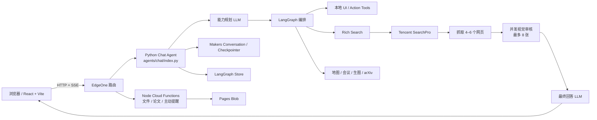
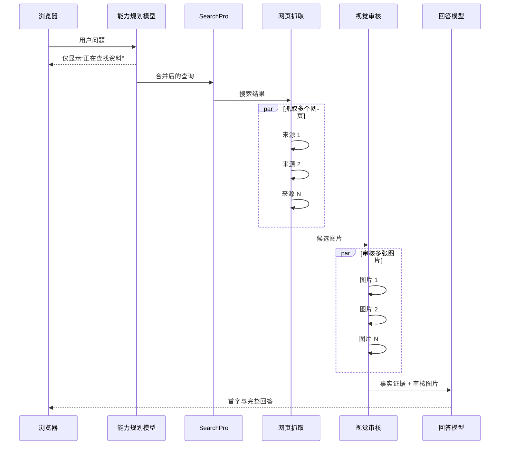
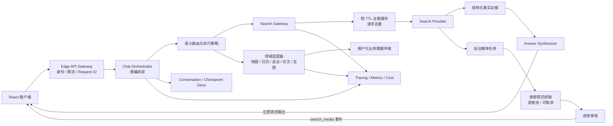
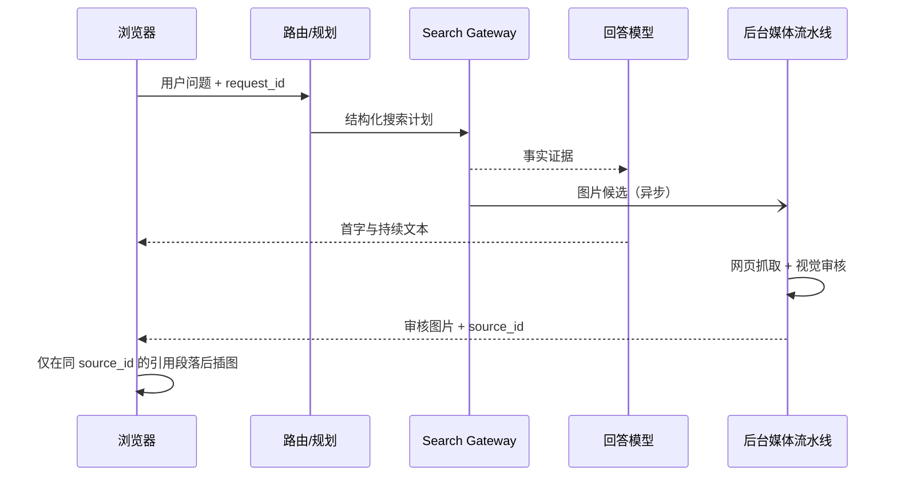

# FLORIS 架构审查与演进计划

> 基线：`main` 提交 `712fe07a1b41dc1ce2ba316838bba0e2d111d32a`
> 工作分支：`dev`
> 审查日期：2026-07-31
> 范围：线上体验、前后端与 Agent 全仓代码、搜索关键路径、部署配置和测试体系

## 1. 结论摘要

FLORIS 已经不是一个简单聊天页，而是一个以 LangGraph 为中枢、同时连接搜索、地图、日历、会议、论文、文档、图片和主动提醒的个人 Agent。当前架构的优点是能力覆盖完整、工具副作用边界明确、SSE 与断线恢复较扎实、单元测试数量充足。

当前最影响体验的问题不是“没有并行”，而是**并行任务仍然位于回答首字之前的关键路径**：

1. 每轮先调用一次能力规划模型。
2. 搜索轮等待 SearchPro。
3. 默认继续抓取 4–6 个结果网页。
4. 并发视觉审核最多 8 张候选图。
5. 上述媒体阶段全部完成后，最终回答模型才开始输出。

所以，即使第 3、4 步内部已经并行，用户仍要等待整段流水线。

本分支已完成第一阶段低风险改造：**搜索事实证据仍在关键路径，网页图片抓取与视觉审核改为渐进交付；只有图片生成需要审核后的参考图时才阻塞等待。**

## 2. 线上体验记录

本次通过生产站点 `https://floris.jlutx.com/chatBot` 各执行一次真实请求。它们是单样本观察，不替代正式压测。

| 场景 | 请求 | 观察到完成 | 现象 |
| --- | --- | ---: | --- |
| 普通问答 | `1+1等于几？只回答结果。` | 约 11.3 秒 | 说明模型规划与回答本身已有较高固定成本 |
| 富搜索 | `最近 24 小时 AI 领域有哪些重要进展？请给出 3 条并注明来源。` | 约 29.5 秒 | 约 14.7 秒时仍只有“正在查找资料…”，尚无首字 |

搜索相对普通问答额外增加约 18.2 秒。结果可读、引用可点击并带图片，但本轮展示的来源全部落在同一个腾讯搜索聚合域名，来源独立性和第一方来源优先级仍需加强。

建议今后用服务端事件统一记录：

- `request_received`
- `plan_completed`
- `search_provider_completed`
- `answer_first_token`
- `answer_completed`
- `media_completed`
- `request_settled`

核心指标应是 `TTFT`、回答完成时间、搜索 Provider 时间、媒体阶段时间、成功率和取消率的 p50/p95，而不是只看整轮总时长。

## 3. 当前架构



当前搜索关键路径：



## 4. 主要不足

### 4.1 P0：搜索媒体阻塞首字

- `agents/chat/index.py` 原先固定传入 `progressive_media=False`。
- `agents/_shared/rich_search.py` 的 SearchPro、网页抓取、视觉审核按阶段串行。
- 网页抓取和视觉审核各自内部并行，但整个媒体阶段仍在最终回答之前。
- 默认 `image_limit=8`，普通新闻问答也会付出完整视觉链路成本。

### 4.2 P0：身份与数据隔离仅适合受控的个人部署

- Python `require_user()` 固定返回 `local-user / owner`。
- Node `currentUser()` 同样固定返回 `local-user / owner`。
- 如果站点没有平台层访问控制，所有访问者会共享会话归属、工作区和 Owner 能力。

若产品明确只供站长个人使用，应在 EdgeOne 前增加访问门禁并写入部署文档；若准备开放多用户，必须在新增功能前接入可信身份、租户前缀和服务端授权检查。

### 4.3 P1：编排层过度集中

- `agents/chat/index.py` 约 2500 行，承担请求解析、规划、状态加载、工具配置、SSE、持久化和后处理。
- `agents/chat/_ui_tools.py` 同时承载多个业务域适配器。
- 前端 `MessageBubble.tsx` 和全局样式也偏大。

这使性能策略、领域逻辑和协议逻辑耦合，修改一个搜索行为需要理解整条对话链路。

### 4.4 P1：网络层缺少复用和真正的取消

- 搜索与网页抓取使用 `urllib` + `asyncio.to_thread`。
- 没有共享异步连接池。
- `asyncio.wait_for` 超时后不能真正停止底层阻塞线程。
- 单页最多读取 5 MB，慢源可能继续占用线程和连接。

### 4.5 P1：搜索质量与缓存策略不足

- 相同或近似问题跨轮次会再次访问 Provider。
- 当前线上样本的来源域名集中，缺少第一方来源优先和域名多样性约束。
- `result_limit` 主要在 Provider 返回后本地截断，不能保证减少上游工作量。

缓存不应简单恢复成长期答案缓存，而应使用短 TTL 的“检索证据缓存”，并把时效边界、用户要求和 Provider 版本纳入 key。

### 4.6 P2：缺少性能回归门禁

当前测试对功能正确性覆盖很好，但还缺少：

- 搜索 TTFT / p95 预算；
- Provider 慢、媒体超时、取消等故障注入；
- 浏览器级关键流程测试；
- 前端 bundle 体积门禁。

当前主应用构建产物约 1.25 MB（gzip 约 369 KB），PDF worker 约 1.30 MB，仍有进一步按路由和能力懒加载的空间。

## 5. 目标架构



目标搜索时序：



## 6. 分阶段修改优先级

### P0-A：把媒体移出搜索回答关键路径（本分支已实施）

改动：

1. 新增集中策略 `progressive_media_for_plan()`。
2. 普通富搜索在 SearchPro 返回证据后即可进入回答生成。
3. 网页抓取与视觉审核继续后台运行，通过既有 `search_media` SSE 事件合并。
4. 模型只输出正文和普通来源链接，不生成任何内部媒体占位符，也不自行拼接图片 Markdown。
5. 每张审核图片携带稳定 `source_id`；前端只在引用同一来源的段落后插入图片，来源 URL 或 ID 不一致时直接放弃。
6. 审核前的 Provider 预览不进入正文；审核失败或正文没有精确来源引用时不插图。
7. 图片生成仍等待审核图片，因为这些图片会作为生成 Provider 的输入参考。
8. `search_config.media_delivery` 暴露 `disabled / progressive / blocking`，便于诊断。

验收标准：

- 搜索事实和引用不减少。
- 标准搜索的最终回答模型不再等待 `page_media + vision`。
- 新回答内容中不存在 `YUANBAO_MEDIA` 等内部协议。
- 图片必须同时满足视觉审核、`source_id` 匹配和正文精确引用；否则不插入。
- 生图参考链路仍只使用审核后的 HTTPS 图片。
- 媒体失败不影响文字回答。

### P0-B：建立性能可观测性和预算

建议下一步：

1. 为每轮生成稳定 `request_id`，贯穿前端、Agent、Provider 和存储日志。
2. 把现有 `stage_timings_ms` 扩展到首字、回答完成和媒体完成。
3. 建立仪表盘和告警：
   - 普通问答 TTFT p95 < 5 秒；
   - 搜索问答 TTFT p95 < 10 秒；
   - 搜索回答完成 p95 < 20 秒；
   - 媒体完成 p95 < 15 秒；
   - 搜索成功率 > 99%。
4. 在 CI 加入模拟慢 Provider 的关键路径测试。

### P0-C：明确个人站或多租户的安全边界

个人站方案：

1. EdgeOne 网关增加登录或访问白名单。
2. 所有 Owner Action 只允许平台校验后的请求。
3. README 明确站点不可匿名开放。

多租户方案：

1. 从可信平台 Header / Session 获取用户身份，禁止客户端自报身份。
2. 所有 Conversation、Store、Blob key 加入 `tenant_id/user_id`。
3. 每个 Action 在服务端重新做资源归属和角色校验。
4. 增加跨租户访问、重放和越权测试。

### P0-D：利用已购买的 EdgeOne 个人版

先区分两个产品层：

- EdgeOne 个人版主要提升站点的动静态加速能力和配额，并支持智能加速、HTTP/3、图片即时处理等增值能力；它可以缩短浏览器到 EdgeOne 的网络耗时，但不会自动消除 Agent 内部的模型、SearchPro 和视觉审核等待。
- EdgeOne Makers 的公开文档目前仍只公布免费版运行配额，商业版具体算力差异尚未公开。因此应以 Makers 控制台的实际套餐说明和运行指标为准，不能把 EdgeOne 个人版直接等同为更快的 Agent CPU。

可立即利用：

1. 为静态构建产物启用长缓存、智能压缩和预热；HTML 使用短缓存，带 hash 的 JS/CSS/字体使用长期不可变缓存。
2. 若已额外开通智能加速或 HTTP/3，可用于页面资源和 SSE 网络链路；`/chat`、用户数据和 Action 接口禁止边缘缓存。
3. Cloud Functions 默认中国大陆区域是广州。如果主要用户与外部服务在华北，可在 Preview 先将 `mainlandRegions` 设为 `ap-beijing`，比较 p50/p95 后再决定是否用于生产。
4. 使用个人版更长的指标查询周期和实时日志任务，建立 TTFT、5xx、SSE 中断与缓存命中率仪表盘。

官方边界参考：

- [EdgeOne 套餐选型对比](https://intl.cloud.tencent.com/zh/document/product/1145/55650)
- [EdgeOne Makers Cloud Functions 区域配置](https://pages.edgeone.ai/document/cloud-functions)
- [EdgeOne Makers 商业版说明](https://pages.edgeone.ai/document/pricing-and-plans)

### P1-A：拆分搜索服务边界

从 `rich_search.py` 中拆出：

- `SearchProviderClient`：Provider 请求、重试、限流、熔断；
- `EvidenceNormalizer`：结果清洗、日期边界、来源去重；
- `MediaPipeline`：网页抓取、候选筛选、视觉审核；
- `SearchPolicy`：结果数、图片数、深度和超时预算；
- `SearchTelemetry`：阶段计时、费用和失败原因。

改用支持连接池和取消的异步 HTTP 客户端；统一总 deadline，而不是多个局部 timeout 叠加。

### P1-B：增加短 TTL 证据缓存与请求合并

1. key 包含归一化查询、严格日期、目标日期、搜索深度和 Provider 版本。
2. “最近/今天”类内容 TTL 2–5 分钟，稳定知识 30–60 分钟。
3. 只缓存结构化证据，不缓存最终人格化回答。
4. 同一时刻的相同请求使用 single-flight 合并。
5. 用户显式要求刷新时绕过缓存。

### P1-C：提升来源质量

1. Provider 查询明确要求官方/第一方来源和多个独立域名。
2. 归一化后按 registrable domain 去重和限额。
3. 对新闻至少保留 2 个独立域名；重要产品发布优先官方公告。
4. 前端显示真实来源域名和发布日期，不把聚合跳转域名当作唯一来源身份。

### P1-D：拆薄 Chat Orchestrator

建议目录：

```text
agents/chat/
  endpoint.py
  orchestration/
    planner.py
    execution_policy.py
    stream.py
    persistence.py
  domains/
    search.py
    places.py
    calendar.py
    meeting.py
    papers.py
    images.py
```

`endpoint.py` 只负责鉴权、输入校验、创建 run 和返回 SSE；领域模块不直接控制全局流。

### P2：前端与平台工程

1. 按聊天、论文阅读器、地图、Skill 广场拆包和懒加载。
2. 拆分 `MessageBubble` 为文本、搜索、路线、会议、生图等渲染器。
3. 把超长全局 CSS 拆为组件级样式或 tokens。
4. 服务端状态更新使用真正的原子 CAS/幂等键，避免多实例竞争。
5. 增加 Playwright 端到端测试：新对话、搜索首字、断线恢复、取消、媒体迟到、Action 确认。

## 7. 发布与回滚建议

1. `dev` 部署到 Preview 环境，不直接部署 Production。
2. 用固定的 20 个搜索问题分别跑 3 次，记录 main 与 dev 的 TTFT、完成时间、媒体到达时间和结果正确性。
3. 先给 10% Preview 会话开启渐进媒体，观察错误率、`source_id` 匹配率和无匹配放弃率。
4. 若文字 TTFT 无明显改善，优先检查能力规划与 SearchPro，而不是继续优化图片并发。
5. 回滚只需关闭渐进媒体策略或将 Preview 切回 main；不要改写 main 历史。

## 8. 本分支范围

本次只实施 P0-A，并加入测试与本计划书。身份系统、缓存、Provider 替换、目录大拆分和生产部署不在本次改动中，避免在缺少产品与平台约束时一次引入过大的风险。
