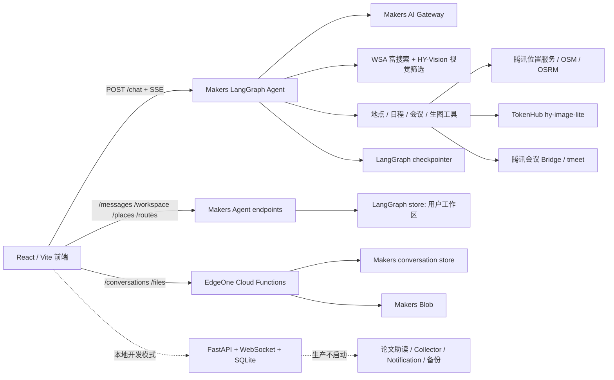
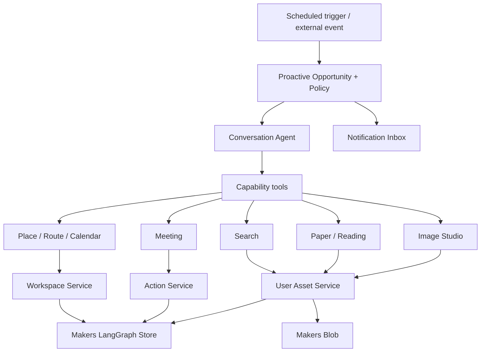

# 当前架构、能力盘点与改造计划

> 状态：当前事实源 / 待评审改造计划  
> 代码基线：`codex/publish-current-workspace-ui`，`f07d1fe`  
> 复核日期：2026-07-15  
> 生产目标：EdgeOne Makers + LangGraph；`backend/` 仅作为旧能力和本地兼容参考

> 2026-07-16 全量现状评估：当前生产架构、已实现能力、过窄能力、未实现能力，以及距离主动式 Agent 的量化差距，统一见 [`CURRENT_ARCHITECTURE_CAPABILITIES_AND_PROACTIVE_GAP.md`](CURRENT_ARCHITECTURE_CAPABILITIES_AND_PROACTIVE_GAP.md)。

> P0–P3 改造实现状态见 [`MAKERS_PROACTIVE_IMPLEMENTATION_STATUS.md`](MAKERS_PROACTIVE_IMPLEMENTATION_STATUS.md)。

> 2026-07-16 实施更新：Phase 1 的前端清理/日历覆盖、Phase 2 的直接生图与图片版本工作室、Phase 3/4 的 PDF 阅读库与论文助读核心链路已经部署到生产，Deployment ID 为 `dpd4ge32d3zf`。下文第 2–6 节保留改造前基线用于解释设计动机；当前线上事实以 [`CURRENT_RELEASE.md`](CURRENT_RELEASE.md) 为准。DOC/DOCX 转换、OCR、后台定时 Collector/Notification 和身份隔离仍未完成。

## 1. 结论

项目已经完成了从“本地 FastAPI 单体”到“EdgeOne Makers 托管 Agent”的第一阶段迁移。当前生产主链可稳定承载对话、联网富搜索、地图推荐、真实地点与道路路线、日程工作区、腾讯会议桥和混元文生图；会话、检查点、工作区状态和文件分别复用 Makers 的 conversation store、LangGraph checkpointer/store 与 Blob。

当前最需要解决的不是继续往 `MessageBubble` 或 `_ui_tools.py` 塞功能，而是消除两套运行时造成的能力分裂：论文助读、我的阅读、主动 Collector/Notification、PDF 文本索引等代码仍在旧 FastAPI 链路，Makers 生产环境不可达。文档也同时描述了本地 v4 架构和 Makers v5 架构，容易把“代码存在”误判为“线上可用”。

本轮建议采用以下方向：

1. EdgeOne Makers 是唯一生产运行时，旧 FastAPI 不再作为新功能落点。
2. 会话记忆继续由 LangGraph checkpointer 隔离；“我的日程、我的阅读、图片资产”等用户资源使用跨会话 Workspace/Asset Store。
3. 模型负责语义理解与工具选择；资源身份、版本、权限、幂等、状态迁移和下载归档由确定性代码负责。
4. 生图改为用户明确提出后直接执行，但仍保留幂等、预算、状态与失败恢复；会议和日程写入继续确认。
5. 先建立统一的文件/图片/阅读资产模型，再做轮播、批量下载、论文自动助读和主动提醒，避免每个 UI 组件自建临时状态。

## 2. 审查范围与仓库边界

本次核对了以下源码和历史：

- `agents/`：Makers 生产 Agent、工具、工作区、地图、路线、会议和生图 Provider。
- `cloud-functions/`：Makers 会话管理和 Blob 文件签名/读取。
- `frontend/src/`：SSE/WebSocket 双 Transport、生产工作区、本地管理面板、论文阅读器和 PDF.js 解析。
- `backend/`：旧 FastAPI 的 API、持久 Runtime、Collector、Notification、Skill、论文助读和本地文件索引。
- `docs/`、测试、配置和相关 Git 历史。

不把 `.edgeone/agent-python/lib`、虚拟环境、构建产物和裸仓库对象当作项目业务代码；它们是 CLI 生成的运行时依赖或历史存储。当前工作区中 `.edgeone/` 和 `.env` 已有未提交变化，本次文档修改不触碰这些用户/工具生成内容。

## 3. 当前底层架构



### 3.1 生产运行时

| 层 | 主要代码 | 当前职责 |
| --- | --- | --- |
| UI | `frontend/src/App.tsx` | 左侧会话、中间对话、右侧地图/日历的三栏工作区 |
| Transport | `useSSEChat.ts` | 每轮创建 SSE 请求、停止、流事件归一化、恢复检查点 |
| Agent | `agents/chat/index.py` | 能力规划、LangGraph 工具循环、SSE 心跳与终态元数据 |
| Graph | `agents/chat/_graph.py` | MessagesState、ToolNode、Makers checkpointer/store |
| 模型 | `agents/chat/_llm.py` | Makers AI Gateway；可选 DeepSeek 直连故障切换 |
| 工具 | `agents/chat/_ui_tools.py` | 富搜索、地点校验、地图 Action、日程 Action、会议与生图提案 |
| 资源工作区 | `agents/shared/workspace.py` | `local-user` 级日程、Action、地点候选和地图状态 |
| 副作用 | `agents/workspace/index.py` | Action 确认/取消、日程提交、会议/生图执行 |
| 搜索媒体 | `agents/shared/rich_search.py` | WSA SearchPro、网页图片抽取、HY-Vision 视觉相关性过滤 |
| 地图路线 | `agents/shared/tencent_location.py` | 腾讯地点/路线，OSM/OSRM 降级，多点顺序与费用估算 |
| 文件 | `cloud-functions/files/index.js` | PDF Blob 预签名直传、读取和删除 |
| 会话 | `cloud-functions/conversations/index.js` | Makers 会话列表、标题和消息追加 |

### 3.2 本地兼容运行时

`backend/` 仍是一个完整的 FastAPI + SQLite 主动 Agent 平台，包含 Event/Run/Observation、Action/Executor、Scheduler/Supervisor、日程/天气/文件 Collector、通知、记忆、反馈、预算、备份、论文与 PDF 索引。它有较好的领域设计和测试价值，但 EdgeOne 构建不会启动它；生产前端也不会渲染 `MyPanel`、Agent Activity、Memory 或 System Safety 面板。

因此后续迁移应复用它的领域契约和算法，不应把 FastAPI 路由、SQLite Repository、WebSocket 编排原样搬进 Makers。

### 3.3 状态与所有权

| 数据 | 当前事实源 | 作用域 |
| --- | --- | --- |
| 对话历史/短期记忆 | LangGraph checkpointer | 每个 `conversation_id` 独立 |
| 会话列表/标题 | Makers conversation store | 用户级 |
| 日程、地图、工作区 Action | LangGraph store，namespace=`yuanbao_workspace_v1/local-user` | 跨会话用户级 |
| 上传 PDF 字节 | Makers Blob | Blob key 中含上传会话，但没有独立资产索引 |
| 本地论文/文件/通知/记忆 | SQLite | 仅旧本地模式 |

这个划分基本合理：对话上下文应隔离，用户资产应跨对话可见。但当前用户资产只覆盖日程/地图，文件、阅读和生成图片尚未进入同一资源层。

## 4. 当前可实现的能力

### 4.1 Makers 生产已可用

| 能力 | 状态 | 说明 |
| --- | --- | --- |
| 多会话对话与恢复 | 可用 | 会话列表、标题、检查点恢复、SSE 流式输出、停止运行 |
| 通用问答 | 可用 | Makers AI Gateway + LangGraph 工具循环 |
| 联网富搜索 | 可用 | WSA 搜索、来源列表、网页图片抽取、HY-Vision 视觉筛选、图文回答 |
| 真实地点推荐 | 可用 | 腾讯地点优先，OSM 降级；模型不能自由提交坐标 |
| 地图 Action | 可用 | 用户点击后才激活右侧地图 |
| 道路路线与费用估算 | 可用 | 腾讯路线优先，OSRM 降级；支持多点优化和估算说明 |
| 日程 CRUD | 可用 | 对话提案需确认；右侧 UI 可直接新增、编辑、删除 |
| 腾讯会议 | 条件可用 | 需要部署会议 Bridge/token 或运行环境已有 `tmeet` 登录态 |
| AI 文生图 | 条件可用 | 当前为 `hy-image-lite`，需要确认，成功 URL 未归档到 Blob |
| PDF 上传/打开 | 基础可用 | 仅 PDF、20MB、Blob 直传；不解析、不分类、不索引 |

### 4.2 代码存在但生产不可达

| 能力 | 现有代码 | 缺口 |
| --- | --- | --- |
| arXiv 论文搜索与摘要翻译 | `PaperSkill`、`paper_search_service.py` | Makers Agent 未注册论文工具/事件协议 |
| PDF 论文阅读器 | `PaperFullReader.tsx`、`PaperReader.tsx` | 请求 `/api/paper/*`，生产没有这些路由 |
| 选词翻译、段落总结、术语/公式解释 | `paperApi.ts`、`paper_routes.py` | 只接旧 DeepSeek SSE，未适配 Makers AI Gateway |
| 全文翻译/总结/问答 | `paper_routes.py` | 简单截断 40k–60k 字符，不是真正全文任务，也无页码引用 |
| “我的阅读” | 本地 `papers` 表 + `MyPanel` | 生产右栏使用 `EdgeOnePlatformPanel`，没有云端资产索引 |
| PDF 文本提取与哈希去重 | `file_service.py` | 仅本地磁盘/SQLite；Blob 上传后没有后处理 |
| 主动日程/天气/文件提醒 | Collector/Scheduler/Notification | 只随 FastAPI lifespan 运行，Makers 生产无后台调度接线 |
| 记忆、反馈、用量、备份 | 本地 API 与面板 | 生产未迁移；平台已提供部分会话/追踪能力，可避免重复建设 |

### 4.3 尚未实现

- 基于生成图片继续修改、多图参考、图片版本树、轮播和批量下载。
- 生成图片的长期 Blob 归档、元数据索引和过期 URL 修复。
- DOC/DOCX 转 PDF、扫描 PDF OCR、通用 PDF 与论文自动分类。
- 论文分页/章节索引、页码级引用、真正分块全文翻译和检索增强问答。
- Makers 生产上的主动定时触发、免打扰、冷却、通知收件箱和恢复。
- 一套覆盖 Makers dev/生产 Agent + Cloud Functions + 浏览器交互的端到端测试。

## 5. 架构评价

### 5.1 做得好的部分

1. **充分复用 Makers**：生产没有再托管一套 FastAPI、WebSocket、会话数据库和文件中转，符合平台迁移方向。
2. **模型与确定性边界清楚**：地点必须由 Provider 验证，地图与日程通过版本化 Action 操作，模型自由文本不能直接改资源。
3. **会话与用户资产分层正确**：对话检查点按会话隔离，日程工作区跨会话共享，符合个人助手产品语义。
4. **搜索媒体链路有质量门槛**：来源、图片、视觉审核和前端元数据是结构化的，不完全依赖模型编造 URL。
5. **降级策略实际可用**：地图有 OSM/OSRM，模型有可选故障切换，会议有 Bridge 边界。
6. **旧本地架构可作为领域设计库**：其 Runtime、Policy、幂等、Collector 与论文阅读代码为迁移提供了成熟素材。

### 5.2 主要问题

1. **双运行时形成事实分裂**：`frontend/services/api.ts` 同时暴露 Makers 和大量 `/api` 本地接口，类型和 UI 容易显示“支持”，实际生产请求 404。
2. **生产 Agent 单文件职责过重**：`_ui_tools.py` 同时含搜索、地图、日程、会议、生图和图片分析，继续扩展论文/图片版本会迅速失控。
3. **资源模型不完整**：Blob 只保存字节，没有 `DocumentAsset`/`ReadingItem`/`ImageAsset` 索引；临时 Provider URL 被直接写进 Action result。
4. **副作用策略不一致**：旧 `ImageSkill` 已设计为直接生图，Makers 生产又强制确认。产品希望已经明确，应统一为“明确生图请求直接执行、会议/日程仍确认”。
5. **论文“全文”能力名不副实**：当前全文翻译截断文本并受单次输出 token 限制；问答没有分块检索和页码证据。
6. **选词交互混合了两套算法**：既有浏览器原生 TextLayer 选择，又有基于段落 bbox 的点击命中；跨栏、跨页、连字符和浮动层会产生误选。
7. **主动 Agent 只在旧本地链路成立**：生产实际上是“会主动调用工具的响应式 Agent”，还不是能在无用户消息时运行的主动服务。
8. **文档过时且互相矛盾**：README/Migration 仍称搜索使用 `ctx.tools.web_search`，实际已统一为 WSA `rich_search`；旧实现状态把 FastAPI 能力写成当前系统能力。

综合评价：**领域设计基础较好，Makers 迁移方向正确，但目前属于“生产主链可用、能力迁移未收口”的过渡架构**。建议先完成资产层与 Transport/API 收敛，再继续扩能力。

## 6. 目标架构



建议新增三类统一资源：

```text
ImageAssetV1
  id, blob_key, mime_type, width, height, prompt, source_image_ids,
  root_asset_id, parent_asset_id, version, provider, provider_job_id,
  conversation_id, created_at

DocumentAssetV1
  id, blob_key, original_name, normalized_pdf_key, sha256, mime_type,
  page_count, document_kind, classification_confidence, processing_status,
  conversation_id, created_at

ReadingItemV1
  id, document_asset_id, title, authors, year, doi, arxiv_id,
  kind(paper|pdf), progress, last_page, added_at, last_opened_at
```

这些索引存 Makers LangGraph store，字节存 Blob。列表、详情和更新由独立 Agent endpoint 提供；不要依赖回放聊天消息重建资产列表。

## 7. 需求一：直接生图与图片工作室

### 7.1 Provider 结论

`agents/shared/rich_search.py` 使用 TokenHub `hy-vision-2.0-instruct` 判断网页图片是否相关。`hy3` 属于纯文本模型，不支持 `image_url`，不能用于视觉筛选。当前生成路径调用独立的混元生图模型。

腾讯官方文档显示：

- 混元生图 3.0 `SubmitTextToImageJob` 支持 `Images.N`，最多三张参考图。
- TokenHub/OpenAI 兼容的 `hy-image-v3.0` 同步接口支持 `images`。
- 独立 `ImageToImage` 接口支持输入图 + 文本的风格化；另有局部消除、扩图、变清晰等专用接口。

参考：

- [混元生图 3.0 接口](https://cloud.tencent.com/document/api/1668/124632)
- [混元 OpenAI 兼容接口](https://cloud.tencent.com/document/product/1668/129429)
- [图像风格化（图生图）](https://cloud.tencent.com/document/product/1668/88066/)

建议将 `hy-image-v3.0` 作为“基于当前图继续修改”的主 Provider；`ImageToImage` 只作为明确风格化操作的 Adapter，视觉理解与图像生成保持独立。

### 7.2 交互与执行

用户明确要求生成或修改图片时：

```text
模型提取 prompt / source_image_ids / size
→ 确定性校验和预算检查
→ 创建 executing ImageJob（不弹确认卡）
→ Provider 执行/轮询
→ 成功图复制到 Makers Blob
→ 保存 ImageAsset 版本
→ SSE 推送 image_job / image_asset
→ ImageStudioCard 更新轮播
```

“不询问”不等于绕过安全边界：仍保留输入校验、内容安全、用量上限、幂等键、超时、Provider job ID 和失败终态。只有请求语义不完整（例如用户说“把它改一下”但没有可引用图片）时才补问信息。

### 7.3 前端组件

新增 `components/image/ImageStudioCard.tsx`，不要继续在 `MessageBubble` 内直接拼 ``：

- 主画布显示当前版本，左右切换或缩略图条形成轮播。
- 每个版本展示提示词、生成时间、版本号和失败状态。
- “基于此图修改”把 `source_image_id` 和用户编辑指令发送给 Agent。
- “下载当前”使用同源 Blob 下载端点。
- “下载全部”由服务端读取该 `root_asset_id` 下所有版本并流式生成 ZIP，避免浏览器跨域抓 Provider URL 和内存爆炸。
- 默认只加载当前图和相邻缩略图；大图懒加载。
- 生成结果必须带 AI 生成标识/元数据策略，遵守 Provider 合规要求。

### 7.4 验收

- 明确生图请求不出现确认/取消卡，直接进入生成状态。
- 选择任一历史版本修改后，新图进入同一版本链，旧图不丢失。
- 刷新、切换对话后仍能恢复图片链。
- 单图和全部 ZIP 均从 Blob 下载；Provider 临时 URL 失效不影响历史图片。
- 重复 SSE 或重复点击不会生成两个相同 job。

## 8. 需求二：日历与当日安排覆盖切换

生产需要修改的是 `EdgeOnePlatformPanel`，不是仅本地显示的 `MyPanel`。

把当前“日历卡 + 下方当日安排卡”改成一个固定高度的 `CalendarWorkspaceCard`：

```text
calendar（月视图） --点击日期--> day（日程视图）
day --返回/向左滑--> calendar
```

实现建议：

- 同一容器内叠放两层，状态为 `calendar | day`，避免页面高度跳变。
- 点击日期时，日程层从左向右进入（`transform: translateX(-100%) → 0`）；日历层同步向右退出。
- 日程页顶部显示返回图标、日期、前后一天和“添加”。
- 尊重 `prefers-reduced-motion`，无动画模式直接切换。
- 动画期间隐藏非活动层的 pointer/keyboard 交互并维护焦点。
- 空日期也进入当日页，直接给“添加安排”，不在日历下方保留重复空态。
- 删除日历格按忙碌度填充的灰/蓝背景，只保留普通背景、今天/选中边框和小圆点/数量。

地图继续位于该卡上方；切换日期时沿用现有规则，把地图切到所选日期的日程地点。

## 9. 需求三：论文助读、我的阅读与文档接入

### 9.1 迁移原则

保留 PDF.js 阅读体验、论文 prompt 和 arXiv 搜索 Service；废弃生产对 `/api/paper/*`、本地路径、SQLite `papers` 表和 DeepSeek 直连接口的依赖。论文工具统一走 Makers AI Gateway，文件统一走 Blob + Asset Store。

### 9.2 文档摄取

新增 `DocumentIngestionService`：

1. 上传原文件到 Blob。
2. 计算哈希并创建 `DocumentAsset`。
3. PDF：提取 metadata、第一页文本、页数和段落坐标；扫描件进入 OCR 状态。
4. DOC/DOCX：调用 `DocumentConverter` 生成 PDF，再进入同一流程。
5. 论文分类使用确定性特征评分：标题/作者区、摘要、章节结构、参考文献、DOI/arXiv、页眉页脚；LLM 只作为低置信度补充。
6. 高置信度论文自动创建 `ReadingItem(kind=paper)` 并打开助读；其他文件创建 `kind=pdf`，使用普通 PDF 阅读器。

EdgeOne Agent 运行时不应假设存在 LibreOffice。`DocumentConverter` 必须是可替换 Adapter：先做一次 Makers 运行时能力验证；若无可用二进制，使用受控转换 Bridge/服务。转换失败时保留原文件和失败状态，不伪造 PDF。

### 9.3 更精准的选词

当前 `getSelectedText()` 直接读取全局 `window.getSelection()`，点击段落又通过 PDF 坐标 bbox 命中，两者混用会导致跨页、跨栏、浮层文字和连字符误选。

改为一条原生选择链：

1. 只接受 `Range.commonAncestorContainer` 位于当前 `.pdf-text-layer` 的选择。
2. TextLayer span 写入 `page/itemIndex/charOffset` 数据，Range 起止映射回 PDF 文本 item。
3. 使用 Range 的 client rect 与 TextLayer span 交集确定选择边界，不再用整段 bbox 猜词。
4. 规范化软换行、断词连字符和重复空格，但保留公式符号与段落顺序。
5. 双击使用浏览器词边界；拖选支持跨行但默认不跨页。跨页选择需要显式合并。
6. 工具条锚定最后一个 selection rect，并在 selectionchange、滚动、缩放时更新/关闭。
7. 单击段落不再自动翻译，只把精确选中内容交给翻译/总结/解释工具。

### 9.4 真正的全文能力

- 按页/章节切块，保存 `chunk_id + page_from/page_to + text_hash`。
- 全文翻译是持久 Job：分块翻译、断点续跑、术语表一致性、块级缓存和合并导出，不再截断 60k 字符后称为全文。
- 总结采用分层 Map-Reduce：段落/章节摘要 → 全文贡献、方法、实验、限制。
- 问答先做关键词 + 向量混合检索，再让模型回答；结果引用页码和 chunk。
- 论文搜索结果点“阅读”时自动下载/归档并进入我的阅读，不要求用户再次收藏。

### 9.5 右栏“我的阅读”

右栏改为图标 Tab：`工作区（日历/地图）` 与 `我的阅读`。阅读列表展示论文和普通 PDF，记录最近阅读、页码和处理状态。论文打开 `PaperReader`，普通文档打开 `PdfReader`；不要把本地 `MyPanel` 整体搬到生产。

## 10. 需求四：前端信息架构清理

以下改动可以作为独立的低风险批次先完成：

- 首页标题从“旅游 Agent”改为“元宝 Agent”或“你的主动式智能助手”，引导词覆盖搜索、阅读、日程、会议、图片与旅行。
- 删除“每个对话拥有独立记忆”“新对话不会读取其他对话内容”的可见说明；内部隔离行为保持不变。
- 顶栏移除左侧无效/重复的 `☰`。桌面端会话栏常驻时不显示；窄屏仅保留真正能打开抽屉的历史会话图标。
- 移除 `EdgeOne Makers · LangGraph` 标签和输入框下的托管说明。
- 移除“行程工作台”状态卡；连接状态由必要的错误/重连提示表达。
- “收起右栏/展开右栏”替换为带 Tooltip 和 `aria-label` 的图标按钮。
- 日历格使用普通背景，今天、选中和有日程状态使用边框/圆点表达。
- 能力文案不再突出实现平台或内部记忆，只描述用户能完成的任务。

## 11. 需求五：更主动的 Agent

主动式服务要区分“主动发现”和“擅自执行”。推荐优先实现以下机会：

| 机会 | 主动行为 | 自动执行边界 |
| --- | --- | --- |
| 今日/明日简报 | 汇总日程、路线、天气、待读论文 | 自动生成应用内卡片；不改日程 |
| 出发准备 | 根据下一项地点和道路时间提醒应出发时间 | 自动提醒；路线变化可更新提示 |
| 日程冲突/空档 | 发现重叠、过短转场或可利用空档 | 提建议；写入必须确认 |
| 旅行天气变化 | 标出受影响户外项目并生成室内替代草案 | 自动生成草案；替换日程需确认 |
| 新文档到达 | 自动分类、索引；论文生成导读 | 读取/摘要自动；外发/删除需确认 |
| 阅读续接 | 下次打开时从上次页码继续，长时间未读给一次提醒 | 受冷却和关闭设置约束 |
| 论文追踪 | 对收藏论文的作者/主题生成新论文提醒 | 只通知有可信来源的新内容 |
| 图片迭代 | 生图后给出 2–3 个可直接执行的编辑建议 | 只有用户点击/明确回复才生成新图 |
| 会议准备 | 会前聚合相关文档、问题清单和会议链接 | 自动准备；创建/改会仍确认 |

生产实现应复用旧 `OpportunityDetector`、Notification 冷却/静默/每日上限的思想，但持久化迁入 Makers。每条主动卡必须展示简短触发原因、来源、关闭同类提醒和稍后提醒，不由 LLM 决定是否越过 Policy。

## 12. 分阶段实施计划

### Phase 0：事实源、契约和拆分

- 以本文为当前事实源，旧 FastAPI 文档标记为历史参考。
- 从 `_ui_tools.py` 拆出 `search_tools`、`travel_tools`、`image_tools`、`reading_tools`。
- 定义 `ImageAssetV1`、`DocumentAssetV1`、`ReadingItemV1`、`ImageJobV1` 和 Store namespace。
- 把前端 Makers API 与 legacy API 分文件，生产 bundle 不再暴露不可达方法。

退出条件：生产能力清单与路由测试一致；Schema round-trip 和旧工作区兼容测试通过。

### Phase 1：前端清理与日历覆盖动画

- 完成第 8、10 节 UI 改动。
- 抽出 `CalendarWorkspaceCard`，增加 reduced-motion 与键盘测试。
- 不改变日程后端契约。

退出条件：首页和顶栏无指定废弃文案；当日安排不再占用日历下方固定空间。

### Phase 2：图片资产与直接生成

- Provider 升级到 `hy-image-v3.0`，支持 `images`。
- 生图 Action 改为直接 `ImageJob`，会议 Action 保持确认。
- 成功图片归档 Blob，保存版本链。
- 实现 `ImageStudioCard`、轮播、基于此图修改、单图/批量下载。

退出条件：第 7.4 节全部通过，刷新可恢复，临时 URL 不成为事实源。

### Phase 3：文档资产与通用 PDF 阅读

- Blob 后处理、哈希/metadata/页数/文本索引。
- `DocumentConverter` 合约与 DOC/DOCX 转换方案验证。
- 右栏“我的阅读”与普通 `PdfReader`。
- 上传后自动创建 ReadingItem。

退出条件：PDF/DOCX 的成功、失败和重复上传均有稳定资产状态；普通 PDF 不触发论文工具。

### Phase 4：论文助读迁移

- arXiv 搜索接入 Makers 工具与消息协议。
- 迁移 PaperReader，完成精确选词链。
- 分块全文翻译、分层总结、混合检索 QA 和页码引用。
- 论文自动分类并进入我的阅读。

退出条件：搜索论文、上传论文两条入口都自动打开助读；全文任务可断点恢复且没有静默截断。

### Phase 5：主动服务迁移

- 在 Makers 可用的定时/外部触发机制上实现 Event inbox、Scheduler lease、Opportunity、Policy、Notification。
- 首批只做日程简报/冲突、文件就绪/论文导读、旅行天气。
- 增加免打扰、冷却、每日上限和同类关闭。

退出条件：无用户消息也能产生一次性、可解释、可关闭的通知；重启/重复事件不重复打扰。

### Phase 6：收口与删除旧生产假象

- Makers dev + 生产 smoke + 浏览器 E2E。
- 动态导入 PDF Reader、地图和图片工作室，控制首屏体积。
- 删除前端生产不可达的旧 API 暴露；`backend/` 进入明确维护/归档状态。
- 更新部署、回滚、数据迁移和故障排查文档。

## 13. 优先级与依赖

```text
P0: Phase 0
 ├─ P1: Phase 1（可并行）
 ├─ P1: Phase 2 图片工作室
 └─ P1: Phase 3 文档资产
          └─ P1: Phase 4 论文助读
Phase 2/3 稳定后 ── P2: Phase 5 主动服务
全部完成 ── Phase 6 收口
```

首个开发批次建议是 **Phase 0 + Phase 1**。第二批做图片资产与直接生图，第三批做文档资产和论文助读。原因是图片与阅读都依赖统一资产索引；如果先做组件而不做资源层，轮播、批量下载、我的阅读和刷新恢复都会再次依赖聊天消息临时状态。

## 14. 关键风险与决策点

1. **Makers 后台触发能力**：Phase 5 前必须验证平台定时任务和 Agent Store 在生产的租约语义；若平台不提供可靠定时触发，使用最小外部 scheduler 只负责唤醒，不承载业务状态。
2. **DOC 转换**：不能假设 Serverless 有 LibreOffice；先做运行时探针，再选择转换 Bridge。
3. **生图计费与并发**：直接执行需硬预算和并发队列；额度耗尽应进入可重试失败，不回退到询问确认。
4. **图片版权/合规**：生成图保留标识；搜索图片与生成资产分开，不把网页图误存为生成版本。
5. **文档隐私**：文档内容只进入明确配置的模型网关；日志不记录全文、签名 URL 或凭证。
6. **Store 容量**：LangGraph store 保存索引和状态，不保存 PDF 文本全集或图片字节；大文本/导出文件放 Blob。
7. **旧数据迁移**：本地 SQLite 阅读记录若需要上云，应另做显式导入工具，不能在生产启动时扫描本地路径。

## 15. 完成定义

- 用户明确生图后直接生成，可基于任一版本继续修改、轮播和批量下载。
- 点击日历日期后，安排在同一卡片内覆盖切换，布局无额外纵向占用。
- 论文搜索、论文上传、普通 PDF 和 DOC/DOCX 上传在 Makers 生产链路有明确且可恢复的处理结果。
- 论文支持准确选词、分块全文翻译、总结、问答和页码引用；我的阅读跨会话持久化。
- 首页和顶栏不再显示指定的内部实现/记忆文案或无效控件。
- 主动提醒受 Policy、冷却、免打扰和每日预算控制，可解释、可关闭、不会重复。
- README、当前版本文档、路由、前端能力入口和自动化测试描述一致。
