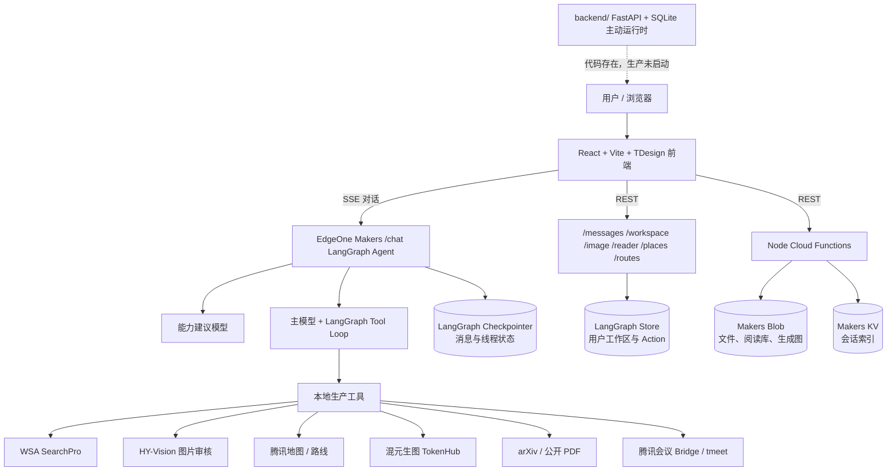
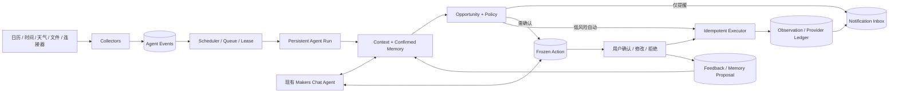

# 当前架构、能力边界与主动式 Agent 差距评估

> 评估日期：2026-07-16  
> 评估对象：当前 EdgeOne Makers 生产链，同时审阅仓库内未启用的 `backend/` FastAPI + SQLite 旧链  
> 依据：当前代码、`README.md`、`CURRENT_RELEASE.md`、`CURRENT_ARCHITECTURE_AND_REFACTOR_PLAN.md`、`PROACTIVE_AGENT_REFACTOR_PLAN.md`、`IMPLEMENTATION_STATUS.md`

> **2026-07-16 实施更新**：本文以下评分是改造前基线。P0–P3 的 Makers 实现现状与剩余边界见 [`MAKERS_PROACTIVE_IMPLEMENTATION_STATUS.md`](MAKERS_PROACTIVE_IMPLEMENTATION_STATUS.md)。

## 1. 执行摘要

当前产品已经不是简单聊天机器人。它具备多轮会话、流式回答、工具自主调用、富搜索、多媒体编排、地图/路线、日程确认、生图、论文和 PDF 助读，以及跨会话工作区。它可以称为一个**有工具、有状态、有安全确认的交互式 Agent**。

但当前生产链还不能称为真正的主动式 Agent。关键原因不是模型不够“主动”，而是运行时缺少下面这条闭环：

```text
外部信号或时间触发
→ 持久事件
→ 后台 Agent Run
→ 机会判断与策略
→ 通知或安全 Action
→ 用户响应/执行
→ 结果、反馈与长期记忆
→ 调整下一次行为
```

现在只有用户发送消息或点击 UI 时才会启动 Agent。左侧“主动提醒”是在页面打开后，由浏览器对已加载日程执行三条固定规则；它不会后台运行、不会主动送达，也没有持久 Event、Run、通知去重、免打扰和反馈学习。因此它是一个有价值的**主动体验原型**，但不是主动运行时。

综合评估：

| 评价对象 | 当前成熟度 | 含义 |
| --- | ---: | --- |
| 交互式工具 Agent | 约 70% | 主对话、工具、状态、确认式 Action 和丰富 UI 已成立 |
| 生产级主动 Agent 闭环 | 约 25% | 有领域状态和主动提示原型，但缺事件、后台运行、通知和学习闭环 |
| 仓库整体可复用资产 | 约 55% | 旧 FastAPI 链已有大量主动基础设施，但尚未迁入 Makers 生产链 |

这里的 25% 不是按代码量计算，而是按主动系统必须具备的产品闭环加权计算。若只是做一个“页面打开时提示日程”的演示，已经接近完成；若目标是可靠、可解释、可控制、能长期运行的主动式 Agent，仍需一次运行时级改造。

## 2. 当前生产架构



### 2.1 前端层

当前是三栏工作台：

- 左侧：会话列表、主动提醒、会话新建与切换。
- 中间：流式对话、Markdown/富媒体、搜索和工具进度、Action 卡片、图片工坊、论文卡和“猜你想问”。
- 右侧：地图、路线、日历、阅读库和相应详情。
- 支持会话本地乐观缓存与远端恢复合并、栏宽持久化、窄屏抽屉和主题切换。

前端不是纯展示层：当前“主动提醒”的机会检测也在浏览器里。这是现架构最明显的主动能力边界之一。

### 2.2 对话与编排层

`/chat` 是当前主 Agent 入口：

1. 每轮按北京时间解析“今天、最近、最新”等相对时间。
2. 一个独立模型生成能力建议，但不强制主模型调用工具。
3. 主模型在 LangGraph Tool Loop 中自主选择搜索、地点、日程、会议、生图和论文等工具。
4. 模型回答通过 SSE 流式输出；DSML/工具协议在服务端过滤。
5. 工具产生的网页、视频和已审核图片作为素材交给主模型，由模型决定是否采用和放置位置。
6. 主回答结束后，独立模块生成“猜你想问”。
7. LangGraph Checkpointer 保存线程消息，LangGraph Store 保存用户级工作区。

这是一个**按对话回合启动的反应式 Agent Loop**，还不是持续运行的 Agent Runtime。

### 2.3 工具与领域能力层

当前生产工具主要包括：

- WSA 富搜索、网页媒体抽取、HY-Vision 图片审核。
- 腾讯地图地点单查/批查、地图 Action 和路线。
- 日程创建、更新和删除提案。
- 腾讯会议创建提案。
- 混元文生图、参考图生图、历史版本修改。
- 页面图片收集和并行图片分析。
- arXiv 精确标题补充检索。
- PDF 阅读、翻译、总结、术语/公式解释和全文问答。

### 2.4 状态与存储层

生产链现在有四类状态：

| 状态 | 存储 | 当前用途 |
| --- | --- | --- |
| 对话线程 | LangGraph Checkpointer | 多轮消息、线程恢复 |
| 用户工作区 | LangGraph Store | 日程、Action、地点候选、激活地图、生图版本 |
| 会话索引 | Makers KV + 浏览器缓存 | 历史对话标题、时间、消息数和快速切换 |
| 文件资产 | Makers Blob | 上传文件、PDF、阅读库、生成图片 |

工作区是用户级共享状态，而不是每个会话一份，已经具备跨会话连续性。但它仍主要是资源状态，不等于长期语义记忆或主动运行状态。

### 2.5 安全副作用层

- 地图推荐先生成 Action，用户点击后才激活地图。
- 日程增删改和会议创建先冻结提案，用户以 `action_id + version` 确认后执行。
- 生图按当前产品策略直接执行，并保存版本链。
- 工作区 Action 有状态和版本检查，可避免明显的陈旧确认。

这比“模型直接执行所有动作”安全，但还没有生产级的幂等账本、执行租约、崩溃恢复和外部状态核对。

### 2.6 未启用的旧后端

`backend/` 是另一套 FastAPI + SQLite 架构。它已经实现或测试了：

- Event、Run、Observation、PendingAction。
- Scheduler、Supervisor、租约、恢复和取消。
- 日程、天气、文件 Collector。
- OpportunityDetector、Policy、Notification。
- 通知去重、冷却、静默时段、每日上限、已读、忽略和稍后提醒。
- 记忆提案/确认/版本、反馈、Usage 和预算。
- Provider 调用账本、部分副作用核对、健康检查和备份恢复。

这些是重要资产，但 `edgeone.json` 不启动 FastAPI，当前线上路由也没有 Run、Notification、Memory、Usage 或 Scheduler 入口。因此这些能力必须标记为**代码存在但生产不可达**，不能计入当前产品承诺。

## 3. 当前已实现的功能

### 3.1 已在线上成立的核心能力

1. **多轮流式对话**
   - LangGraph 线程状态、SSE 分片、停止、重连和历史恢复。
   - 用户消息乐观上屏，远端消息按序列合并，避免重复和串位。
   - DSML 和内部工具协议不暴露给用户。

2. **模型自主工具调用**
   - 能力规划只提供建议，主模型保留工具选择权。
   - 搜索结果作为证据，不强制回答围绕网页列表展开。

3. **富搜索与富媒体回答**
   - SearchPro 搜索、页面媒体提取、视觉模型审核。
   - 动态日期约束和“今日”严格发布日期过滤。
   - 网页、视频和图片可由模型穿插到相关段落，而非统一堆在末尾。

4. **地点、地图和路线**
   - 单地点和批量地点核验。
   - 使用真实 `place_id`、坐标和地图 Action。
   - 路线查询和右侧地图联动。

5. **日程工作区**
   - 日历展示、创建/更新/删除提案。
   - 确认后才修改日程。
   - 跨会话共享工作区。

6. **图片工作室**
   - 文生图、参考图生图、基于历史版本继续修改。
   - Provider URL 复制到 Blob，减少历史图片失效。
   - 版本轮播、缩略图、单图下载和 ZIP 批量下载。

7. **论文和 PDF 助读**
   - 普通富搜索优先、arXiv 精确标题补充。
   - PDF 上传、分类、阅读库和文件夹管理。
   - 翻译、总结、全文分析、术语/公式解释和正文问答。

8. **会话与工作台体验**
   - 会话创建、切换、删除、标题和时间恢复。
   - 三栏可调布局和窄屏适配。
   - “猜你想问”、工具进度、富媒体卡片和主动提醒入口。

### 3.2 已有但受环境约束的能力

- 腾讯会议需要配置 HTTPS Meeting Bridge，EdgeOne 本身没有持久系统 Keychain；未配置时不能可靠创建会议。
- 地图、搜索、视觉、生图和模型全部依赖外部 Provider 配置、额度和网络。
- 生图可回退模型，但参考图编辑不能安全回退到不支持参考图的接口。

## 4. 当前“太窄”的功能

这里的“太窄”指功能名看起来完整，但触发源、适用范围或闭环明显小于用户对该功能的自然预期。

### 4.1 主动提醒太窄

当前只检查：

1. 两个日程是否时间重叠。
2. 两个不同地点日程之间是否不足 30 分钟。
3. 最近一项日程是否在 24 小时内。

局限：

- 只在前端渲染时计算，页面关闭后不运行。
- 不获取真实路线耗时、交通变化、天气或地点营业状态。
- 不产生持久事件和通知。
- 不支持静默时段、冷却、去重、优先级和通知渠道。
- “让元宝处理”只是把一段模板写入输入框，仍需用户主动发送。

所以它更准确的名字是“日程机会提示”，不是完整主动提醒系统。

### 4.2 日历太窄

- 是产品内部工作区日历，不是系统日历、腾讯日历、Outlook 或 Google Calendar 同步。
- 事件来源主要是聊天中创建，缺少外部变化订阅。
- 没有重复日程、参与人、提醒策略、时区迁移和冲突解决协议。

### 4.3 长期记忆太窄

- 当前有跨会话工作区和聊天线程，但没有生产可用的长期语义记忆治理。
- 主提示词虽然要求静默使用“用户记忆和旅行偏好”，Makers 生产链没有与旧 `memory_proposals/memories` 等价的完整读写、确认、编辑、删除和版本机制。
- 没有把长期偏好稳定注入每一次计划和主动机会判断。

### 4.4 Action 安全太窄

- 有冻结 payload、确认、版本和状态，这是正确方向。
- 但没有持久 Agent Run、不可变快照哈希、全局幂等键、Provider 调用账本、租约和执行中崩溃核对。
- 外部 Provider 已成功但响应丢失时，生产链还不能可靠判断“成功、失败还是未知”，也不能保证永不重复创建。

### 4.5 富搜索太窄

- 已有日期、来源、图片审核和富媒体编排，但来源冲突检测、引用覆盖率和证据置信度仍弱。
- 图片质量判断偏向“画面相关”，对来源权威性、授权、水印、图库营销和叙述匹配的综合评分仍有限。
- 为了让模型在同一流里编排图片，需要在正文前等待视觉审核，首字延迟仍偏高。

### 4.6 论文助读太窄

- 对文本型 PDF 很强，但扫描件 OCR、复杂表格/图像理解、页码级可靠引用和增量索引尚未上线。
- 阅读库仍是单用户项目级 namespace，多用户化前必须重构权限和 Blob key。

### 4.7 任务执行太窄

- Agent 的绝大多数任务在一个 `/chat` 请求内完成。
- 没有跨小时/跨天的计划、步骤 checkpoint、暂停/恢复、依赖等待、局部重算和补偿动作。
- “停止生成”是当前请求取消，不是通用任务中心里的持久取消。

## 5. 当前未实现的功能

### 5.1 真正主动运行必需但未上线

- 后台 Scheduler、Supervisor 和 Worker。
- 时间、日历、天气、文件、邮件、企业消息等 Collector。
- 持久 Event、Run、Observation 和执行时间线。
- 用户不发消息时自动启动 Agent。
- 持久通知中心及站外通知渠道。
- 通知去重、冷却、免打扰、优先级、每日上限和稍后提醒。
- 机会判断的原因、证据和策略版本审计。
- 主动任务预算、频率、权限范围和一键暂停。

### 5.2 记忆与学习闭环未上线

- 可确认的记忆提案。
- 长期记忆版本、敏感度、导出、删除和冲突处理。
- 对用户接受/忽略/修改建议的反馈记录。
- 从反馈生成可确认、可回滚的规则提案。
- 主动策略的离线评估与 A/B 对照。

### 5.3 可靠执行未完整上线

- 持久执行队列和跨重启恢复。
- Action 全局幂等、Provider request-id 对账和未知结果处理。
- 长任务步骤级 checkpoint 和补偿工作流。
- 统一重试策略、错误分类、成本预算和熔断。

### 5.4 数据源与产品能力未上线

- 真实外部日历双向同步。
- 邮件、企业微信/腾讯会议消息、操作系统和浏览器通知。
- DOC/DOCX 转换、扫描 PDF OCR、多模态文档索引。
- 多用户、组织、RBAC、租户隔离和云账户安全。
- 生产级 metrics、distributed tracing 和外部告警。

## 6. 距离真正主动式 Agent 还有多远

### 6.1 按能力维度评分

| 维度 | 权重 | 生产现状 | 得分 | 主要差距 |
| --- | ---: | --- | ---: | --- |
| 对话理解与工具规划 | 10% | LangGraph、多工具、动态能力建议 | 8/10 | 计划仍以单回合为主 |
| 用户与领域状态 | 10% | 会话、工作区、日程、Action 跨会话 | 6/10 | 缺长期记忆治理和事件历史 |
| 信号采集 | 12% | 仅页面内读取已有日程 | 1/12 | 无后台 Collector 和外部订阅 |
| 后台调度与持续运行 | 15% | 生产为请求驱动 | 0/15 | 无 Scheduler、Worker、lease、recovery |
| 机会检测与 Policy | 10% | 前端三条固定日程规则 | 2/10 | 无统一策略、证据、预算和审计 |
| 通知与触达 | 10% | 页面内卡片 | 1/10 | 无 Inbox、站外推送、免打扰和去重 |
| 安全 Action 与执行可靠性 | 13% | 确认、版本、工作区状态 | 6/13 | 缺幂等账本、Run、租约和核对 |
| 记忆、反馈和学习 | 10% | 生产几乎未接入 | 1/10 | 旧链有代码，Makers 未迁移 |
| 用户控制与可解释性 | 5% | Action 卡、日程确认 | 3/5 | 缺主动权限、频率、原因和总开关 |
| 可观测性与运营 | 5% | 日志、测试、部署检查 | 2/5 | 缺运行指标、策略效果和告警 |
| **总计** | **100%** |  | **约 30/100** | 取保守口径约 **25%–30%** |

产品感知上可能高于 30%，因为现有聊天、搜索、地图和生图很丰富；但主动 Agent 的核心是“无用户消息也能可靠地发现机会、做决定并安全触达”，这部分当前接近空白。

### 6.2 不是从零开始

仓库旧 FastAPI 链已经提供可迁移参考和测试，尤其是：

- Event/Run/Observation 数据模型。
- Scheduler/Supervisor/Collector。
- Notification 和 Policy。
- Memory/Feedback/Usage。
- Provider 调用账本与恢复。

因此工程距离不是重新设计 75%，而是把旧链中正确的领域模型适配到 Makers 的存储、定时触发和执行环境，并舍弃 SQLite、本地进程和本地认证假设。预计可复用：

| 资产 | 可复用程度 | 说明 |
| --- | ---: | --- |
| 领域 contracts、状态机、Policy 规则 | 高，70%–85% | 主要改存储和运行时接口 |
| Collector / Opportunity 逻辑 | 中高，60%–75% | Provider 与触发入口需云化 |
| Notification / Memory / Usage Service | 中，50%–70% | Repository 和身份 namespace 需重写 |
| SQLite Repository、FastAPI 路由、进程内 Supervisor | 低，10%–30% | 不适合直接搬入 Makers Serverless |
| 测试用例和验收不变量 | 高，70%–90% | 可作为迁移契约继续使用 |

### 6.3 达到不同目标所需阶段

#### 阶段 A：可演示的主动 Agent

目标：用户关闭聊天后，系统仍能根据日程主动生成一条站内提醒。

必须完成：

1. 选择 EdgeOne 可用的定时触发/队列方案。
2. 建立最小 `Event → Run → Opportunity → Notification` 持久模型。
3. 把现有三条前端规则迁到后端 Collector/Policy。
4. 增加通知 Inbox、已读/忽略、去重和免打扰。
5. 提供主动功能总开关和频率设置。

完成后可达到约 45%–50%，可以真实演示“无用户消息也会运行”。

#### 阶段 B：可靠的垂直主动 Agent

目标：围绕日程和出行，可靠监控天气、交通和冲突，并提出或执行安全动作。

必须增加：

1. 日程、天气、路线和文件 Collector。
2. Scheduler lease、失败重试、checkpoint 和启动恢复。
3. 持久 Action snapshot、幂等账本和未知外部状态核对。
4. 原因、证据、优先级、冷却、预算和通知上限。
5. 长期偏好记忆与用户确认。
6. 接受、忽略、修改反馈闭环。

完成后约 65%–75%，已经是有明确领域价值的主动 Agent。

#### 阶段 C：通用、可长期托付的主动 Agent

目标：支持多来源、长任务和多用户，在成本、安全和可靠性上可运营。

还需要：

- 邮件、企业消息、系统日历等连接器。
- 通用 Workflow/DAG、步骤 checkpoint、补偿和人工介入。
- 多用户身份、权限、租户隔离和 Secret 管理。
- 分布式队列、Worker、锁和高可用存储。
- 生产 metrics、tracing、告警、策略评估和成本治理。
- 可回滚的个性化规则学习。

完成后才接近 85% 以上的生产级通用主动 Agent。剩余部分会长期是领域覆盖、质量和运营优化，而不是一次性功能开发。

## 7. 推荐的目标架构

不建议把旧 FastAPI 进程整体重新启动作为生产旁路；也不建议继续把主动规则加在 React 组件中。推荐保留当前 Makers 对话链，在其旁边建立云原生主动运行时：



关键设计原则：

1. Chat Agent 和 Proactive Runtime 共享资源、记忆和 Action，但不是同一个请求生命周期。
2. Collector 只产生事实信号，不直接通知或执行。
3. Opportunity 负责价值判断，Policy 负责是否允许提醒/自动执行。
4. 所有副作用只经过唯一 Executor。
5. 通知必须可解释：为什么现在提醒、使用了什么证据、为何没有自动执行。
6. 记忆和规则调整必须由用户确认、可查看、可删除、可回滚。
7. “主动”不能等于“频繁”；去重、冷却、免打扰和预算与 Collector 同等重要。

## 8. 推荐实施顺序

### P0：先建立主动最小闭环

1. 确认 EdgeOne 的 cron/queue/worker 和持久存储能力；若 Makers Agent 本身不适合定时运行，使用独立云函数触发器，但共享同一数据模型。
2. 迁移旧链的 Event、Run、Observation、Notification contracts。
3. 把前端日程规则迁成后端 ScheduleCollector + OpportunityDetector。
4. 实现站内通知 Inbox、总开关、免打扰、每日上限、已读、忽略和稍后提醒。
5. 保留现有左侧主动提醒作为 Inbox 摘要，不再让它承担机会计算。

### P1：补可靠执行和用户控制

1. 把 Makers Workspace Action 升级为冻结快照、哈希、全局幂等键和 Provider ledger。
2. 建立 Scheduler lease、checkpoint、重试和重启恢复。
3. 增加天气/路线 Collector，形成第一个“行程主动助理”完整场景。
4. 增加 Run 时间线和“为什么提醒我”。
5. 增加主动权限矩阵：仅观察、可提醒、可提案、允许低风险自动执行。

### P2：补记忆反馈和更多信号

1. 迁移 Memory Proposal、版本、敏感度、导出和删除。
2. 记录提醒接受、忽略、稍后、修改和最终执行结果。
3. 将反馈转成用户确认的 Rule Proposal，而不是让模型静默改规则。
4. 接入外部日历、邮件/企业消息和文件事件。

### P3：通用工作流与多用户生产化

1. 通用 WorkflowStep、依赖、checkpoint、补偿和人工介入。
2. 多用户身份、租户隔离、RBAC、配额和 Secret。
3. 分布式 Worker、锁、可观测性、外部告警和策略评估。

## 9. 下一里程碑的验收标准

下一阶段不要以“新增了一个主动提醒卡片”为完成标准。最小主动 Agent 必须同时满足：

1. 用户不发送消息、浏览器关闭时，日程 Collector 仍会按计划运行。
2. 同一信号只创建一个 Event，同一机会在冷却期内只生成一条通知。
3. 每条通知都有原因、证据、发生时间和可执行下一步。
4. 用户可以关闭主动功能、设置免打扰、每日上限和提醒类型。
5. 进程重启或请求失败后，Run 不丢失且不会重复执行副作用。
6. 需要副作用时只创建冻结 Action；重复确认不会产生第二个外部资源。
7. 用户的接受、忽略和修改会被记录，但不会未经确认暗改高风险规则。
8. UI 展示的是持久 Notification/Run，而不是在 React 渲染时临时推断。

达到这八条后，产品才能从“带主动提示的交互式 Agent”正式跨入“主动式 Agent”的第一阶段。
