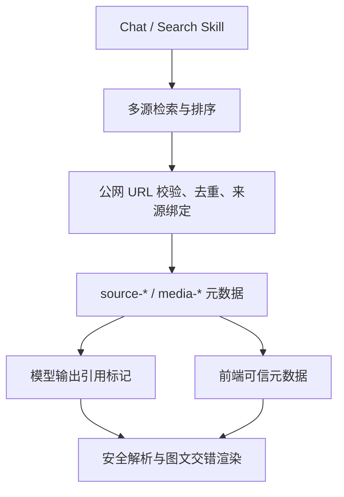

# 结构化图文回答：架构审查与实现说明

> **范围说明（2026-07-15）**：本文主要记录旧 FastAPI 搜索链的 `source-* / media-*` 协议。Makers 生产已改为 WSA `rich_search` + hy3 视觉筛选 + 标准 Markdown 图片，当前事实见 [`CURRENT_ARCHITECTURE_AND_REFACTOR_PLAN.md`](CURRENT_ARCHITECTURE_AND_REFACTOR_PLAN.md)。本文保留为安全与媒体来源绑定的设计参考。

## 1. 结论

项目的 Agent 主干（Event、Run、Plan、Policy、Action、Executor、Observation）已经具备良好的持久化与扩展边界，适合继续增加 Collector 和 Skill。原图文链路则不具备同等质量：模型直接输出远程图片 URL，图片与原始网页没有稳定关系，普通 Chat 和 Search 使用两套上下文格式，前端依赖正则替换文本。这会造成图片失效、错配、提示注入、无法署名以及难以扩展视频或图表等问题。

本次改造把“文字生成”和“媒体选择”解耦。检索层决定可用的来源与图片，模型只能在正文中引用稳定 ID，前端再从同消息携带的可信元数据解析 URL。



## 2. 消息协议

模型正文只允许使用三类标记：

```text
[[cite:source-1]]
[[image:media-1]]
[[card:source-2]]
```

WebSocket 最终事件同时携带 `search_results`：

```json
{
  "schema_version": 1,
  "query": "北京故宫",
  "results": [
    {"id": "source-1", "title": "...", "url": "https://...", "snippet": "...", "source": "web"}
  ],
  "media": [
    {
      "id": "media-1",
      "url": "https://.../image.jpg",
      "source_id": "source-1",
      "source_url": "https://...",
      "caption": "故宫外景",
      "alt": "故宫外景",
      "generated": false
    }
  ]
}
```

模型看得到媒体 ID、说明和对应来源，但看不到可直接复制的图片 URL。未知 ID 会被丢弃；旧消息的 `[[img:https://...]]` 仅作为兼容路径保留，并且仍需通过安全 URL 检查。

## 3. 关键模块与职责

| 模块 | 职责 | 扩展边界 |
| --- | --- | --- |
| `services/search_system.py` | 多源检索、确定性排序、媒体候选提取 | 新搜索源实现统一结果字段即可 |
| `services/rich_media_service.py` | 来源 ID、媒体 ID、公网 URL 校验、去重、来源绑定 | 可新增 `video`、`chart` 等 kind |
| `services/search_service.py` | grounded prompt 与富媒体元数据协议 | 升级时递增 `schema_version` |
| `skills/chat_skill.py` / `search_skill.py` | 统一消费检索结果并传输元数据 | Skill 不解析或拼接远程图片 URL |
| `components/common/richContent.ts` | 引用、卡片、媒体标记解析 | 纯函数，便于单元测试 |
| `MarkdownRenderer.tsx` | 图片、说明、出处、失败降级渲染 | 新媒体类型在这里增加组件 |

## 4. 安全与质量规则

1. 来源 URL 和图片 URL 只从检索结果进入，不接受模型新造 URL。
2. 图片在后端经过协议、DNS/IP 和重定向安全校验；前端再次限制为 HTTPS/HTTP 形式。
3. 图片必须绑定来源页面，界面显示说明和“查看图片来源”。AI 生成图使用 `generated=true` 单独标识。
4. 排序保持确定性并兼顾来源多样性，便于测试、缓存和问题复现。
5. 图片加载失败时显示降级框，不让整段内容悄然消失。
6. 简单定义题不强行配图；地点、人物、产品、历史、新闻和操作教程优先选择 1–3 张真正有解释作用的图。

## 5. 对当前总体架构的审查

### 做得好的部分

- Transport 已经足够薄，业务进入 Application Service、Skill 和单一 Executor。
- Event/Run/Observation 让长任务、断线和重启恢复可审计。
- 副作用有 Policy、不可变 Action、幂等键和执行账本，适合增加更多外部工具。
- ModelGateway、Repository 和 Provider Service 的依赖方向清晰。

### 本次一并修复的问题

- 前端联网开关此前未进入 Agent Plan，现只以白名单字段合并，避免任意客户端 payload 污染计划。
- Chat 与 Search 的搜索上下文重复实现，现共用结构化 prompt 与元数据。
- 搜索结果随机抽样导致回答不可复现，现改为按评分与来源多样性确定性选择。
- 生图被改成 AUTO 直接执行，违背独立额度和统一副作用边界；现恢复为确认型 Action，高风险 AUTO 也会由 Policy 强制升级确认。

### 仍建议继续做的事

1. 把 `search_system.py` 拆成 Retriever、Ranker、MediaResolver 三个可注入接口，避免搜索源增加后单文件继续膨胀。
2. 增加引用覆盖率检查：对含数字、日期和具体结论的句子验证是否带有效 citation。
3. 下载图片到受控缓存或代理缩略图，统一超时、尺寸、内容类型、版权/许可元数据与失效策略。
4. 将 follow-up 生成迁入 ModelGateway，消除 ChatSkill 对特定 Provider 的直接 HTTP 调用。
5. 前端按页面动态导入 PDF、地图和管理面板，处理当前主 chunk 大于 500KB 的警告。
6. 增加 Playwright 端到端用例：流式正文先到、媒体元数据到达、图片失败、旧消息兼容和关闭联网搜索。

## 6. 验证范围

- 后端覆盖媒体去重、来源绑定、危险 URL 拒绝、确定性排序、Prompt 不暴露图片 URL，以及 Chat/Search 的结构化元数据传递。
- 前端覆盖媒体 ID 解析、未知 ID 拒绝、安全 URL、citation 解析和兼容路径。
- 完整后端 unittest、前端 Vitest、ESLint、TypeScript/Vite build 均通过。
