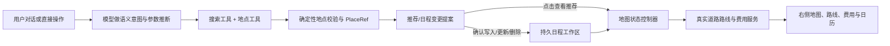

# 地图、地点、搜索、日程与 Agent 能力改造 PLAN

> 状态：待评审，不包含业务代码改动
> 制定日期：2026-07-15
> 目标基线：`edgeone-makers-adaptation` / `c521485`，并纳入当前工作区中尚未提交的 Makers 地图与日历原型
> 生产目标：EdgeOne Makers + LangGraph；旧 FastAPI 仅作为能力与领域设计参考

## 1. 结论

本轮不应只把 `MakersMap` 的直线换成一条腾讯地图折线，而应同时收敛地点真实性、路线计算、地图状态、日程确认、搜索媒体、自然回复以及会议/生图的副作用边界。否则会继续出现“模型推荐了不存在的地点”“地图先更新、用户还没同意”“路线看起来真实但费用仍按直线估算”“刷新后无法更新或删除日程”等不一致。

建议形成以下闭环：



核心原则：

1. 模型负责理解“用户想做什么”、生成自然文案和选择工具；地点是否存在、是否允许写入、路线是否最短、费用如何计算、Action 是否已确认等由确定性代码负责。
2. 地图只读取两类业务来源：已提交的日程、用户点击过的推荐地点。模型自由文本不能直接改地图。
3. 所有带地点的日程必须引用已验证的 `PlaceRef`；未找到的模型推荐可以保留在文字中，但不得进入地图或日程。
4. Agent 发起的日程新增、更新、删除先形成提案，用户明确同意后才提交。直接 UI 操作以确认弹窗作为明确同意。
5. 路线使用真实道路规划结果；在既定交通方式和时间约束内，按“路线距离最小，距离实质相同时费用最小”做字典序选择。
6. “真实交通费用”在产品上表述为“基于真实路线的费用估算”；没有供应商实时报价时不得伪装成最终成交价。

## 2. 当前实现审查

### 2.1 Makers 生产链路

当前生产链路已经有一个可用原型：

- `agents/chat/_ui_tools.py` 新增了 `show_places_on_map`、`add_calendar_events` 和图片并行分析工具。
- `agents/chat/index.py` 会把工具返回转换成 `map_update` / `calendar_update` SSE。
- `frontend/src/components/profile/MakersMap.tsx` 能显示地点并自动缩放。
- `frontend/src/components/profile/EdgeOnePlatformPanel.tsx` 能展示地图和日历。
- `agents/messages/index.py` 通过回放 LangGraph checkpoint 中的工具消息恢复地图和日历。

这些文件目前属于工作区未提交原型，后续实现必须保留并演进，不能用旧 FastAPI 文件覆盖。

### 2.2 已确认缺口

| 模块 | 当前事实 | 影响 |
| --- | --- | --- |
| 地图路线 | `MakersMap` 直接按地点数组绘制 `MultiPolyline` | 两点之间是直线，不是道路路线 |
| 地点真实性 | `show_places_on_map` 接收模型给出的名称、地址和可选坐标，前端再 geocode | 幻觉地点也可能被画到地图上 |
| 地图更新时机 | 工具一返回就执行 `SET_MAP_PLACES` | 用户还未点击或确认，地图已变化 |
| 日程写入 | `add_calendar_events` 立即生成事件并发出 `calendar_update` | 违反“先询问、同意后写入” |
| 日程 CRUD | Makers 原型只有新增，没有结构化更新和删除 | 无法形成双通道完整闭环 |
| 日程持久化 | 通过历史 ToolMessage 回放聚合 | 随机新 ID 易重复；更新、删除、版本冲突难以表达 |
| 当前定位 | Makers 地图未实现浏览器位置授权状态机 | 无日程时无法按要求显示当前位置/授权按钮 |
| 费用 | 旧本地实现按 `公里 × 常数` 估算 | 没有充分使用道路距离、路桥费、城市计价和交通方式 |
| 搜索宽度 | Makers 内置 `web_search` 默认最多 5 条；当前提示词没有显式规划深度 | 深度查询覆盖不足 |
| 网页图片 | 本地搜索单页最多提取 20 张、视觉分析 8 张、媒体输出 8 张；Makers 内置搜索只返回标题/链接/摘要 | 达不到单页最多 30 张候选的要求，且本地能力没有迁移到生产链路 |
| 自然回复 | Makers 生产提示词整体自然；旧本地旅行编排仍会拼接“根据之前的了解，你偏好……” | 两套模式体验不一致，内部记忆可能被显式复述 |
| 会议/生图 | FastAPI 有实现，Makers 生产链路没有工具 | 云端用户无法使用；`tmeet` CLI 也不适合 Serverless 原样搬运 |

### 2.3 需要立即处理的硬编码与安全问题

P0 必须先移除 `backend/services/place_db_service.py` 中硬编码的数据库公网 IP、用户名和密码，并轮换已经暴露的凭证。即使该文件当前不在 Makers 生产链路，也不能继续保留真实连接信息。

以下硬编码应分类处理，而不是一律交给模型：

| 类型 | 示例 | 处理方式 |
| --- | --- | --- |
| 必须删除 | 数据库 IP/账号/密码、前端或仓库中的真实 Secret | 改为环境变量/Secret 管理并轮换 |
| 应由模型推断 | 城市枚举识别、旅行关键词、推荐/讨论/新闻的关键词表、固定开场白、是否需要地点/搜索 | 结构化意图输出；规则只做模型不可用时的保守降级 |
| 应改为配置 | 搜索深度、每页图片上限、并发数、路线缓存 TTL、地图地点上限、费用参数 | 版本化配置，带供应商能力上限 |
| 必须保留为代码 | 权限、确认、幂等、状态机、Schema、SSRF、防注入、地点存在性、供应商限流、路线目标函数 | 不允许交给模型自由决定 |
| 可由模型生成但需校验 | “去右侧地图看看”的点击文案、会议主题、搜索查询改写、交通方式偏好 | 文案自然生成；Action ID、候选 ID 和参数由后端校验 |

## 3. 目标领域模型

### 3.1 已验证地点 `PlaceRefV1`

```json
{
  "schema_version": 1,
  "place_id": "tmap:123456",
  "provider": "tencent_lbs",
  "name": "地点标准名",
  "address": "供应商标准地址",
  "city": "上海",
  "category": "restaurant",
  "latitude": 31.0,
  "longitude": 121.0,
  "provider_payload_hash": "...",
  "confidence": 0.98,
  "verified_at": 0
}
```

约束：

- `place_id + provider` 是地点身份，不能以模型生成的名称作为主键。
- 只有地点服务返回的候选才能变为 `PlaceRefV1`。
- 推荐项找不到时从地图 payload 中省略，并把 `unresolved_names` 留给回答层决定是否提示。
- 普通任务和线上会议允许没有地点；只要填写了地点，就必须引用 `PlaceRefV1`。

### 3.2 地图动作 `MapRecommendationV1`

```json
{
  "action_id": "maprec_xxx",
  "title": "适合晚餐的几家店",
  "places": ["tmap:1", "tmap:2"],
  "unresolved_names": [],
  "created_from_message_id": "...",
  "status": "ready",
  "expires_at": 0
}
```

工具只创建推荐快照，不立即更新地图。模型在回复中引用该 Action：

```text
[[map_action:maprec_xxx|想看位置的话，点这里在右侧展开]]
```

竖线后的文字由模型自然生成，前端只信任已存在的 `action_id`。禁止通过匹配某句固定中文来触发地图。

### 3.3 日程变更提案 `CalendarChangeSetV1`

```json
{
  "action_id": "cal_xxx",
  "version": 1,
  "operation": "create|update|delete",
  "targets": ["schedule_xxx"],
  "before": [],
  "after": [],
  "summary": "...",
  "status": "awaiting_confirmation",
  "expires_at": 0
}
```

规则：

- Agent 通道：模型调用 `propose_calendar_change`，前端显示确认卡；只有确认接口成功后提交。
- UI 通道：用户从日历或地图发起新增/编辑/删除，先选择真实地点并看到确认弹窗，再调用同一个提交服务。
- 确认请求只提交 `action_id + version`，不得由前端重新发送一套可被篡改的日程参数。
- 地图仅读取已提交日程，不读取 `awaiting_confirmation` 草稿。

### 3.4 路线 `RoutePlanV1`

```json
{
  "route_id": "route_xxx",
  "provider": "tencent_lbs",
  "mode": "driving",
  "ordered_place_ids": ["tmap:1", "tmap:2"],
  "segments": [
    {
      "from_place_id": "tmap:1",
      "to_place_id": "tmap:2",
      "distance_m": 4200,
      "duration_s": 900,
      "polyline": [{"lat": 31.1, "lng": 121.1}],
      "toll_cny": 0
    }
  ],
  "totals": {
    "distance_m": 4200,
    "duration_s": 900,
    "estimated_cost_cny": {"min": 18, "max": 26}
  },
  "cost_basis": ["道路里程", "城市出租车计价配置"],
  "computed_at": 0
}
```

后端必须把供应商压缩 polyline 解码为普通坐标点，前端不再解析供应商私有格式。

## 4. 地图显示状态机

地图统一由 `TravelMapController` 决策，不允许各组件各写一套判断。

### 4.1 基础优先级

| 条件 | 地图模式 |
| --- | --- |
| 用户刚点击有效的推荐地图 Action | `recommendation`，显示该推荐及其最短路线；直到用户选择其他行程相关内容、切换日期或日程提交 |
| 当前选中日期存在至少 2 个已验证日程地点 | `schedule_route`，显示真实道路路线，不依赖定位权限 |
| 不足 2 个日程地点，且定位权限为 `granted` | `current_location`，只显示当前位置 |
| 不足 2 个日程地点，且权限为 `prompt/unknown` | `permission_prompt`，显示自然的授权按钮，不自动弹浏览器权限 |
| 不足 2 个日程地点，且权限为 `denied` | `permission_denied`，说明如何在浏览器设置中开启 |

### 4.2 状态转换

- 页面初始化先读取日程与最近一次已确认的地图选择，再查询 `navigator.permissions`；只有用户点击授权按钮才调用 `navigator.geolocation.getCurrentPosition`。
- 用户点击模型回复中的地图 Action：验证 action 未过期且至少有一个已解析地点，更新 `activeMapSource` 并持久化 revision。
- 用户切换日历日期：清除临时推荐选择，按所选日期重新推导日程路线。
- 新增、更新、删除日程确认成功：重新推导当前日期地图；未确认不更新。
- 推荐中只有一个真实地点时显示单点，不伪造路线；全部未找到时提示“这些地点暂时无法在地图中确认”。
- 位置只保存在浏览器内存；除非用户另行同意，不写入长期会话或日志。

## 5. 真实道路路线与费用

### 5.1 路线供应商适配

新增统一 `RouteProvider`：

```text
geocode / place_search / distance_matrix / directions / route_alternatives
```

首个实现使用腾讯位置服务。供应商响应先在服务端规范化，前端只消费 `RoutePlanV1`。不再由前端把 Marker 坐标直接连线。

实施要求：

- 两点路线调用真实 Direction API。
- 多点路线先获取道路距离矩阵，再优化访问顺序，最后按供应商途经点上限分段请求并无缝合并 polyline。
- 固定时间日程按开始时间作为硬约束，不为缩短路线擅自改变用户已确认的先后顺序；同一时间窗内的柔性地点可以优化顺序。
- 无时间约束的推荐地点：地点数较小时用精确算法，较大时用可重复的启发式算法，目标按 `(总道路距离, 总估算费用)` 排序。
- 路线距离差处于供应商误差范围（建议可配置为 `max(100m, 1%)`）时视为相等，再选择更低费用方案。
- 交通方式优先使用用户明确选择或模型结构化推断；缺失且不同方式差异明显时展示步行/公交/驾车选项，不默默猜测。
- 路线请求按地点 ID、坐标版本、交通方式、顺序约束和供应商版本缓存，设置短 TTL；路况时间敏感结果不得永久缓存。

### 5.2 费用模块

费用模块拆成可替换的 `FareEstimator`：

- 自驾：真实道路里程 × 能耗参数 × 能源单价 + 路桥费；停车费未知时明确标注未计入。
- 出租车/网约车：城市版本化计价配置，包括起步价、起步里程、分段里程费、时长费和夜间附加；输出区间而非单个伪精确值。
- 公交/地铁：优先使用路线供应商票价；没有票价就显示“供应商未返回”，不按公里瞎估。
- 步行/骑行：交通票价为 0，但可显示距离和耗时。
- 每个估价返回 `basis`、配置版本、币种、估价时间和缺失项。

旧代码中的 `distance_km * 0.7`、`distance_km * 3` 只保留为显式降级策略，并在 UI 标注“粗略估算”，不能作为主结果。

## 6. 搜索与地点联合工具

### 6.1 工具分工

一次“推荐餐馆/景点”的回答应至少走两个独立能力：

1. `rich_web_search`：查营业信息、口碑、时效内容和可引用来源。
2. `search_places`：从地图/地点供应商取得真实 `place_id`、地址和坐标。
3. `prepare_map_recommendation`：只接收前一步返回的候选 ID，保存可点击地图 Action。
4. 模型生成回答和自然的点击文案，不直接输出坐标、地图 JSON 或自由拼接地点 ID。

如果网页搜索推荐了 5 个地点而地点服务只确认 3 个：正文可以诚实说明其余未能核实，地图 Action 只包含确认成功的 3 个。

### 6.2 Makers 生产地点服务

- 将地点查询做成 `PlaceProvider`，首选腾讯位置服务；可配置 OSM/PostGIS 作为补充，但不得硬编码数据库地址和凭证。
- EdgeOne Agent 工具通过 `ctx.env` 读取服务端 Secret；JS SDK Key 仅用于地图渲染，并设置域名白名单。
- 为搜索候选创建短期 `PlaceCandidate` 快照，后续日程/地图只引用快照中的 ID，防止模型在不同 Tool Call 间偷换参数。
- 自动补全支持名称、别名、地址和附近中心点；提交前必须由用户选择候选。

## 7. 日程新增、更新、删除的双通道

### 7.1 Agent 对话通道

- 模型识别 `create/update/delete` 及目标范围。
- 更新/删除先查询现有日程；目标不唯一时让用户选择，不能默认删第一条。
- 新增或更新包含地点时调用地点模糊搜索；没有选中有效地点前不能生成可提交 Action。
- 生成 `CalendarChangeSetV1`，AI 用自然语言询问是否应用，并显示“确认/取消”。
- 用户确认后再提交并触发地图重新计算；拒绝则只把 Action 标为 cancelled。

### 7.2 用户直接操作通道

- 日历提供新增、编辑、删除入口。
- 地点输入框只用于搜索，最终值必须来自候选下拉；自由文本不能作为地点提交。
- 用户在地图 Marker 或推荐卡上可以“添加到日程”，进入相同的编辑与确认流程。
- 删除与覆盖更新显示变更前后摘要；确认后调用与 Agent 相同的 Workspace Service。

### 7.3 持久化

当前通过 ToolMessage 回放恢复日程的方式升级为版本化 Workspace Store：

- `schedules/{schedule_id}`：当前资源与 version。
- `actions/{action_id}`：冻结变更快照、状态与过期时间。
- `map_selections/{conversation_id}`：最近一次用户点击的推荐来源与 revision。

`agents/messages/index.py` 在迁移期继续读取旧 `calendar_update` / `map_update`，首次加载时幂等导入新 Store；新版本完成后不再以消息回放作为日程真相源。

## 8. 自然回复与可点击地图文案

- 不把“根据已确定的旅行偏好”“根据用户记忆”等说明性前缀拼到最终回复。
- 记忆和偏好以结构化内部上下文提供给模型，提示模型静默使用；用户没有询问“为什么推荐”时不主动解释记忆来源。
- 移除旧 `memory_driven_orchestrator.py` 中城市枚举、正则天数和固定开场白在生产链路中的职责，统一由模型输出结构化旅行意图。
- 地图点击文字由模型生成，但必须绑定系统签发的 `map_action` ID。前端渲染 Action，不通过中文句子正则识别。
- 给模型风格约束：避免每次相同开场、避免复述已知偏好、直接回应当前问题、工具调用细节对用户不可见。
- 增加回复多样性回归测试：同类旅行请求不得稳定重复同一句首句；同时不能牺牲事实性和可测试的结构化 Action。

## 9. 搜索扩容与单页 30 张图片

### 9.1 搜索宽度

EdgeOne 内置 `web_search` 默认 `maxResults=5`，生产工具应由模型先输出 `SearchPlan`：查询改写、时效范围、站点约束、期望深度和是否需要图片。确定性代码再把计划裁剪到账号套餐与预算允许的范围。

推荐目标：

| 深度 | 原始网页候选 | 最终证据 | 使用场景 |
| --- | ---: | ---: | --- |
| basic | 10 | 5-8 | 简单事实 |
| standard | 20 | 8-15 | 一般解释/推荐 |
| deep | 30-50（套餐允许时） | 12-24 | 比较、攻略、复杂推荐 |

Makers 内置工具只返回标题、链接、摘要、站点和日期。需要图片列表时新增 `rich_web_search` 包装：优先读取 WSA SearchPro 的 `images/pics`，不足时用安全页面抓取补充；不要让模型自己从 HTML 猜 URL。

### 9.2 图片容量

- 单个相关网页最多提取 30 张有效图片；网页不足 30 张就返回实际最大值。
- 支持 `og:image`、`img src`、`data-src`、`srcset`、`picture/source` 和常见懒加载属性。
- 候选图片先做 URL 规范化、SSRF 校验、类型/大小校验、去重和来源绑定。
- 当前一次只视觉分析 8 张的逻辑改成可配置批处理：每批 6-8 张、并发最多 4，总候选最多 30；单张失败不清空整批。
- 搜索 metadata 可以保存最多 30 张候选，但正文默认只插入模型认为有帮助的少量图片，前端图库按需懒加载，避免一次渲染 30 张大图。
- 上限、并发和抓取字节数使用配置项，不散落魔法数字。

官方能力边界：Makers `web_search` 可设置 `maxResults`，WSA SearchPro 的搜索条数和图片字段受套餐约束；代码必须读取实际返回能力并降级，不能假定所有环境都支持 50 条或每条 10 图。

## 10. 生图与腾讯会议适配

### 10.1 复用与不复用

从旧 FastAPI 复用：

- `ImageActionInput` / `MeetingActionInput` 的版本化 Pydantic Schema。
- Action 快照、version、幂等键、预算检查、未知副作用不盲重试的设计。
- 生图结果、会议号和加入链接的结构化输出经验。

不直接复用：

- FastAPI WebSocket handler、SQLite Repository 和前端轮询链路。
- `suggest()` 内直接创建会议/生图的绕行路径。
- 不复制旧 FastAPI 的 WebSocket/SQLite 编排；会议 Provider 按本次评审决定保留 `tmeet` CLI 调用。部署环境必须预装并已有可用登录态，应用不负责下载或交互登录。

### 10.2 Makers Action 流程

新增统一 `SideEffectActionV1`：

```text
模型提取参数 -> 后端校验 -> 生成冻结提案 -> 前端确认
-> Provider 执行 -> 结果持久化 -> SSE 更新消息/卡片
```

- 会议创建：始终确认；按产品决定复用旧 FastAPI 的 `tmeet` CLI Provider，不接 REST/OAuth。运行环境必须已有 `tmeet` 与可用登录态，应用不自动下载、不发起交互登录；输出会议 ID、会议号、加入链接，幂等与未知结果按保守策略处理。
- 生图：显式展示预计费用/额度；按预算策略决定直接执行还是确认。默认建议确认，后续可允许用户配置“明确生图请求且低于金额阈值时自动执行”。
- 生图采用当前有效的混元生图接口，异步任务需支持轮询、超时和取消；成功图片复制到 Makers Blob，避免供应商临时 URL 过期。
- Provider 凭证全部放 Makers Secret，日志和 ToolMessage 不保存 Secret、OAuth token 或完整原始响应。

## 11. 建议代码结构

```text
agents/
├── chat/
│   ├── index.py
│   ├── tools/
│   │   ├── search_tools.py
│   │   ├── place_tools.py
│   │   ├── calendar_tools.py
│   │   ├── map_tools.py
│   │   ├── image_tools.py
│   │   └── meeting_tools.py
│   └── prompts.py
├── workspace/                 # 确认、取消、CRUD、地图 Action 激活
├── places/                    # UI 模糊搜索端点
├── routes/                    # UI 路线端点
└── shared/
    ├── models.py
    ├── workspace_store.py
    ├── place_provider.py
    ├── route_provider.py
    ├── route_optimizer.py
    ├── fare_estimator.py
    └── action_service.py

frontend/src/
├── components/map/
│   ├── TravelMap.tsx
│   ├── MapPermissionState.tsx
│   ├── RouteSummary.tsx
│   └── PlaceAutocomplete.tsx
├── components/actions/
│   ├── MapActionLink.tsx
│   ├── CalendarChangeCard.tsx
│   └── SideEffectActionCard.tsx
├── hooks/
│   ├── useGeolocationPermission.ts
│   ├── useTravelMap.ts
│   └── useWorkspaceActions.ts
├── store/workspaceState.ts
└── services/workspaceApi.ts
```

是否把无模型的地点/路线查询最终放入 Cloud Functions，应先做一个小型部署验证；无论部署位置如何，领域模型、响应 Schema 和测试夹具只保留一套。

## 12. 分阶段实施

### Phase 0：基线、安全与契约

- 冻结当前 Makers 地图/日历原型，补最小测试后再重构。
- 删除并轮换硬编码数据库凭证。
- 确定 `PlaceRefV1`、`RoutePlanV1`、`CalendarChangeSetV1`、`MapRecommendationV1`。
- 增加配置模型，集中管理搜索/图片/路线/费用上限。
- 明确 EdgeOne Store 的读写、乐观版本和 endpoint 形态。

退出条件：凭证不在仓库；Schema 测试通过；旧 checkpoint 可读取。

### Phase 1：真实地点与可点击推荐

- 接入生产 `search_places`，返回供应商 ID。
- `show_places_on_map` 改为 `prepare_map_recommendation`，禁止直接接收自由坐标。
- 实现动态 `[[map_action:...|...]]` 渲染和点击激活。
- 未解析地点不进入地图。

退出条件：模型推荐 5 个、供应商只找到 3 个时，地图只显示 3 个；未点击前地图不变化。

### Phase 2：Workspace 与日程确认 CRUD

- 建立版本化 Workspace Store 和 Action 状态机。
- 实现 Agent/UI 双通道新增、更新、删除。
- 地点自动补全强制选择真实候选。
- 迁移旧 ToolMessage 日程。

退出条件：拒绝提案不写入；重复确认只提交一次；更新/删除可跨刷新恢复。

### Phase 3：真实路线、定位状态机与费用

- RouteProvider、polyline 解码、距离矩阵、多点优化和费用估算。
- 用 `TravelMapController` 替换 `MakersMap`/`DailyRouteMap` 的分散逻辑。
- 实现定位 `granted/prompt/denied` UI。
- 本地 FastAPI 通过 Adapter 消费相同前端路线契约，避免双地图继续分叉。

退出条件：两点沿真实道路绘制；四种定位/日程组合均符合第 4 节；费用由真实道路距离驱动。

### Phase 4：搜索宽度和 30 图媒体管线

- 新增模型驱动 `SearchPlan` 和供应商能力裁剪。
- 迁移/重写 `rich_web_search`，单页最多 30 图。
- 视觉分析分批、失败隔离、来源绑定与前端懒加载。

退出条件：含 35 张有效图的测试页返回 30 张；含 7 张的页面返回 7 张；无图页返回 0；深度搜索结果数受套餐而非固定 5 条限制。

### Phase 5：自然回复与硬编码收敛

- 结构化意图替代城市枚举、旅行/搜索关键词和固定首句。
- 内部记忆与可见回复上下文分离。
- 增加回复多样性、Action 引用合法性和提示词泄漏测试。

退出条件：旅行回答不再固定以“根据已确定的旅行偏好”开头；地图点击文字自然变化但都能安全触发对应 Action。

### Phase 6：会议与生图

- 接入 Makers Action、确认卡和 Provider Adapter。
- 腾讯会议适配旧版 `tmeet` CLI；混元生图接 TokenHub，并在后续补充 Makers Blob 长期归档。
- 接入预算、幂等、超时、失败恢复和审计。

退出条件：未确认不创建会议/付费图片；重复确认不重复创建；刷新后可看到最终结果。

### Phase 7：端到端收敛与发布

- EdgeOne Makers dev 条件测试、真实 Provider smoke test、浏览器 E2E。
- 清理旧生产不可达代码，但保留本地兼容模式必要 Adapter。
- 更新 README、迁移文档、环境变量、故障排查和数据回滚说明。

退出条件：所有验收场景通过，旧会话可迁移，功能开关可一键回退到旧地图只读模式。

## 13. 关键验收 CASE

| CASE | 操作 | 预期 |
| --- | --- | --- |
| MAP-001 | 已授权定位，当日不足 2 个有效地点 | 显示当前位置，不画伪路线 |
| MAP-002 | 已授权定位，当日有 2 个以上有效日程地点 | 显示日程真实道路路线，定位不覆盖路线 |
| MAP-003 | 未授权定位，当日有有效路线 | 直接显示路线，不要求授权 |
| MAP-004 | 未授权定位，当日无有效路线 | 显示授权按钮；只有点击按钮才触发浏览器权限 |
| MAP-005 | 模型推荐多个地点但用户未点击 | 回答里有自然可点击文字，右侧地图保持原状态 |
| MAP-006 | 点击推荐地图 Action | 地图显示全部已确认地点；未找到的地点不显示 |
| MAP-007 | 两点路线 | polyline 沿道路，距离显著不同于直线时采用道路距离 |
| MAP-008 | 多点可重排推荐 | 选择总道路距离最小方案；等距时选估价更低方案 |
| SCH-001 | Agent 提议写入日程 | 确认前 Store 无正式日程，确认后才出现 |
| SCH-002 | 用户拒绝写入 | Action cancelled，地图和日历都不变化 |
| SCH-003 | 对话更新/删除目标不唯一 | 先让用户选择，不默认操作第一项 |
| SCH-004 | UI 手动输入不存在地点 | 不能提交；选择地点搜索候选后才能提交 |
| SCH-005 | 重复确认同一 Action | 只执行一次，第二次返回当前终态 |
| SRCH-001 | 标准/深度搜索 | 不再固定 5 条，按 SearchPlan 与套餐能力返回 |
| IMG-001 | 页面有 35 张有效图 | 最多返回 30 张候选并保留来源 |
| IMG-002 | 页面只有 7 张有效图 | 返回 7 张，不用占位图补足 |
| IMG-003 | 一张图片分析失败 | 其他图片继续处理，不清空整个结果 |
| TXT-001 | 连续 5 次相似旅行请求 | 首句不固定复述旅行偏好，回答仍使用记忆改善推荐 |
| ACT-001 | 未确认创建会议 | Provider 未调用 |
| ACT-002 | 会议确认后重复点击 | 只创建一个会议 |
| ACT-003 | 生图供应商 URL 将过期 | 成功结果复制到 Makers Blob 后展示 |

## 14. 风险与边界

- 腾讯地图不同 API/套餐的路线模式、途经点、路况和票价字段不同，必须用真实账号做合约测试，缺字段时明确降级。
- WSA 的结果数和图片字段随套餐变化：内置 `web_search` 不能替代完整图片管线。
- 腾讯会议 REST API 需要合适账号版本、权限点和 OAuth/AKSK 配置，不能假设个人账号可直接创建。
- 地理位置属于敏感数据，默认不持久化、不进入模型上下文。
- 路线最短与用户固定日程时间可能冲突；固定时间是硬约束，系统只能提示优化建议，不能静默重排已提交日程。
- “所有硬编码都交给模型”不可作为实现原则。涉及安全、权限、费用公式、供应商限额和数据一致性的硬约束必须保持确定性。

## 15. 评审后建议的首个开发批次

PLAN 通过后，第一批只做 Phase 0 + Phase 1：先移除凭证、固定契约、建立真实地点 ID 与可点击地图 Action。这样能尽快解决“模型幻觉地点直接上图”和“推荐一出就擅自改地图”两个风险，同时为后续真实路线、日程确认和会议/生图提供统一 Action 基础。

## 16. 参考文档

- [EdgeOne Makers 网络搜索工具](https://cloud.tencent.com/document/product/1552/132746)
- [EdgeOne Makers Agent 框架使用](https://cloud.tencent.com/document/product/1552/132770)
- [腾讯云联网搜索 SearchPro](https://cloud.tencent.com/document/product/1806/130615)
- [腾讯会议创建会议 API](https://cloud.tencent.com/document/product/1095/42417)
- [腾讯混元生图 API 概览](https://cloud.tencent.com/document/product/1668/88077)
