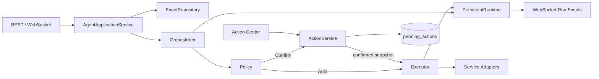

# 元宝 Agent 当前能力、边界与近期实现架构

> **实现状态更新（2026-07-11）**：本文件保留为目标设计/历史交接快照。当前代码完成度、测试结果和剩余边界以 [`docs/IMPLEMENTATION_STATUS.md`](../IMPLEMENTATION_STATUS.md) 为准。


> 文档日期：2026-07-10
> 代码基线：M0、M1 已完成，M2 持久 Runtime 基础层实施中
> 目标读者：继续实现本项目的开发者或 Agent

## 1. 本次验证结论

在编写本文档前完成了以下验证：

| 验证项 | 结果 | 备注 |
| --- | --- | --- |
| 后端单元测试 | 13/13 通过 | 包含 M1 持久化和 M2 Repository 状态测试 |
| 后端源码编译和应用导入 | 通过 | FastAPI 3.0.0 可创建 |
| 前端 lint | 通过 | ESLint 零错误 |
| 前端单元测试 | 3/3 通过 | reducer 与消息恢复基础行为 |
| 前端生产构建 | 通过 | 存在非阻塞的大包体警告 |
| 实际数据库迁移 | 通过 | schema migration 版本为 1、2、3 |
| 前端运行态 | 通过 | `http://127.0.0.1:5173` 返回 200 |
| 后端运行态 | 通过 | `http://127.0.0.1:8000` 可访问 |
| 对话模型配置 | 已配置 | `llm_ready=true`，实际调用仍依赖外网和供应商可用性 |
| 生图配置 | 已配置 | `image_ready=true`，尚未接入 M2 安全确认闭环 |
| 地图配置 | 未就绪 | `map_ready=false` |
| 腾讯会议环境 | 不可用 | `tmeet` 未正确安装，状态接口当前返回 500 |

“测试通过”只证明本地确定性代码和模拟链路通过，不代表外部模型、地图、搜索、arXiv 或会议服务始终可用。

## 2. 能力分级定义

- **可用**：本地调用链完整，有持久化或明确结果，已通过测试。
- **条件可用**：代码链存在，但依赖 API Key、外网、额度、本机 CLI 或第三方服务。
- **基础已建但未接线**：数据结构或 API 已存在，尚未进入真实用户执行链。
- **不可用**：产品界面或代码中可能有描述，但没有可靠闭环。

## 3. 当前系统能做什么

### 3.1 本地身份、会话与消息

状态：**可用**。

系统能够：

- 启动时创建固定用户 `local-user` 和默认会话 `default-conversation`。
- 创建和列出后端 conversation。
- 保存用户、AI、system 消息及 UI metadata。
- 刷新、WebSocket 重连和后端重启后恢复消息。
- 将 M0 之前的旧消息表无损导入默认会话。
- 在普通输入和追问时先保存消息，再触发 Agent，避免未持久化消息进入执行链。
- WebSocket 建连时从最近消息重建模型对话历史。

主要代码：

| 文件 | 当前职责 |
| --- | --- |
| `backend/database/repositories/conversation_repo.py` | 固定身份、conversation、message 持久化 |
| `backend/api/conversation_routes.py` | bootstrap 和 conversation/message REST API |
| `backend/api/websocket.py` | WebSocket 接入、历史恢复、流式消息 |
| `frontend/src/hooks/useWebSocket.ts` | 前端重连、流式消息聚合、完成消息持久化 |
| `frontend/src/components/chat/InputBar.tsx` | 用户消息先持久化后发送 |
| `frontend/src/components/chat/MessageBubble.tsx` | 追问先持久化后发送 |

当前限制：前端只使用默认会话，尚无会话列表、切换、重命名和删除界面；AI 流式结果仍由前端在 `stream_end` 时保存，浏览器在流式结束前崩溃可能丢失该次 AI 输出。

### 3.2 普通聊天与意图识别

状态：**条件可用**。

系统能够通过 WebSocket 接收用户消息，调用意图分类器，并路由到 chat、travel、meeting、paper、search、translation、image 等处理器。普通聊天支持流式输出和后续追问建议。

条件：需要可访问的混元或 DeepSeek 服务、有效 Key 和可用额度。当前配置显示模型 Key 已配置，但实际运行环境曾出现外部连接失败，因此不能承诺离线可用。

当前限制：Orchestrator 使用 `backend/agent/runtime.py` 中的内存 Runtime，M2 持久 Repository 尚未接入真实 WebSocket 流程。

### 3.3 PDF 上传、持久化与阅读

状态：**可用；AI 分析部分条件可用**。

系统能够：

- 上传真实 PDF。
- 校验 PDF 文件签名、50MB 上限、500 页上限和加密状态。
- 拒绝无可提取文本的扫描件。
- 提取全文文本和页数。
- 以 SHA-256 去重，使用随机文件名隔离用户文件名和存储路径。
- 重启后通过 files 表重新打开 PDF。
- files 索引存在但磁盘文件丢失时，用同哈希文件恢复原 `file_id`。
- 将旧论文文件迁移到持久 files 索引。

论文翻译、总结、术语解释、全文分析和问答依赖外部模型，因此属于条件可用。

### 3.4 论文搜索和“我的阅读”

状态：**条件可用**。

系统具有 arXiv 搜索、PDF 下载、论文收藏、阅读、段落翻译、总结、公式解释、术语提取和问答 API。收藏记录统一归属 `local-user`，文件内容可以从数据库回源。

条件和限制：

- 搜索和下载依赖 arXiv/外网。
- 中文摘要、全文分析和问答依赖 DeepSeek。
- 没有后台下载任务、超时恢复和进度持久化。
- 文件下载和分析尚未进入持久 AgentRun。

### 3.5 旅游计划与本地日程

状态：**部分可用**。

本地可用：

- 城市名称搜索。
- 旅游计划和日程的 SQLite CRUD。
- 日程完成状态切换。
- 日程时间冲突检查。
- 所有旧 session API 在服务端统一归属 `local-user`。

条件可用：

- 自然语言需求分析和行程生成依赖模型。
- POI 搜索、路线、天气和每日路线依赖腾讯地图 Key 与外网。

当前实测 `map_ready=false`，因此当前环境不能可靠完成真实地图、POI、路线和天气能力。

### 3.6 搜索、翻译与生图

状态：**条件可用**。

- 搜索代码支持网页、微信、知乎、百科和 WSA 聚合、打分、图片提取与模型总结。
- 翻译支持外语检测和模型翻译。
- 生图配置已存在，可通过 WebSocket 或 REST 调用。

限制：

- 全部依赖外网、供应商服务和额度。
- 搜索引用校验、统一超时和部分结果降级尚不完整。
- 生图是有额度副作用的操作，但旧 WebSocket 流程仍可能自动执行，尚未接入 M2 PendingAction 确认和幂等执行。

### 3.7 腾讯会议

状态：**当前不可用**。

代码具有会议意图识别、信息抽取和 `tmeet` CLI 调用，但当前状态接口返回 500。根因包括：

- `tmeet` 未安装或未授权。
- `MeetingService` 会在检查状态时尝试自动安装 CLI，违反显式 Setup 原则。
- Windows 环境调用 `npm` 而不是可发现的 `npm.cmd`，可能产生 `FileNotFoundError`。
- 会议确认按钮仍直接调用旧 REST 接口，没有使用 PendingAction 参数快照。

因此当前版本不能宣称“可创建腾讯会议”。

### 3.8 M2 持久 Runtime 基础层

状态：**基础已建但未接线**。

已经实现：

- `agent_events`、`agent_runs`、`agent_observations`、`pending_actions` 表。
- 事件 `dedup_key` 去重。
- Run 状态迁移与 observation 审计。
- Action 规范化 JSON 快照、SHA-256 快照哈希、version 和 idempotency key。
- Action 查询、确认、取消、过期联动和 Run 有限重试 API。
- 确认版本冲突、重复确认、过期、取消和重试测试。

尚未实现：

- 现有 Orchestrator 没有写入这些表。
- 确认后没有持久 worker 领取并执行 Action。
- 会议和生图没有迁移。
- 没有启动恢复、租约和未知外部结果核对。
- 前端没有 Run 时间线和待确认 Action 中心。

## 4. 当前系统不能做什么

下列能力当前不能作为产品承诺：

1. 没有用户输入时主动运行。当前没有 Scheduler、Collector 或后台 Supervisor。
2. 不能主动监控日程临近、冲突、旅行天气变化或文件到达事件。
3. 不能保证同一副作用在崩溃、重试或重复确认后只执行一次。
4. 不能在服务重启后继续现有 Orchestrator 的执行中任务。
5. 不能在确认后证明最终执行参数和确认快照字节级一致。
6. 不能可靠创建腾讯会议。
7. 当前环境不能使用真实地图、路线、POI 和天气能力。
8. 不能离线完成聊天、搜索总结、翻译、论文 AI 分析和生图。
9. 没有持久通知中心、免打扰、每日上限、冷却和去重通知策略。
10. 没有长期记忆、偏好管理、反馈学习和数据导出/清空界面。
11. 没有本地访问令牌；CORS 和默认安全边界不适合暴露到局域网或公网。
12. 没有统一错误分类，部分外部连接或 CLI 缺失会直接返回 HTTP 500。
13. 没有前端多会话管理、Run 详情页或 Action 管理页。
14. 没有完整成本、Token、预算和额度持久化。

## 5. 当前架构问题

### 5.1 Transport 仍承担业务执行

`backend/api/websocket.py` 包含搜索、论文、翻译、生图等大量 handler。Transport 应只负责协议解析和事件推送，核心调用应下沉到 application service 和 executor。

### 5.2 内存 Runtime 与持久 Repository 并存

`backend/agent/runtime.py` 是同步内存实现，`backend/database/repositories/runtime_repo.py` 是异步持久实现。继续双轨会导致 UI 收到的 run_id 与数据库状态不一致。

### 5.3 副作用绕过统一 Action

会议、生图、日程写入等仍可由旧 REST 或前端按钮直接执行。所有副作用必须经过同一个 ActionService 和 Executor。

### 5.4 外部服务错误没有统一边界

地图、模型、搜索、arXiv 和 CLI 的异常处理分散。配置缺失、认证失败、限流、超时和外部服务失败没有统一错误 DTO。

## 6. 近期应实现的目标

近期只完成当前代码和依赖完全有能力支撑的内容：完成 M2、把现有能力接入可靠执行链、修复当前外部能力的 Setup 和错误边界。不进入 M3 主动调度。

### 6.1 目标状态流



强制依赖方向：

```text
api / websocket / frontend
        -> application services
        -> domain contracts + policy + runtime + executor
        -> repositories / service adapters
        -> SQLite / HTTP / CLI
```

API 层不得直接调用外部 CLI、模型、生图或会议服务；Repository 不得导入 FastAPI、WebSocket 或前端 DTO。

## 7. 后端详细实现设计

### 7.1 Domain contracts

文件：`backend/agent/contracts.py`

应增加或收敛为以下不可变 DTO：

```python
@dataclass(frozen=True, slots=True)
class EventInput:
    type: str
    source: str
    subject_id: str | None
    payload: dict[str, Any]
    dedup_key: str
    occurred_at: float

@dataclass(frozen=True, slots=True)
class ValidatedPlan:
    run_id: str
    event_id: str
    skill_name: str
    params: dict[str, Any]
    steps: tuple[str, ...]
    permission_level: PermissionLevel
    risk_level: RiskLevel
    timeout_seconds: float
    max_attempts: int
    idempotency_key: str | None

@dataclass(frozen=True, slots=True)
class ActionSnapshot:
    skill_name: str
    params: dict[str, Any]
    expected_output: dict[str, Any]
    permission: str
    cost_limit: float | None
    timeout_seconds: float

@dataclass(frozen=True, slots=True)
class ExecutionResult:
    status: Literal["succeeded", "failed", "cancelled"]
    output: dict[str, Any]
    external_resource_id: str | None
    error_type: str | None
    user_message: str
```

规则：DTO 不持有数据库连接、WebSocket 或 service client；进入 Plan 和执行前各验证一次；快照字段必须可规范化 JSON 序列化。

### 7.2 Persistent Runtime facade

建议新文件：`backend/agent/persistent_runtime.py`

该层封装 Repository，替代当前内存 `AgentRuntime`，向 Orchestrator 暴露领域语义：

```python
class PersistentAgentRuntime:
    async def start_run(self, event: AgentEvent) -> AgentRunRecord
    async def record_classification(self, run_id: str, intent: str, payload: dict[str, Any]) -> AgentRunRecord
    async def attach_plan(self, run_id: str, plan: ValidatedPlan) -> AgentRunRecord
    async def record_policy(self, run_id: str, decision: PolicyDecision) -> AgentRunRecord
    async def queue(self, run_id: str, reason: str) -> AgentRunRecord
    async def start_execution(self, run_id: str, lease_seconds: float) -> AgentRunRecord
    async def finish(self, run_id: str, result: ExecutionResult) -> AgentRunRecord
    async def fail(self, run_id: str, error: AgentError) -> AgentRunRecord
    async def cancel(self, run_id: str, reason: str) -> AgentRunRecord
    async def recover_expired_runs(self, now: float) -> list[AgentRunRecord]
```

输入是已经验证的领域对象；输出是数据库保存后的完整 record。每次状态变化必须与 observation 在同一个事务提交。

`backend/agent/runtime.py` 在迁移完成后只保留兼容导出，禁止继续作为生产内存注册表。

### 7.3 Repository 下沉边界

文件：`backend/database/repositories/runtime_repo.py`

Repository 只负责 SQL、事务、并发条件和序列化，不负责业务决策。建议拆分为：

- `event_repo.py`
- `run_repo.py`
- `observation_repo.py`
- `action_repo.py`

如果暂时不拆文件，至少按以下函数边界组织：

```python
async def insert_event(event: EventInput) -> tuple[EventRecord, bool]
async def insert_run(event_id: str, max_attempts: int) -> RunRecord
async def get_run_for_update(run_id: str) -> RunRecord | None
async def transition_run(expected_status: str, target_status: str, observation: ObservationInput) -> RunRecord
async def claim_queued_run(run_id: str, lease_owner: str, lease_until: float) -> RunRecord | None
async def list_recoverable_runs(now: float, limit: int) -> list[RunRecord]
async def insert_action(action: ActionCreate) -> ActionRecord
async def confirm_action(action_id: str, expected_version: int, now: float) -> ActionRecord
async def claim_confirmed_action(action_id: str, idempotency_key: str) -> ActionRecord | None
async def complete_action(action_id: str, result: ExecutionResult) -> ActionRecord
```

所有 `expected_status/version` 条件必须进入 SQL `WHERE`，以 `rowcount == 1` 作为成功依据。

### 7.4 Agent application service

建议新文件：`backend/agent/application_service.py`

```python
class AgentApplicationService:
    async def ingest(self, event: EventInput, transport: EventPublisher) -> AgentResponse
    async def get_run(self, run_id: str) -> RunView
    async def confirm_action(self, action_id: str, version: int) -> ActionView
    async def cancel_action(self, action_id: str) -> ActionView
    async def retry_run(self, run_id: str) -> RunView
```

`ingest()` 顺序必须固定：

1. 持久化/去重 event。
2. 创建 run。
3. classify。
4. 创建并持久化 plan。
5. policy check。
6. Auto 则 queued；Confirm 则创建 ActionSnapshot；Deny 则 skipped。
7. 发布保存后的状态事件。

Transport 断开不影响 1–6 的事务结果。

### 7.5 Action service

建议新文件：`backend/agent/action_service.py`

```python
class ActionService:
    async def request_confirmation(self, run: RunRecord, plan: ValidatedPlan, expires_at: float) -> ActionRecord
    async def confirm(self, action_id: str, version: int, now: float) -> ActionRecord
    async def cancel(self, action_id: str, reason: str, now: float) -> ActionRecord
    async def expire_due(self, now: float, limit: int = 100) -> int
    async def execute_confirmed(self, action_id: str, cancellation: CancellationToken) -> ExecutionResult
```

`confirm()` 不重新调用 LLM、不重新解析用户消息，只允许执行数据库中的 snapshot。`execute_confirmed()` 必须再次计算 snapshot hash，并将 snapshot.params 原样传给 Executor。

### 7.6 Executor

建议新文件：`backend/agent/executor.py`

```python
class SkillExecutor:
    async def execute(
        self,
        skill_name: str,
        params: dict[str, Any],
        idempotency_key: str,
        timeout_seconds: float,
        cancellation: CancellationToken,
    ) -> ExecutionResult

    async def reconcile(
        self,
        skill_name: str,
        idempotency_key: str,
        external_resource_id: str | None,
    ) -> ExecutionResult | None
```

Executor 是唯一允许调用有副作用 Adapter 的入口。它不直接更新 run/action 表，而是返回结果给 ActionService/PersistentRuntime。

### 7.7 Meeting adapter

文件：`backend/services/meeting_service.py`

需要拆成纯 Adapter，移除请求时自动安装：

```python
class MeetingAdapter:
    async def status(self) -> MeetingSetupStatus
    async def create(self, request: MeetingCreateInput, idempotency_key: str) -> MeetingCreateOutput
    async def find_by_idempotency_key(self, idempotency_key: str) -> MeetingCreateOutput | None
```

建议新增：`backend/services/setup_service.py`

```python
class SetupService:
    async def inspect_meeting_cli(self) -> SetupCheck
    async def install_meeting_cli(self, approved: bool) -> SetupResult
    async def begin_meeting_auth(self, approved: bool) -> SetupResult
```

安装和授权只能由显式 Setup API 调用。Windows 命令发现应使用 `shutil.which("tmeet")`、`shutil.which("npm.cmd")`，不得在普通 status 请求中安装软件。

### 7.8 Image adapter

建议新文件：`backend/services/image_adapter.py`

```python
class ImageAdapter:
    async def generate(self, request: ImageGenerateInput, idempotency_key: str) -> ImageGenerateOutput
    async def get_result(self, external_task_id: str) -> ImageGenerateOutput | None
```

生图必须先由 Policy 根据额度决定 Auto/Confirm。结果 URL、provider task id、参数和费用写入 observation/action result。

### 7.9 Unified errors

建议新文件：`backend/agent/errors.py`

```python
class AgentError(Exception):
    type: Literal[
        "configuration_error", "authentication_error", "quota_exhausted",
        "rate_limited", "timeout", "validation_error",
        "external_service_error", "cancelled", "internal_error"
    ]
    retryable: bool
    user_message: str
    details: dict[str, Any]

def classify_exception(error: Exception, provider: str) -> AgentError
```

API 只返回 `type/user_message/run_id`，内部堆栈和供应商原始响应只进入脱敏日志。

### 7.10 Startup recovery

建议新文件：`backend/agent/recovery.py`

```python
class RecoveryService:
    async def recover(self, now: float) -> RecoveryReport
    async def recover_run(self, run: RunRecord, now: float) -> RecoveryDecision
    async def reconcile_action(self, action: ActionRecord) -> ExecutionResult | None
```

启动时处理：

- `executing` 且租约过期的 run。
- `confirmed/executing` action。
- 已过期的 awaiting action。
- 对副作用结果未知的操作先调用 Adapter.reconcile，不直接重试。

## 8. API 与 WebSocket 设计

### 8.1 REST API

保留并完善：

```text
GET  /api/runs/{run_id}
GET  /api/actions?status=awaiting_confirmation
POST /api/actions/{action_id}/confirm  {"version": 1}
POST /api/actions/{action_id}/cancel   {"reason": "user_cancelled"}
POST /api/runs/{run_id}/retry
POST /api/runs/{run_id}/cancel
GET  /api/setup/meeting
POST /api/setup/meeting/install
POST /api/setup/meeting/auth
```

修改接口必须返回更新后的资源及 version，不能只返回 `{ok: true}`。

### 8.2 WebSocket envelope

`backend/api/websocket.py` 只处理 envelope 和连接，不执行业务函数：

```json
{
  "version": 1,
  "type": "run.updated",
  "id": "wsmsg-xxx",
  "ts": 0,
  "cursor": 123,
  "payload": {"run": {}}
}
```

需要的发布函数：

```python
class EventPublisher(Protocol):
    async def publish_run(self, run: RunView) -> None
    async def publish_action(self, action: ActionView) -> None
    async def publish_error(self, error: AgentError) -> None
    async def replay(self, conversation_id: str, after_cursor: int) -> list[Envelope]
```

近期可以先通过数据库 observation id 作为 cursor，不需要引入消息中间件。

## 9. 前端详细实现设计

### 9.1 类型

文件：`frontend/src/types/index.ts`

增加：

```typescript
export type RunStatus = 'created' | 'classified' | 'planned' | 'policy_checked' |
  'waiting_confirmation' | 'queued' | 'executing' | 'succeeded' |
  'failed' | 'cancelled' | 'skipped';

export interface AgentObservationView {
  id: number;
  status: RunStatus;
  step: string;
  payload: Record<string, unknown>;
  error: string;
  ts: number;
}

export interface AgentRunView {
  id: string;
  status: RunStatus;
  intent: string;
  plan: Record<string, unknown>;
  observations: AgentObservationView[];
  updated_at: number;
}

export interface PendingActionView {
  id: string;
  run_id: string;
  skill_name: string;
  snapshot: Record<string, unknown>;
  version: number;
  status: string;
  expires_at?: number;
}
```

### 9.2 API client

建议新文件：`frontend/src/services/agentApi.ts`

```typescript
export async function getRun(runId: string): Promise<AgentRunView>
export async function listPendingActions(): Promise<PendingActionView[]>
export async function confirmAction(actionId: string, version: number): Promise<PendingActionView>
export async function cancelAction(actionId: string, reason: string): Promise<PendingActionView>
export async function retryRun(runId: string): Promise<AgentRunView>
export async function cancelRun(runId: string): Promise<AgentRunView>
```

所有函数对非 2xx 解析统一 `ApiError {status, type, message, runId}`。

### 9.3 Store

文件：`frontend/src/store/appState.ts`

增加规范化状态：

```typescript
runsById: Record<string, AgentRunView>;
actionsById: Record<string, PendingActionView>;
activeRunIds: string[];
```

Reducer action：

```text
UPSERT_RUN
UPSERT_ACTION
HYDRATE_ACTIONS
REMOVE_ACTION
SET_ACTION_MUTATING
```

WebSocket 与 REST 回包都进入相同 reducer，禁止组件维护第二份业务状态。

### 9.4 组件

建议新增：

```text
frontend/src/components/agent/RunTimeline.tsx
frontend/src/components/agent/PendingActionCard.tsx
frontend/src/components/agent/ActionCenter.tsx
frontend/src/components/agent/RunErrorPanel.tsx
frontend/src/components/setup/MeetingSetupCard.tsx
```

`PendingActionCard` 输入：

```typescript
interface PendingActionCardProps {
  action: PendingActionView;
  run?: AgentRunView;
  onConfirm(actionId: string, version: number): Promise<void>;
  onCancel(actionId: string, reason: string): Promise<void>;
}
```

卡片必须展示完整确认参数、预计动作、风险、费用上限、可逆性、过期时间和版本。按钮请求期间禁用，409 后刷新最新 Action。

## 10. 测试拆分

### 10.1 后端

新增或扩展：

```text
backend/tests/test_runtime_transitions.py
backend/tests/test_action_snapshot.py
backend/tests/test_action_idempotency.py
backend/tests/test_action_concurrency.py
backend/tests/test_recovery.py
backend/tests/test_meeting_adapter.py
backend/tests/test_image_adapter.py
backend/tests/test_agent_api.py
backend/tests/test_agent_integration.py
```

必须覆盖：

- 两个并发确认只有一个成功。
- 旧 version 返回 409。
- 确认后篡改 snapshot 导致执行拒绝。
- 重复执行 idempotency key 不产生第二个外部资源。
- 执行中重启后 reconcile，不盲目重试。
- 过期 Action 同步终止 Run。
- 配置、授权、额度错误不可重试。
- 网络超时在最大次数内重试。

### 10.2 前端

新增：

```text
frontend/src/store/agentState.test.ts
frontend/src/components/agent/PendingActionCard.test.tsx
frontend/src/hooks/useWebSocket.agent.test.ts
```

覆盖确认中禁用、409 刷新、重连补发、Run 时间线排序、取消和重试。

## 11. 实施顺序

1. 收敛 contracts 和错误模型。
2. 拆分/加固 Runtime Repository 事务接口。
3. 实现 PersistentAgentRuntime，并把 Orchestrator 改成 async runtime。
4. 实现 ActionService 与 SkillExecutor。
5. 迁移 MeetingAdapter，移除自动安装。
6. 迁移 ImageAdapter。
7. 接入 Run/Action REST 和 WebSocket envelope。
8. 实现前端 Action Center 与 RunTimeline。
9. 实现 RecoveryService 和启动恢复。
10. 完成并发、重启、幂等和端到端测试。

## 12. M2 完成判定

只有同时满足以下条件，才能把 M2 标为完成：

- 所有真实用户事件都创建持久 event/run/observations。
- Orchestrator 不再使用生产内存 Runtime。
- 会议和生图只能通过 ActionService/Executor 执行。
- 确认参数与执行参数规范化 JSON 字节一致。
- 同一 idempotency key 只产生一个外部资源。
- 确认、取消、过期、失败和有限重试都有 API、UI 和 observation。
- 重启可恢复 waiting/queued/executing 状态，未知副作用先 reconcile。
- 后端测试、前端测试、lint、build 和 M2 端到端测试全部通过。
