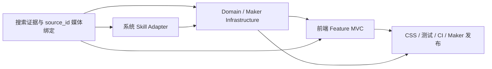

# Floris 架构重构实施计划索引

> **For agentic workers:** REQUIRED SUB-SKILL: Use superpowers:subagent-driven-development (recommended) or superpowers:executing-plans to implement these plans task-by-task. Steps use checkbox (`- [ ]`) syntax for tracking.

**Goal:** 按可回滚、可验收的顺序完成 Floris 后端 MVC、搜索链路、系统 Skill、Maker 多租户、前端 Feature MVC、测试和独立发布重构。

**Architecture:** 五份子计划共享同一设计约束，但每份都有独立测试和提交。先固定搜索/媒体安全，再迁移系统 Skill；随后拆 domain/infrastructure 与统一权益；再拆前端；最后做 CSS、测试、全链路门禁与独立 Maker 部署。

**Tech Stack:** Python、Node.js、React/TypeScript、EdgeOne Makers、GitHub Actions、Playwright。

## 必读设计

- `docs/superpowers/specs/2026-07-31-floris-architecture-refactor-design.md`

## 执行顺序

1. `docs/superpowers/plans/2026-07-31-chat-search-media-refactor.md`
2. `docs/superpowers/plans/2026-07-31-system-skill-adapters.md`
3. `docs/superpowers/plans/2026-07-31-domain-infrastructure-entitlements.md`
4. `docs/superpowers/plans/2026-07-31-frontend-feature-mvc.md`
5. `docs/superpowers/plans/2026-07-31-css-tests-release-gates.md`

## 阶段依赖

## 每个 Task 的固定执行协议

- [ ] 先使用 `superpowers:using-git-worktrees` 检查隔离、`dev` 分支和 `main` 固定哈希。
- [ ] 使用 `superpowers:test-driven-development`：写一个失败测试，观察预期失败，再写最小实现。
- [ ] 每个 Task 只提交其列出的文件；不合并或修改 `main`。
- [ ] 每完成一份子计划，运行该计划的完整回归并推送 `dev`。
- [ ] 最终使用 `superpowers:verification-before-completion` 和 `superpowers:requesting-code-review`。
- [ ] 只有全部门禁通过后，才推送 `dev` 并由 Git 集成部署 `floris-dev`。

## 不可协商验收条件

- SearchPro 每个搜索回合只调用一次。
- 首字不等待网页抓取/视觉审核。
- 新旧消息都没有图片占位符策略。
- 搜索图片只能由 `vision_reviewed + source_id + source_url + 精确引用` 决定性插入。
- 回答缓存不存在，只有证据缓存。
- 用户只看到结构化进度，不看到隐藏思维链。
- Guest 只能使用 `core` 和 `proactive-agent`。
- 九个系统 Skill 都由可信 Adapter 产生；用户上传 Skill 保持不可执行的 `pending_review`。
- Node/Python 权益来自一个 JSON Contract。
- `agents/_shared`、`agents/chat/_ui_tools.py`、前端大 Hook/大组件/API 聚合/全局大 CSS 和单体大测试全部退出。
- Maker 数据使用可信 tenant/user 前缀，支付保持不可用接口。
- `main` 保持 `72be68b2615e7dc23abfbeadca9ce204e3a3c84c`。
- 只部署项目 `floris-dev`（`makers-0kgcojx0gjiy`）。
